## 大数据导论
1. 4V ：大量(Volume) 高速(Velocity) 多样(Variety) 低价值密度(Value)

- **Volume（大量）** 截至目前，人类生产的所有印刷材料的数据量是200PB，而历史上全人类总共说过的话的数 据量大约是5EB。当前，典型个人计算机硬盘的容量为TB量级，而一些大企业的数据量已经接近EB量级。

- **Velocity（高速）** 这是大数据区分于传统数据挖掘的最显著特征。根据IDC的“数字宇宙”的报告，预计到2025 年，全球数据使用量将达到163ZB。在如此海量的数据面前，处理数据的效率就是企业的生命。
- **Variety（多样）** 这种类型的多样性也让数据被分为结构化数据和非结构化数据。相对于以往便于存储的以数 据库/文本为主的结构化数据， 非结构化数据越来越多，包括网络日志、音频、视频、图片、地理位置信息等，这 些多类型的数据对数据的处理能力提出了更高要求。
- **Value（低价值密度）** 价值密度的高低与数据总量的大小成反比。比如，在一天监控视频中，我们只关心指定 课堂的45分钟，如何快速对有价值数据“提纯”成为目前大数据背景下待解决的难题。

2.应用场景 

电商网站：浏览过的商品，同类别推荐。

抖音：推荐你喜欢的视频。

零售： 分析用户消费习惯， 为用户购买商品提供方便， 从而提升商品销量。

经典案例：纸尿布+啤酒
https://zhuanlan.zhihu.com/p/111319675 （有兴趣可读）

物流仓储：京东物流， 上午下单下午送达、 下午下单次日上午送达

保险：海量数据挖掘及风险预测， 助力保险行业精准营销， 提升精细化定价能力。

金融：多维度体现用户特征，帮助金融机构推荐优质客户，防范欺诈风险。

房产：大数据全面助力房地产行业， 打造精准投策与营销， 选出更合适的地， 建造更合适的楼，卖给更合适
的人。

人工智能 + 5G + 物联网 + 虚拟与现实

传媒、文娱、舆情监控等

3.流程

1. 产品提需求，统计各地实时数据，热门排行数据

2. 搭建数据平台，分析数据指标
3. 数据可视化，开发数据报表，邮件发送，大屏幕展示


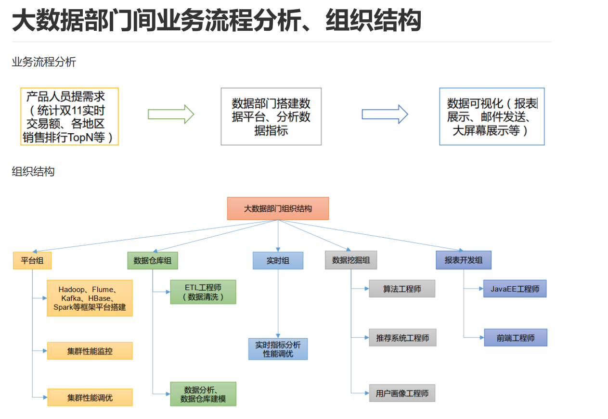

## Hadoop

> Hadoop是一个由Apache基金会所开发的分<font color='red'>布式系统基础架构</font>。  主要解决， <font color='red'>海量数据的存储和海量数据的分析计算</font>问题

1. 创始人是Doug Cutting

2. （必考）来源：Google三论文 GFS MapReduce BigTable

GFS --> HDFS 

MapReduce --> MR 

BigTable --> HBase

3. （必考）版本 1.X 2.X 3.X    

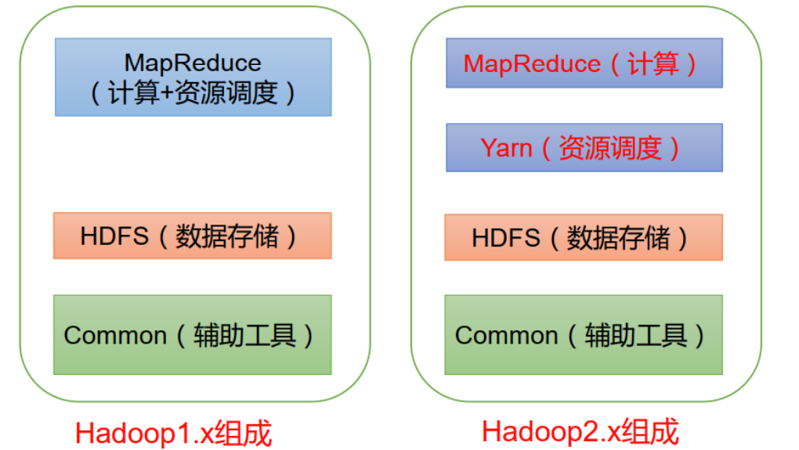

在 Hadoop1.x 时 代 ，MapReduce同时处理业务逻辑运算和资源的调度， 耦合性较大。 

在Hadoop2.x时代， 增加了Yarn。 Yarn只负责资源的调度 ，MapReduce 只负责运算。 

Hadoop3.x备课在组成上没有变化。 3版本和2版本在某些方面有差异，具体表现为：

支持多个NameNode：Hadoop 3.x支持两个以上的NameNode，提高了群集的容错能力。
DataNode内部负载均衡：Hadoop 3.x在DataNode内部添加了负载均衡功能，以优化数据存储和访问性能。


4. 运行模式：本地、完全分布式\伪分布式

	本地模式：单机运行，只是用来演示一下官方案例。生产环境不用。 

	伪分布式模式：也是单机运行，但是具备Hadoop集群的所有功能，一台服务器模拟一个分布式的环境。个别缺钱的 公司用来测试，生产环境不用 

	完全分布式模式：多台服务器组成分布式环境。生产环境使用。

4. 历史服务器

	查看程序的历史运行情况，具体配置步骤:

	1. 配置 mapred-site.xml

		`[whuc@hadoop102 hadoop-3.1.3]$ cd etc/hadoop/ [whuc@hadoop102 hadoop]$ vim mapred-site.xml 添加如下到configuration标记对中`

		

		```xml
		<!-- 历史服务器端地址 -->
		<property>
		<name>mapreduce.jobhistory.address</name>
		<value>hadoop102:10020</value>
		</property>
		<!-- 历史服务器 web 端地址 -->
		<property>
		<name>mapreduce.jobhistory.webapp.address</name>
		<value>hadoop102:19888</value>
		</property>
		```

	2. 分发配置文件到103、104

		`[whuc@hadoop102 hadoop]$ xsync mapred-site.xml`

	3. 在103停掉yarn服务，重启

		`[whuc@hadoop102 hadoop]$ ssh hadoop103 jps `
		6304 NodeManager 

		5717 DataNode 7917 

		Jps 

		6175 ResourceManager

		#有ResourceManager ，表示yarn是启动的

		`[whuc@hadoop102 hadoop]$ ssh hadoop103`
		Last login: Sat Jul 24 15:24:04 2021 from hadoop102

		（1）切换目录

		`[whuc@hadoop103 ~]$ cd /opt/module/hadoop-3.1.3/sbin/`

		（2）先停掉yarn

		`[whuc@hadoop103 sbin]$ ./stop-yarn.sh`

		（3）再启动

		`[whuc@hadoop103 sbin]$ ./start-yarn.sh Starting resourcemanager Starting nodemanagers`

		（4）查看 103上有ResourceManager和NodeManager ok

		`[whuc@hadoop103 sbin]$ jps 8370 ResourceManager 8500 NodeManager 5717 DataNode 8862 Jps`

		（5）查看102 和104节点

		`[whuc@hadoop103 sbin]$ exit 登出 Connection to hadoop103 closed. [whuc@hadoop102 hadoop]$ jps 6321 DataNode 6167 NameNode 8767 NodeManager 8895 Jps [whuc@hadoop102 hadoop]$ ssh hadoop104 jps 5238 DataNode 7160 NodeManager 5353 SecondaryNameNode 7307 Jps`

	4. 在102启动历史服务器

		手动启动

		`[whuc@hadoop102 hadoop]$ mapred --daemon start historyserve`

		查看jps，出现JobHistoryServer，ok

		`[whuc@hadoop102 hadoop]$ jps 6321 DataNode 8961 JobHistoryServer 9029 Jps 6167 NameNode 8767 NodeManager`

	5. 查看web端，http://hadoop102:19888/jobhistory

5. 时间同步服务器

时间同步问题

- 如果服务器在公网环境（能连接外网），可以不采用集群时间同步，因为服务器会定期和公网时间进行校准；
- 如果服务器在内网环境，必须要配置集群时间同步，否则时间久了，会产生时间偏差，导致集群执行任务时间不同步。


需求；找一个机器，作为时间服务器，所有的机器与这台集群时间进行定时的同步， 生产环境根据任务对时间的准 确程度要求周期同步。 测试环境为了尽快看到效果，采用 1 分钟同步一次。

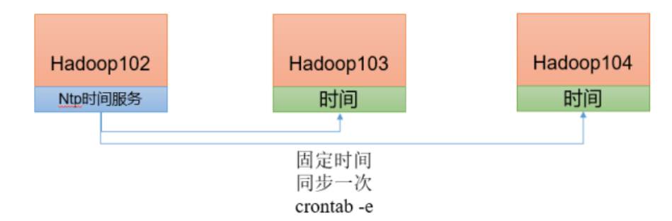

 时间服务器配置、102（必须 root 用户）

```cmd :collapsed-lines=1
[root@hadoop102 ~]# yum install -y ntp
[root@hadoop102 ~]# systemctl start ntpd
[root@hadoop102 ~]# systemctl status ntpd
## 修改配置文件
[root@hadoop102 ~]# vim /etc/ntp.conf
## 修改（授权 192.168.10.0-192.168.10.255 网段上的所有机器可以从这台机器上查询和同步时间）
18 restrict 192.168.3.0 mask 255.255.255.0 nomodify notrap
## 注释（集群在局域网中，不使用其他互联网上的时间）
22 #server 0.centos.pool.ntp.org iburst
23 #server 1.centos.pool.ntp.org iburst
24 #server 2.centos.pool.ntp.org iburst
25 #server 3.centos.pool.ntp.org iburst
## 添加（当该节点丢失网络连接，依然可以采用本地时间作为时间服务器为集群中的其他节点提供时间同步）
61 server 127.127.1.0
62 fudge 127.127.1.0 stratum 10
## 保存退出
## 会影响ntp开机自启，关闭
[root@hadoop102 ~]# systemctl disable chronyd
[root@hadoop102 ~]# systemctl enable ntpd
[root@hadoop102 ~]# systemctl restart ntpd
```

其他机器配置（必须 root 用户）

```cmd :collapsed-lines=1
## 关闭103和104的ntp，以及开机不自启
## 如果没有ntp服务，此步骤可跳过
[root@hadoop102 ~]# ssh hadoop103
Last login: Sat Jul 24 13:19:13 2021 from hadoop103
[root@hadoop103 ~]# systemctl stop ntpd
[root@hadoop103 ~]# systemctl status ntpd
● ntpd.service - Network Time Service
Loaded: loaded (/usr/lib/systemd/system/ntpd.service; disabled; vendor preset: disabled)
Active: inactive (dead)
[root@hadoop103 ~]# systemctl is-enabled ntpd
disabled
[root@hadoop102 ~]# ssh hadoop104
Last login: Sat Jul 24 14:49:40 2021 from hadoop102
[root@hadoop104 ~]# systemctl stop ntpd

[root@hadoop104 ~]# systemctl status ntpd
● ntpd.service - Network Time Service
Loaded: loaded (/usr/lib/systemd/system/ntpd.service; disabled; vendor preset: disabled)
Active: inactive (dead)
[root@hadoop104 ~]# systemctl is-enabled ntpd
disabled
```

若是最小安装系统，无需安装ntp，需要安装的是ntpdate，用于计划任务中与102保持时间同步。

```cmd
[root@hadoop103 ~]# yum list | grep ntpdate
ntpdate.x86_64 4.2.6p5-29.el7.centos.2 base
[root@hadoop103 ~]# yum install -y ntpdate
```

计划任务，同步时间

```cmd :collapsed-lines=1
[root@hadoop103 ~]# crontab -e
*/1 * * * * /usr/sbin/ntpdate hadoop102
[root@hadoop104 ~]# crontab -e
*/1 * * * * /usr/sbin/ntpdate hadoop102
## 保存提出
## 修改104时间 ，1分钟 看同步情况
[root@hadoop104 ~]# date -s "2021-9-11 11:11:11"
2021年 09月 11日 星期六 11:11:11 CST
您在 /var/spool/mail/root 中有邮件
[root@hadoop104 ~]# date
2021年 09月 11日 星期六 11:11:26 CST
[root@hadoop104 ~]# date
2021年 09月 11日 星期六 11:11:47 CST
[root@hadoop104 ~]# date
2021年 07月 24日 星期六 19:07:24 CST
## ok
```

start-dfs.sh（是启动HDFS的命令）

start-yarn.sh（是启动yarn的命令）

start-all.sh命令是 start-dfs.sh 与 start-yarn.sh 这两个命令的合并

## (必考)HDFS（Hadoop Distribute File System）

> HDFS（Hadoop Distributed Filesystem）是一个易于扩展的<font color='red'>分布式文件系统</font>，运行在成百上千台低成本的机器上。

1.组成部分：

HDFS采用主/从（Master/Slave）架构，一般一个HDFS集群由一个<font color='red'>NameNode</font>、一个<font color='red'>Secondary NameNode</font>和多个<font color='red'>DataNode</font>组成。

2.分别什么功能

NameNode（nn）Master

> NameNode是HDFS集群的主节点，是一个中心服务器，负责存储和管理文件系统的元数据（节点信息）

（1） 管理HDFS的名称空间和数据块（ Block） 映射信息

（2） 配置副本策略

（3） 处理客户端读写请求

Secondary NameNode （2nn）
> Secondary NameNode辅助NameNode，分担其工作量，用于同步元数据信息

（1）并非NameNode的热备。当NameNode挂掉的时候，并不能马上替换NameNode并提供服务

（2）辅助NameNode， 分担其工作量， 比如定期合并Fsimage（文件系统持久化存储）和Edits（Edits文件帮助HDFS维护其元数据的完整性和准确性）， 并推送给NameNode

（3）在紧急情况下， 可辅助恢复NameNode

（4）nn的高可用通常使用其他集群框架

DataNode（dn）slave
> DataNode是HDFS集群的从节点，存储实际的数据，汇报存储信息给NameNode（见心跳机制）

（1）接收nn指令
（2）存储实际数据块
（3）执行数据块读写操作

Client 客户端（命令行、浏览器等）

（1）文件切分。 文件上传HDFS的时候， Client将文件切分成一个一个的Block， 然后进行上传

（2）与NameNode交互， 获取文件的位置信息

（3）与DataNode交互， 读取或者写入数据

（4）Client提供一些命令来管理HDFS， 比如NameNode格式化

（5）Client可以通过一些命令来访问HDFS，比如对HDFS增删查改操作


3.优缺点是什么？

优点

（1） 高容错性

数据自动保存多个副本；副本丢失自动恢复

（2）适合处理大数据

数据规模支持GB\TB\PB

文件规模，可处理百万规模文件数量

（3）成本优势

以前处理大数据使用小型机，昂贵；现在硬件成本降低，门槛降低。

缺点

（1）不适合<font color='red'>低延时</font>数据访问

软件层面不支持

（2）处理大量<font color='red'>小文件很低效</font>

DataNode存数据块，NameNode存数据块的元数据；每个数据块的索引额定占用NomeNode150byte空间。小文件过多，索引检索慢。

（3）<font color='red'>不支持并发写入</font>、<font color='red'>文件随机修改</font>

数据只能同时一个写入；数据只能追加


4.副本机制

HDFS的副本机制允许系统在存储节点出现故障时依然能够提供数据的持续访问，从而提高了大规模数据存储的可靠性。其核心思想是将数据分散存储在多个物理节点上，即使个别节点发生故障，也不会导致数据的丢失。每个存储在HDFS中的文件被分割成一系列的块（block），默认情况下每个块大小为128MB。这些块被复制多份，并分布在不同的数据节点（DataNode）中

5.心跳机制

HDFS的心跳机制是保证分布式文件系统中节点状态监测和数据完整性的重要手段。DataNode节点定期向NameNode发送心跳信号，报告其状态和存储信息。NameNode通过心跳信号监控DataNode的可用性，并在节点失效时重新分配数据块副本，确保数据的可用性和一致性。心跳机制还允许NameNode管理数据块的存储和复制，确保系统的高可用性和高性能。

心跳是每 3 秒一次，心跳返回结果带有 NameNode 给该 DataNode 的命令如复制块数据到另一台机器，或删除某个数据块。 如果超过 10 分钟没有收到某个 DataNode 的心跳，则认为该节点不可用。


==6.块大小和什么有关(可能是简答) => 存储介质== 重点

* HDFS中的文件在物理上是分块存储 （ Block） ， 块的大小通过配置参数( dfs.blocksize） 来规定。
  默认大小在Hadoop2.x/3.x版本中是128M， 1.x版本中是64M。
  nn寻址时间为10ms，则找到数据的时间也就是10ms。
  砖家说：寻址时间为传输时间的1%时，是最佳状态
  计算得出，传输时间为10ms/1%=1000ms=1s
  目前机械硬盘读写速率80-100m/s,固态硬盘读写速率200-300m/s
  找一个块的时间10ms，读写（传输）一个块的时间1秒，最佳状态
  所以，dfs.blocksize默认为128M，也有设置为256M的，其原因是存储使用固态硬盘。
* 思考：为什么块的大小不能设置太小， 也不能设置太大？

​	（1）设置太小， 会增加寻址时间， 程序一直在找块的开始位置； 

​	（2）设置太大， 从磁盘传输数据的时间会明显大于找到这个块开始位置所需的时间。 导致程序在处理这块数据时， 会非常慢。

- 总结： HDFS块的大小设置主要取决于磁盘传输速率，最佳状态下 寻址时间或找到数据的时间 / 1% = 传输时间


7.shell操作

基本用法：

- hadoop fs 具体命令 
- hdfs dfs 具体命令
- 两个是完全相同的。

常用命令测试：

- 启动，查看集群

​	-help：查案子命令用法

- 上传

​	（1）-moveFromLocal：从本地剪切粘贴到 HDFS

```cmd
[whuc@hadoop102 ~]$ vim w001.txt
[whuc@hadoop102 ~]$ hadoop fs -moveFromLocal w001.txt /test00
2021-07-25 10:09:23,442 INFO sasl.SaslDataTransferClient: SASL encryption trust check:
localHostTrusted = false, remoteHostTrusted = false
[whuc@hadoop102 ~]$ ls
bin
```

​	（2）-copyFromLocal：从本地剪切粘贴到 HDFS

​	（3）-put：等同于 copyFromLocal，生产环境更习惯用 put

```cmd
[whuc@hadoop102 ~]$ echo 123456 > w002.txt
[whuc@hadoop102 ~]$ hadoop fs -put w002.txt /test00
put: `/test00': File exists
[whuc@hadoop102 ~]$ hadoop fs -put w002.txt /test01
2021-07-25 10:11:56,901 INFO sasl.SaslDataTransferClient: SASL encryption trust check:
localHostTrusted = false, remoteHostTrusted = false
```

​	（4）-appendToFile：追加一个文件到已经存在的文件末尾

```cmd
[whuc@hadoop102 ~]$ hadoop fs -appendToFile w002.txt /test00
2021-07-25 10:22:55,718 INFO sasl.SaslDataTransferClient: SASL encryption trust check:
localHostTrusted = false, remoteHostTrusted = false
```

- 下载

（1）-copyToLocal：从 HDFS 拷贝到本地

```cmd
[whuc@hadoop102 ~]$ hadoop fs -copyToLocal /test00 w001.txt
2021-07-25 10:26:25,321 INFO sasl.SaslDataTransferClient: SASL encryption trust check:
localHostTrusted = false, remoteHostTrusted = false
[whuc@hadoop102 ~]$ ls
bin w001.txt w002.txt
[whuc@hadoop102 ~]$ cat w001.txt
www.baidu.com
www.taobao.com
123456
```

注意：命令行最后的两个路径，一个是hdfs文件系统的路径，一个是Linux文件系统的路径

（2）-get：等同于 copyToLocal，生产环境更习惯用 get

- HDFS直接操作

（1）-ls 

（2）-cat 

（3）-chgrp、 -chmod、 -chown： Linux 文件系统中的用法一样，修改文件所属权限

```cmd
[whuc@hadoop102 ~]$ hadoop fs -chown root /test01
[whuc@hadoop102 ~]$ hadoop fs -ls /test01
-rw-r--r-- 3 root supergroup 7 2021-07-25 10:11 /test01
```


（4）-mkdir：创建路径 

（5）-cp：从 HDFS 的一个路径拷贝到 HDFS 的另一个路径 

（6）-mv：在 HDFS 目录中移动文件 

（7）-tail：显示一个文件的末尾 1kb 的数据 （-head）

（8）-rm：删除文件或文件夹 （-r 参数 递归删除目录中的文件和子目录） 

（9） -du 统计文件夹的大小信息

```cmd
[whuc@hadoop102 ~]$ hadoop fs -du /
77 231 /input
57 171 /output
57 171 /output00
36 108 /test00
7 21 /test01
607115 1821345 /tmp
```

77 231 /input：231 是三个副本的大小

（10）-setrep：设置 HDFS 中文件的副本数量

```cmd
[whuc@hadoop102 ~]$ hadoop fs -setrep 1 /test01
Replication 1 set: /test01
[whuc@hadoop102 ~]$ hadoop fs -du /
77 231 /input
57 171 /output
57 171 /output00
36 108 /test00
7 7 /test01
607115 1821345 /tmp
```

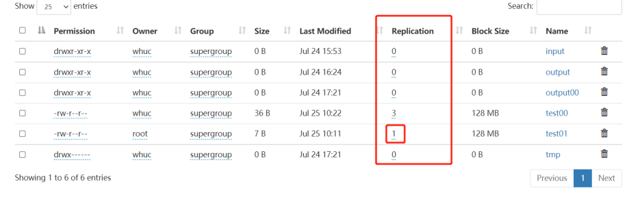

这里设置的副本数只是记录在 NameNode 的元数据中，是否真的会有这么多副本，还得看 DataNode 的数量。因为目前只有 3 台设备，最多也就 3 个副本，只有节点数的增加到 10台时， 副本数才能达到 10。


## MapReduce（编程题多）

MapReduce是Hadoop的一个分布式计算框架，也是一种大规模数据集并行运算的编程模型，主要用于处理海量数据的运算。
MapReduce主要包括Map（映射）和Reduce（规约）两部分。

1.框架思路：先分后合，提高计算效率


2.序列化 writable

序列化就是把内存中的对象，转换成字节序列（或其他数据传输协议）以便于持久化和网络传输。

反序列化就是将收到字节序列（或其他数据传输协议）或者是磁盘的持久化数据，转换成内存中的对象。

Java 的序列化是一个重量级序列化框架（Serializable），一个对象被序列化后，会附带很多额外的信息（各 种校验信息， Header，继承体系等），不便于在网络中高效传输。 所以，Hadoop 自己开发了一套序列化机（Writable）。 

Hadoop 序列化特点 

（1）紧凑 ： 高效使用存储空间 （2）快速： 读写数据的额外开销小 （3）互操作： 支持多语言的交互


3. 两种计算模型 map 和 reduce

map阶段：负责将任务分解，即把复杂的任务分解成若干个“简单的任务”来并行处理，但前提是这些任务没有必然的依赖关系，可以单独执行任务

reduce阶段：负责将任务合并，即把Map阶段的结果进行全局汇总

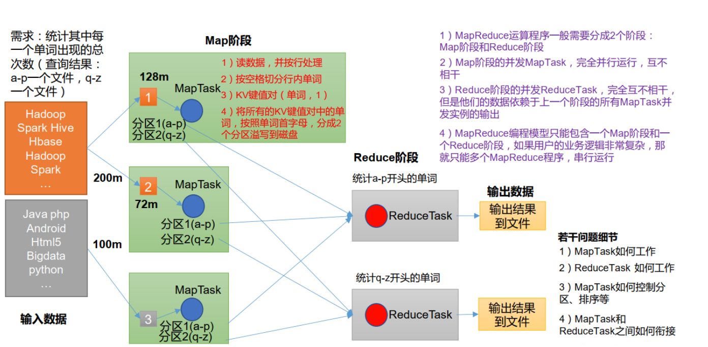

4.inputformat 切片机制 数据读取方式

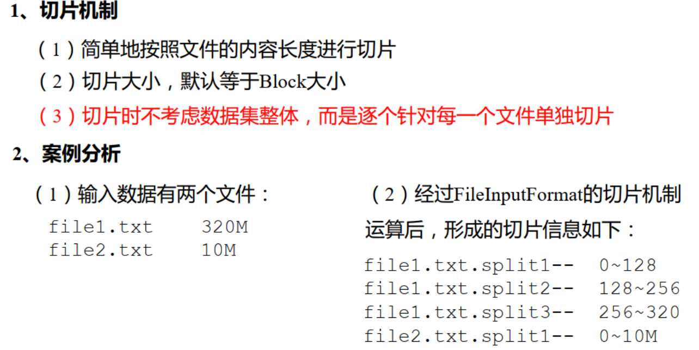

数据读取方式：

针对不同数据类型，FileInputFormat 接口的实现类有 TextInputFormat、 KeyValueTextInputFormat、 NLineInputFormat、 CombineTextInputFormat 和自定义 InputFormat 等。

`TextInputFormat` 是默认的 FileInputFormat 实现类。按行读取每条记录。 键是存储该行在整个文件中的起始字节偏移量， LongWritable 类型。值是这行的内容，不包括任何行终止符（换行符和回车符）， Text 类 型。

`CombineTextInputFormat`，框架默认的 TextInputFormat 切片机制是对任务按文件规划切片， 不管文件多小， 都会是一个单独的切片， 都会交给一个 MapTask， 这样如果有大量小文件， 就会产生大量的MapTask， 处理效率极其低下。CombineTextInputFormat 用于小文件过多的场景， 它可以将多个小文件从逻辑上规划到一个切片中， 这 样， 多个小文件就可以交给一个 MapTask 处理。

5.mapper maptask 数量与什么有关

MapTask 的数量是由切片的个数决定，切片的个数由（1）输入文件的数量、大小 （2）切片规则（按行、按文件的规则）决定。


6.==(编程题会出30分，答题规范先思路再代码) == 

shuffle 环形缓冲区 100M 阈值80% 溢写磁盘（一个MT（MapTask）会有多个溢写文件，合并成一个中间结果）

> Map 方法之后， Reduce 方法之前的数据处理过程称之为 Shuffle 。

Shuffle过程为：

（1）Partition分区

（2）WritableComparable 排序 （WritableComparator类，处理key为基础类型的排序）

- 排序是MapReduce框架中最重要的操作之一
- MapTask和ReduceTask均会对数据按照key进行排序。 该操作属于Hadoop的默认行为。 任何应用程序中的 数据均会被排序， 而不管逻辑上是否需要。
- ==默认排序是按照字典顺序排序==， 且是快速排序。
- <font color='red'>（重点）</font>对于MapTask， 它会将处理的结果暂时放到环形缓冲区中， 当==环形缓冲区==使用率达到一定阈值（==80%==）后， 再对缓冲区中的数据进行一次快速排序， 并将这些有序数据溢写到磁盘上， 而当数据处理完毕后， 它会对磁盘上所有文件进行归并排序。
- 对于ReduceTask，它从每个MapTask上远程拷贝相应的数据文件，如果文件大小超过一定阈值， 则溢写磁盘 上， 否则存储在内存中。如果磁盘上文件数目达到一定阈值，则进行一次归并排序以生成一个更大文件；如 果内存中文件大小或者数目超过一定阈值，则进行一次合并后将数据溢写到磁盘上。当所有数据拷贝完毕 后， ReduceTask统一对内存和磁盘上的所有数据进行一次归并排序
- 排序分类
	- 部分排序 MapReduce根据输入记录的键对数据集排序。 保证输出的每个文件内部有序。 
	- 全排序 最终输出结果只有一个文件， 且文件内部有序。 实现方式是只设置一个ReduceTask。 但该方法在处理大型 文件时效率极低， 因为一台机器处理所有文件， 完全丧失了MapReduce所提供的并行架构。 
	- 辅助排序： （ GroupingComparator分组） 在Reduce端对key进行分组。应用于：在接收的key为bean对象时，想让一个或几个字段相同（全部字段比 较不相同）的key进入到同一个reduce方法时，可以采用分组排序。 
	- 二次排序 在自定义排序过程中，如果compareTo中的判断条件为两个即为二次排序。

bean 对象==做为 key 传输，需要实现 WritableComparable 接口==重写 compareTo 方法， 就可以实现排序。

```java  :collapsed-lines=1
public class FlowBean  implements WritableComparable<FlowBean>{
    
    private long upFlow;
	private long downFlow;
	private long sumFlow;
    
    
    //一定要无参构造器，反射会调用
    public FlowBean(){}
    
    //...getter setter方法
    
    
    //  序列化
    @Override
    public void write(DataOutput out) throws IOException {
        // 记住顺序
        out.writeLong(upFlow);
        out.writeLong(downFlow);
        out.writeLong(sumFlow);
    }
    
    
    // 反序列化
    @Override
    public void readFields(DataInput in) throws IOException {
        // 依据序列化的顺序 进行反序列化
        this.upFlow = in.readLong();
        this.downFlow = in.readLong();
        this.sumFlow = in.readLong();
    }

    
    //格式化输出，文件最后的输出为该对象的toString格式输出
    @Override
    public String toString() {
    return upFlow + "\t" + downFlow + "\t" + sumFlow;
    }
    
    @Override
    public int compareTo(FlowBean o) {
        //按照总流量比较,倒序排列
        if(this.sumFlow > o.sumFlow){
        return -1;
        }else if(this.sumFlow < o.sumFlow){
        return 1;
        }else {
        return 0;
        }
    }

}
```

（3）Combiner 合并

- Combiner是MR程序中Mapper和Reducer之外的一种组件。
-  Combiner组件的父类就是Reducer。 
- Combiner和Reducer的区别在于运行的位置 Combiner是在每一个MapTask所在的节点运行;
-  Reducer是接收全局所有Mapper的输出结果；
-  Combiner的意义就是对每一个MapTask的输出进行局部汇总， 以减小网络传输量。 
- Combiner能够应用的前提是不能影响最终的业务逻辑， 而且， Combiner的输出kv应该跟Reducer的输入kv 类型要对应起来。

简单来说。combiner就是为了让数据从内存到磁盘时，尽量减少IO次数，以提高效率。

注意：平均值的统计不适合使用combiner，求和时，推荐

- 自定义 Combiner 实现步骤 自定义一个 Combiner 继承 Reducer，重写 Reduce 方法 。 在 Job 驱动类中设置：`job.setCombinerClass(XXXCombiner.class);`


7.renducer reducetask 数量与什么有关

```java
//大于1  小于 getPartition次数则抛出异常， 等于1 无论分区多少都是在一个文件里
job.setNumReduceTasks(5);// 1  <  reducerTask  <  getPartitioner次数
```

- 用户配置：job.setNumReduceTasks(0)
- **输入数据的分区数**：Reduce任务的输入来自于Map任务的输出，而Map任务的输出会根据用户指定的分区函数将数据划分为不同的分区。如果输入数据被划分为更多的分区，那么每个Reduce任务将会处理更少的数据，从而提高了并行度
- **Reduce任务的处理能力**：指的是Reduce任务所在节点的计算资源。如果Reduce任务所在的节点具有更多的CPU核心、内存和网络带宽等资源，那么它可以同时处理更多的数据，从而增加并行度。
- **数据倾斜**：在实际的数据处理中，可能会出现数据倾斜的情况，即某些数据分区的大小远远大于其他分区。为了避免某些Reduce任务成为性能瓶颈，可以通过增加Reduce任务的数量来缓解数据倾斜问题，提高整体的并行度。

8.outputformat 输出 DBWritable --》 类似sqoop框架 封装opf

- 默认输出格式TextOutputFormat，例如输出数据到MySQL/HBase/Elasticsearch等存储框架中。

`DBWritable`是一个接口，它允许Hadoop MapReduce作业直接与数据库进行交互，而不需要像Sqoop那样需要一个中间的数据传输过程。


9.代码：三个类 Mapper（继承，重写map，输入输出泛型） Reducer（继承，重写reduce，输入输出泛型） Driver（7-8步骤）

```java  :collapsed-lines=1
定义输入输出
Mapper泛型依次为 输入值key偏移量，输入值value（默认按行读取的值），输出key值，输出value值
map方法的参数依次为偏移量，每行数据，上下文（设置输出值key和value）
map的任务是对数据处理，需求是计算总共的word的出现次数，这里简单处理只出现一次


public class WordCountMapper extends  Mapper<LongWritable,Text,Text,IntWritable>{

		private IntWritable outV  =  new IntWritable(1);
	
		private  Text  outK =  new Text();
		
		public void map(LongWritable key,Text line,Context context){
			String[]  words = 	line.toString().split(" ")
			for(String word:words){
			  outK.set(word)
			  context.write(outK,outV);
			}	
		}
}

//输入输出 
//泛型为 map阶段的输出<Text,IntWritable>   
//reduce阶段输出为单词和单词出现次数所以也为<Text,IntWritable>
//reduce接受的是map阶段的所有key，value为这些key的值的集合 =>  <Text,Iterable<IntWritable>>
public class WordCountReducer extends Reducer<Text,IntWritable,Text,IntWritable>{
    
   private IntWritable  outV = new IntWritable();
    
    public void  map(Text word,Iterable<IntWritable> values,Context context){
     	int num = 0;
        
        for(IntWritable value : values){
           	 num += value.get();
        }
        outV.set(num);
          context.write(word,outV);        
    }
}


public  class WordCountDriver  {
    
    public  static void  main(String[] args){
        //配置类
        Configuration  config = new Configuration();
        
        //job
        Job job = Job.getInstance(config);
        
        //设置该类为启动类
       	job.setJarByClass(WordCountDriver.class);
        //Mapper类
        job.setMapperClass(WordCountMapper.class);
        //Reducer类
        job.setReducerClass(WordCountReducer.class);
		//Map阶段的输入Key
        job.setMapOutPutKeyClass(Text.class):
        
        //Map阶段的输入Value
        job.setMapOutPutValueClass(IntWritable.class);
        
        // （可选） job.setPartitionerClass(WordCountPartitioner.class);
    	//（可选） job.setCombinerClass(WordCountCombiner.class);
        //（可选，设置分区则要设置） job.setNumReduceTasks(4);

        //总体的输入Key
        job.setOutputKeyClass(Text.class);
        //总体的输入Value
        job.setOUtputValueClass(IntWritable.class);
       	
        //输入和输出路径
        FileInputFormat.setInputPaths(job,new Path("datas/words.txt"));
        FileOutputFormat.setOutputPaths(job,new Path("output01"));
        
        //提交
        boolean b =  job.waitForCompletion(job);
        
        System.exit(b?0:1);
        
    }
    
}
```


## Yarn

> Yarn（Yet Another Resource Negotiator）是Hadoop 2.0中的资源管理器，它可为上层应用提供统一的资源管理和调度。

1.mesos 是什么

Mesos是一个开源的资源管理系统，可以对集群中的资源做弹性管理。Mesos可以在各个框架间进行粗粒度的资源分配，每个框架根据自身任务的特点进行细粒度的任务调度。

2. `2.X版本 `才引入


3.（必考，选择题可能  各自功能要清晰）组成部分 ResourceManager、NodeManager、applicationMaster、container(cpu 网络 硬盘 等资源的抽象)

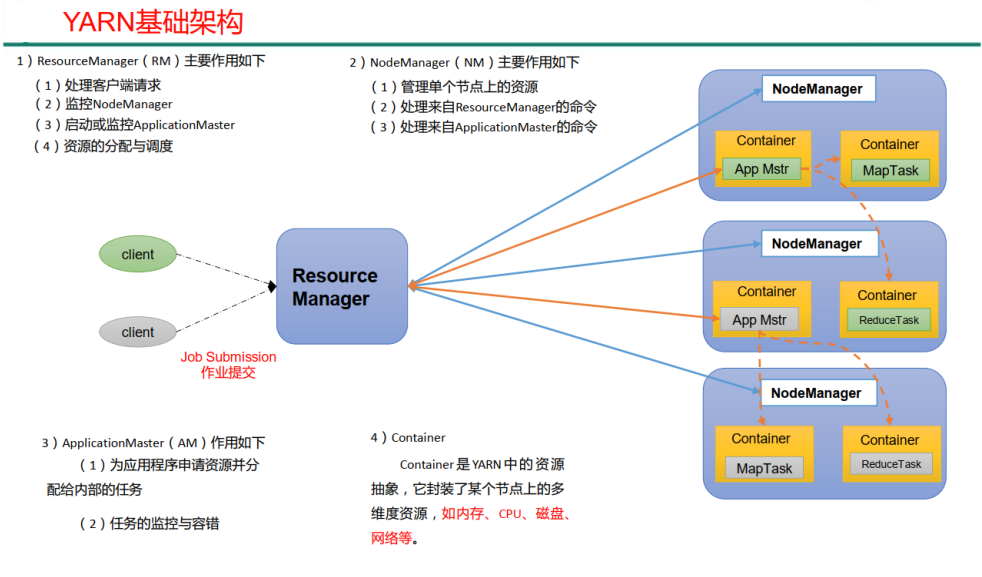

4. <font color='red'>（必考）调度器：</font>

 Hadoop 作业调度器主要有三种： `FIFO`、 `容量（Capacity Scheduler）` 和`公平（FairScheduler）`。 

Apache Hadoop3.1.3 默认的资源调度器是 `Capacity Scheduler`。

CDH 框架默认调度器是 `Fair Scheduler`。

单队列：FIFO

多队列：公平调度器（收费版）、容量调度器（免费版）

* 先进先出调度器（FIFO）

FIFO 调度器（First In First Out） ：单队列，根据提交作业的先后顺序，先来先服务。

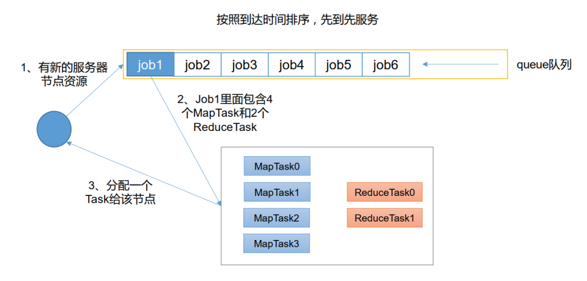

优点：简单易懂； 缺点：不支持多队列，生产环境很少使用；

- 容量调度器（Capacity Scheduler）

Capacity Scheduler 是 Yahoo 开发的多用户调度器。

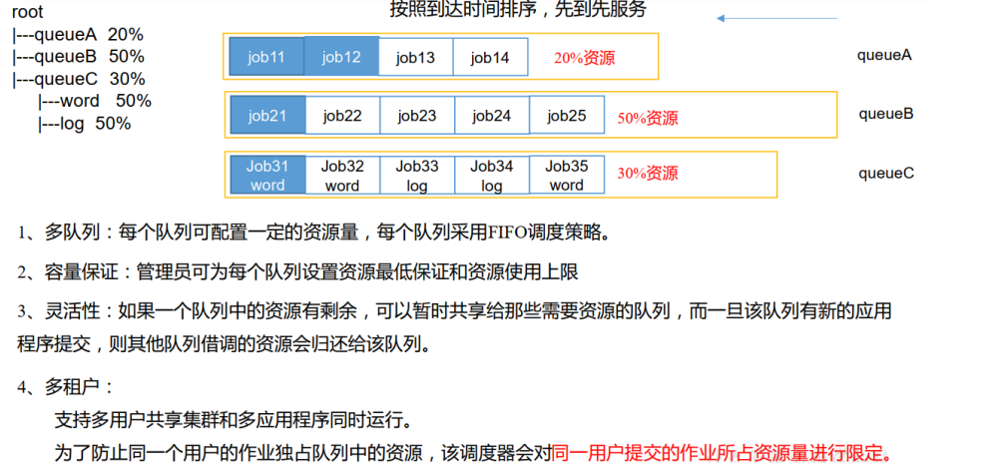

- 公平调度器（Fair Scheduler）

Fair Schedulere 是 Facebook 开发的多用户调度器。

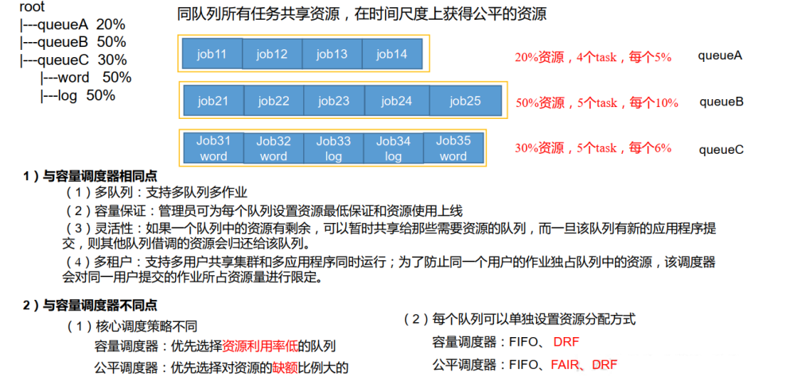

公平调度器设计目标是：在时间尺度上，所有作业获得公平的资源。某一时刻一个作业应获资源和实际获取 资源的差距叫“缺额” 调度器会优先为缺额大的作业分配资源。


5. 管理命令 

**查看**

- 列出所有 Application：：`yarn application -list`

- 根据 Application 状态过滤： `yarn application -list -appStates <States>`

例如：`yarn application -list -appStates FINISHED `（查看FINISHED状态的应用）

- Kill 掉 Application：`yarn application -kill <application编号>`

**yarn logs查看日志**

- 查询 Application 日志：` yarn logs -applicationId  <application的id>`

- 查询 Container 日志：`yarn logs -applicationId -containerId`

**yarn applicationattempt查看尝试运行的任务**

- 列出所有 Application 尝试的列表： `  yarn applicationattempt -list <application的id>`

- 打印 ApplicationAttemp 状态：` yarn applicationattempt -status <appattempt的id>`

**yarn container 查看容器**

- 列出所有 Container：`yarn container -list <appattempt的id>`

- 打印 Container 状态：` yarn container -status`

**yarn node 查看节点状态**：`yarn node -list -all`

**yarn queue 查看队列**：` yarn queue -status default`

启动停止：

start-yarn.sh

stop-yarn.sh

## zookeeper

1.<font color='red'>协调框架  观察者模式</font>

Zookeeper 是一个开源的分布式的，为分布式框架提供协调服务的 Apache 项目。是一个基于观察者模式设计的分布式服务管理框架， 


2. 文件系统+通知系统

基于观察者模式，它负责存储和管理大家都关心的数据， 然后接受观察者的注册， 一旦这些数据的状态发生变化， Zookeeper就将负责通知已经在Zookeeper上注册的那些观察者做出相应的反应


3. 选举机制

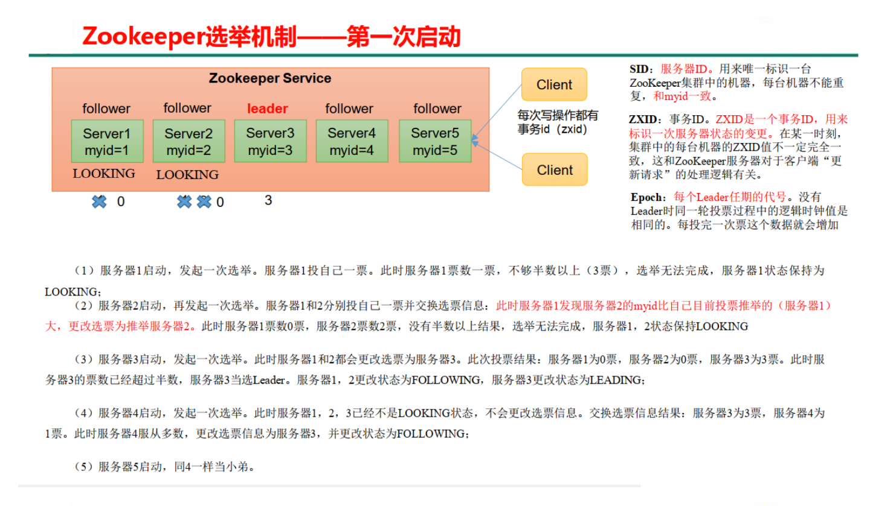


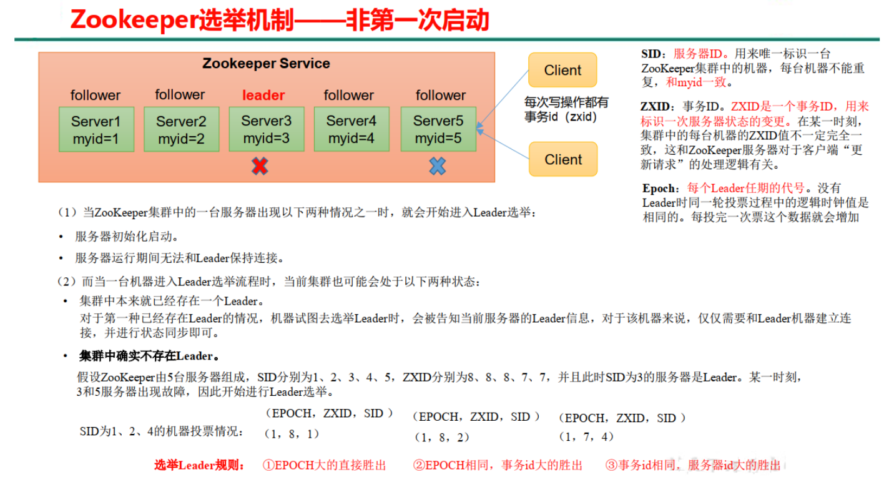

4.leader（管理节点） follower（工作节点）

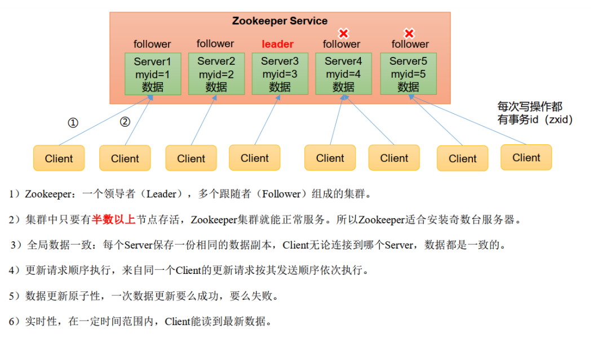


## flume

基础架构

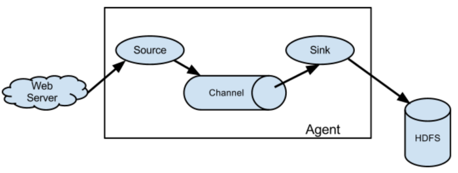

> Flume 是 Cloudera 提供的一个高可用的，高可靠的，分布式的<font color='red'>海量日志采集、聚合和传输的系统</font>。 Flume 基于流式架构，灵活简单。

1. (必考)组成：source、sink、channel

- Agent 是一个 JVM 进程，它以事件的形式将数据从源头送至目的。Agent 主要有 3 个部分组成， Source、 Channel、 Sink。

- Source 是负责接收数据到 Flume Agent 的组件。 Source 组件可以处理各种类型、各种格式的日志数 据，包括 avro、 thrift、 exec、 jms、 spooling directory、 netcat、 sequencegenerator、 syslog、 http、 legacy

- Sink 不断地轮询 Channel 中的事件且批量地移除它们，并将这些事件批量写入到存储或索引系统、或者被 发送到另一个 Flume Agent。Sink 组件目的地包括 hdfs、 logger、 avro、 thrift、 ipc、 file、 HBase、 solr、自定义 。

- Channel 是位于 Source 和 Sink 之间的缓冲区。因此， Channel 允许 Source 和 Sink 运作在不同的 速率上。 Channel 是线程安全的，可以同时处理几个 Source 的写入操作和几个Sink 的读取操作。 Flume 自带 两种 Channel： Memory Channel 和 File Channel 以及 Kafka Channel。 Memory Channel 是内存中的队 列。 Memory Channel 在不需要关心数据丢失的情景下适用。如果需要关心数据丢失，那么 Memory Channel 就不应该使用，因为程序死亡、机器宕机或者重启都会导致数据丢失。File Channel 将所有事件写到磁盘。因 此在程序关闭或机器宕机的情况下不会丢失数据。

- Event 传输单元， Flume 数据传输的基本单元，以 Event 的形式将数据从源头送至目的地。Event 由 Header 和 Body 两部分组成， Header 用来存放该 event 的一些属性，为 K-V 结构，Body 用来存放该条数据，形式为 字节数组。


2. 数据传输形式 event header（k-v）+body（byte array） （见上）


## sqoop

> Sqoop是一款开源的数据导入导出工具，主要用于在Hadoop与传统的数据库间进行数据的转换。

1. 封装了outputformat

原理是将导入或导出命令翻译成mapreduce程序来实现。

在翻译出的mapreduce中主要是对inputformat和outputformat进行定制。

2. 导入导出数据

**导入操作**

使用Sqoop将数据导入到MySQL中。请使用以下命令：

```bash
sqoop import --connect jdbc:mysql://localhost:3306/hive_data \
--username your_username --password your_password \
--table users \
--hive-import \
--hive-table users \
--as-textfile \
--target-dir /user/hive/warehouse/users \
--num-mappers 1
```

下面是命令中各个参数的说明：

- `--connect jdbc:mysql://localhost:3306/hive_data`：指定MySQL的JDBC连接URL。
- `--username your_username --password your_password`：提供连接数据库所需的用户名和密码。
- `--table users`：指明要从Hive中导出哪个表。
- `--hive-import`：指示Sqoop从Hive中导入数据。
- `--hive-table users`：指定Hive中数据表的名字。
- `--as-textfile`：导出数据为文本文件格式，您也可以选择其他格式。
- `--target-dir /user/hive/warehouse/users`：指定存放导出的数据的目标目录。
- `--num-mappers 1`：设置并发任务的数量。

案例：

create database sqoop;

use sqoop

source /home/whuc/whmc.sql

创建好emp表

通过sqoop查看MySQL中sqoop库中的表：

`bin/sqoop list-tables --connect jdbc:mysql://localhost:3306/sqoop --username root --password 111111 emp`

将emp表的数据导入到HDFS指定目录下：

`bin/sqoop import --connect jdbc:mysql://localhost:3306/sqoop --username root --password 111111 --delete-target-dir --table emp --target-dir /sqoop/emp --m 1`

查看导出结果：

`hadoop fs -cat /sqoop/emp/part-m-00000`


**导出操作**

```bash
sqoop export \
    --connect "jdbc:mysql://localhost:3306/your_database" \ # JDBC 连接字符串
    --username your_username \ # 数据库用户名
    --password your_password \ # 数据库密码
    --table your_table_name \ # 要导入的目标表
    --export-dir /path/to/hdfs/data \ # HDFS 上的数据路径
    --input-fields-terminated-by ',' \ # 输入文件分隔符
    --batch # 批量导入
```

- `--connect`: 指定 MySQL 数据库的连接字符串。
- `--username`: 指定 MySQL 数据库用户名。
- `--password`: 指定 MySQL 数据库密码，该信息应保密。
- `--table`: 指定要导入数据的目标表名。
- `--export-dir`: 指定 HDFS 上的数据目录路径。
- `--input-fields-terminated-by`: 指定输入文件的字段分隔符，通常是逗号或制表符。
- `--batch`: 使 Sqoop 以批量方式插入数据，提高性能。

在 MySQL 命令行或者工具中，运行如下 SQL 查询，确保数据已成功导入：

```sql
SELECT * FROM your_table_name LIMIT 10; -- 查询目标表的前10条数据
```


## azkaban

> Azkaban是由Linkedin开源的一个批量工作流任务调度器

任务流调度框架
描述任务之间的依赖关系
	通过一个简单的key:value对的配置文件来定义任务之间的依赖关系。
	在这个配置文件中，可以通过dependencies属性来设置一个或多个前置任务，从而建立任务之间的依赖关系。

详细查看[Azkaban实战一节](https://www.cnblogs.com/liugp/p/16273966.html)

## 题型

选择10 x2 
填空10 x 2
简答 6 x 5
编程 15 x 2


​	

