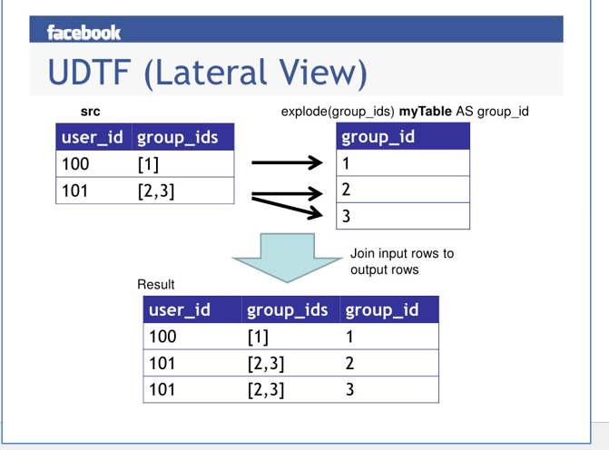

## HQL实战

### HDFS的Shell操作

文件系统（FS）Shell包含了各种的类Shell的命令，可以直接与Hadoop分布式文件系统以及其他文件系统进行交互。


### 实战

1、在本地Linux下`/opt/datas`目录下创建文件`mr_data.txt`，内容如下：


Herman Carson Jenny Kafka

Tom Jenny Herman

Jason Herman Tom

Kafka Carson Herman Tom


使用HDFS shell命令将`mr_data.txt`文件上传到HDFS文件系统下的`/inputdata`目录下


2、在终端使用HDFS shell命令：`-text` 查看`mr_data.txt`文件的内容


3、在终端使用HDFS shell命令创建级联文件夹`/inputdata/wc_input/hive`


4、在终端使用HDFS shell命令将`/inputdata/wcinput.txt`文件 移动到`/inputdata/wc_input/hive`文件夹下面

#### HQL语法实战

#### 常用交互命令

`[hadoop@master data]$ hive -help`


1）“-e”不进入 hive 的交互窗口执行 sql 语句：

`hive -e "select word, count(*) from hive_wordcount lateral view explode(split(context,' ')) wc as word group by word;"`


2）“-f”执行脚本中 sql 语句：

（1）在`/opt/modules/hive312/`下创建 datas 目录并在 datas 目录下创建 hive.sql 文件：[hadoop@master datas]$ touch hive.sql


（2）文件中写入正确的 sql 语句

`select word, count(*) from hive_wordcount lateral view explode(split(context,' ')) wc as word group by word;`

（3）执行文件中的 sql 语句

`[hadoop@master datas]$ hive -f /opt/modules/hive312/datas/hive.sql`


（4）执行文件中的 sql 语句并将结果写入文件中

`hive -f /opt/modules/hive312/datas/hive.sql > /opt/datas/hive_result.txt`

#### Hive数据类型

**基本数据类型**


**集合数据类型**


Hive有三种复杂数据类型ARRAY、MAP和STRUCT。ARRAY和MAP与JaVa中的Array和Map类似，而STRUCT与C语言中的Struct类似，它封装了一个命名字段集合，复杂数据类型允许任意层次的嵌套。

#### DDL 数据定义

创建数据库

```sql
CREATE DATABASE [IF NOT EXISTS] database_name

[COMMENT database_comment]

[LOCATION hdfs_path]

[WITH DBPROPERTIES (property_name=property_value, ...)];
```


1）创建一个数据库，数据库在HDFS上的默认存储路径是`/user/hive/warehouse/*.db`。

`hive (default)> create database db_hive;`


2）避免要创建的数据库已经存在错误，增加` if not exists `判断。（标准写法）

hive (default)> create database db_hive;

FAILED: Execution Error, return code 1 from 

org.apache.hadoop.hive.ql.exec.DDLTask. Database db_hive already exists

`hive (default)> create database if not exists db_hive;`


3）创建一个数据库，指定数据库在HDFS上存放的位置

`hive (default)> create database db_hive2 location '/db_hive2.db';`

#### DDL之数据库操作


1）显示数据库

`hive> show databases;`


2）过滤显示查询的数据库

`hive> show databases like 'db_hive*';`


3）显示数据库信息

`hive> desc database db_hive;`


4）显示数据库详细信息，`extended`

`hive> desc database extended db_hive;`


5）切换当前数据库

`hive (default)> use db_hive;`


6）修改数据库

用户可以使用 `ALTER DATABASE` 命令为某个数据库的 DBPROPERTIES 设置键-值对属性值，来描述这个数据库的属性信息：

`alter database db_hive set dbproperties('createtime'='20170830');`


在 hive 中查看修改结果

`hive> desc database extended db_hive;`


7）删除空数据库

`hive>drop database db_hive;`


如果删除的数据库不存在，最好采用 `if exists `判断数据库是否存在

``hive> drop database if exists db_hive2;``


如果数据库不为空，可以采用 `cascade `命令，强制删除：

`hive> drop database db_hive cascade;`


## Hive高级操作（一）

### **[建表语法](http://www.youbaobao.xyz/datav-next/)**

```sql
CREATE [EXTERNAL] TABLE [IF NOT EXISTS] table_name

[(col_name data_type [COMMENT col_comment], ...)]

[COMMENT table_comment]

[PARTITIONED BY (col_name data_type [COMMENT col_comment], ...)]

[CLUSTERED BY (col_name, col_name, ...)

[SORTED BY (col_name [ASC|DESC], ...)] INTO num_buckets BUCKETS]

[ROW FORMAT row_format]

[STORED AS file_format]

[LOCATION hdfs_path]

[TBLPROPERTIES (property_name=property_value, ...)]

[AS select_statement]
```

#### 字段说明

（1）CREATE TABLE 创建一个指定名字的表。如果相同名字的表已经存在，则抛出异常；用户可以用 IF NOT EXISTS 选项来忽略这个异常。

（2）EXTERNAL 关键字可以让用户创建一个外部表，在建表的同时可以指定一个指向实际数据的路径（LOCATION），在删除表的时候，内部表的元数据和数据会被一起删除，而外部表只删除元数据，不删除数据。

（3）COMMENT：为表和列添加注释。

（4）PARTITIONED BY 创建分区表

（5）CLUSTERED BY 创建分桶表

（6）SORTED BY 不常用，对桶中的一个或多个列另外排序

（7）ROW FORMAT 

```sql
DELIMITED [FIELDS TERMINATED BY char] [COLLECTION ITEMS TERMINATED BY char]

 [MAP KEYS TERMINATED BY char] [LINES TERMINATED BY char]

 | SERDE serde_name [WITH SERDEPROPERTIES (property_name=property_value, 

property_name=property_value, ...)]
```

用户在建表的时候可以自定义 SerDe 或者使用自带的 SerDe。如果没有指定 ROW FORMAT 或者 ROW FORMAT DELIMITED，将会使用自带的 SerDe。在建表的时候，用户还需要为表指定列，用户在指定表的列的同时也会指定自定义的 SerDe，Hive 通过 SerDe 确定表的具体的列的数据。SerDe 是 Serialize/Deserilize 的简称， hive 使用 Serde 进行行对象的序列与反序列化。

（8）STORED AS 指定存储文件类型

常用的存储文件类型：SEQUENCEFILE（二进制序列文件）、TEXTFILE（文本）、RCFILE（列

式存储格式文件）

如果文件数据是纯文本，可以使用STORED AS TEXTFILE。如果数据需要压缩，使用 STORED 

AS SEQUENCEFILE。 


（9）LOCATION ：指定表在HDFS上的存储位置。


（10）AS：后跟查询语句，根据查询结果创建表。


（11）LIKE 允许用户复制现有的表结构，但是不复制数据。

#### 随手练

创建一个数据库：student_info，然后在该数据库下创建表student，数据从本地Linux文件系统导入

1.创建数据库：

`create database if not exists student_info;`

创建student_local表：

```sql
create table if not exists student_local(

name string, 

age int
)

row format delimited fields terminated by ' '

lines terminated by '\n'

stored as textfile;
```


2.在本地/opt/datas文件夹下创建一个数据文件student.txt，文件两列name和age，使用空格隔开，

行采用回车符隔开：

Herman 28

Susan 21

spark 23

Tom 32

Jemy 25


3.从本地文件系统导入：

执行load data local inpath '/opt/datas/student.txt' into table student_local;

即可将本地Linux系统中的文件的数据导入到Hive表中：


从本地文件系统导入数据到Hive表中时，文件的路径必须使用绝对路径，比如这里：/opt/datas/student.txt

有两种方式验证数据是否导入成功，一种是在Hive中执行select * from student_local：

另外一种是查看hdfs文件系统中的student_local目录下面是否有刚刚上传的student.txt文件，查看命令为：

`hadoop fs -ls /user/hive/warehouse/student_local`

（删掉student_local）

#### 作业详解

要求1：创建work_local数据库，指定其位置存放在HDFS的根目录下：/work_local.db

使用相关命令查看数据库的详细信息，并修改数据库的创建时间为20201111


`create database if not exists work_local location '/work_local.db'`


`alter database work_local set dbproperties('createtime'='20201111');`


`desc database extended work_local;`


要求2：使用建表语句在work_local数据库下分别创建部门表dept和员工表emp，并向表中导入数据。


dept表的数据内容如下，三个字段分别为：deptno 部门编号，dname 部门名称 loc部门所在地

```sql
create table if not exists dept(

deptno int,

dname string,

loc int

)
row format delimited fields terminated by ' ';
```

emp表的数据内容如下：

七个字段分别为：empno 员工编号 ename 员工姓名 job 员工职位 mgr 

hiredate 入职时间 sal 薪资待遇 comm 津贴 deptno 所属部门

```sql
create table if not exists emp(

empno int,

ename string,

job string,

mgr int,

hiredate string,

sal double,

comm double,

deptno int)

row format delimited fields terminated by ' ';
```


在本地/opt/datas文件夹下分别创建文件emp.txt，dpt.txt；

使用load命令将上述数据分别导入到表dept和emp中

\#emp

`hive (work_local)> load data local inpath '/opt/datas/emp.txt' into table emp;`

\#dept

`hive (work_local)> load data local inpath '/opt/datas/dept.txt' into table dept;`


3.分别使用hdfs命令和select命令查看导入数据是否成功

`select * from emp;`

`select * from dept;`

`hdfs dfs -ls /work_local.db`

#### 小结

在Hive中创建的数据库和数据表实际相当于HDFS上的文件夹，

数据库以database_name.db的文件夹形式存在，可以仔细观察:

数据表相当于数据库的子文件夹，而Hive表中的数据就相当于存储在HDFS上的文件。


### 内部表和外部表

**内部表**

默认创建的表都是所谓的管理表，有时也被称为内部表(所以内部表和管理表的概念是一样的)。因为这种表，Hive会（或多或少地）控制着数据的生命周期。Hive 默认情况下会将这些表的数据存储在由配置项

hive.metastore.warehouse.dir(例如，/user/hive/warehouse)所定义的目录的子目录下。

当我们删除一个管理表时，Hive也会删除这个表中数据，管理表不适合和其他工具共享数据。


**外部表**

每天将收集到的网站日志定期流入 HDFS 文本文件。在外部表（原始日志表）的基础上

做大量的统计分析，用到的中间表、结果表使用内部表存储，数据通过SELECT+INSERT进入内部表。


#### **外部表测试**

1.1 在default数据库下创建一个外部表：

```sql
create external table if not exists student_external(

name string, age int)

row format delimited fields terminated by ' '

lines terminated by '\n'

stored as textfile;
```

1.2 加载数据到student_external外部表中：

首先在HDFS上的根目录创建文件夹/externaldata

`hdfs dfs -mkdir /externaldata`


然后将准备好的数据传到/externaldata目录中：

`hdfs dfs -put /opt/datas/student.txt /externaldata`


然后加载数据：

`load data inpath '/externaldata/student.txt' into table student_external;`

最后来查询数据：`select * from student_external;`

使用 `desc formatted student_external `观察输出结果


同时观察到由于student_external是在default数据库下创建的，

所以可以直接在/user/hive/warehouse中发现文件夹

student_external，里面的student.txt就是外部表student_external的数据，

原始路径/externaldata下的student.txt发现就没有了。


1.3 删除刚才创建好的外部表：`drop table student_external; `使用show tables命令发现表也被删除了，去HDFS上观察

student_external外部表的数据是否还存在？

发现在/user/hive/warehouse/student_external路径下，依然存在表数据！得到结论：

<font color='red'>删除内部表会直接删除元数据（metadata）及存储数据；删除外部表仅仅会删除元数据，HDFS上的文件并不会被删除，但truncate命令会删除这两者全部数据</font>

#### **内部表和外部表的区别：**

内部表数据存储的位置是hive.metastore.warehouse.dir（默认：/user/hive/warehouse），外部表数据的存储位置由自己制定（如果没有LOCATION，Hive将在HDFS上的/user/hive/warehouse文件夹下以外部表的表名创建一个文件夹，并将属于这个表的数据存放在这里）；

**删除内部表会直接删除元数据（metadata）及存储数据；删除外部表仅仅会删除元数据，HDFS上的文件并不会被删除；**

**对内部表的修改会将修改直接同步给元数据，而<font color='red'>对外部表的表结构和分区进行修改，则需要修复</font>（MSCK REPAIR TABLE table_name;）**


1.4 紧接着我们再重新创建这个刚才删除的外部表，但是这次不再

load数据了，看看执行完创建表语句后，能不能马上查询到数据：

```sql


create external table if not exists student_external(

name string, age int)

row format delimited fields terminated by ' '

lines terminated by '\n'

stored as textfile;
```

紧接着查询：

`select * from student_external;`

发现重新创建这张外部表后，在不导入数据的情况下，居然可以直接查询到这张外部表中的数据！

这是因为在HIVE中新建表后，Hive引擎会自动从default数据库的HDFS文件路径

（/user/hive/warehouse/db_name.db/table_name）location数据，之前删除的外部表student_external中的

数据刚好又存在这个对应路径下，所以再重新创建这张删除的外部表后，可以直接查询出数据。


#### 内部表和外部表的转换

1 修改内部表 hive_wordcount为外部表：

`alter table hive_wordcount set tblproperties('EXTERNAL'='TRUE');`


2 修改外部表 student2 为内部表：

`alter table student_hdfs_external set tblproperties('EXTERNAL'='FALSE');`


> 注意：('EXTERNAL'='TRUE')和('EXTERNAL'='FALSE')为固定写法，==区分大小写==


### 列信息的修改

#### **重命名列信息**

1）语法

`ALTER TABLE table_name RENAME TO new_table_name`


2）实操案例

`alter table hive_wordcount rename to hive_wordcount666;`

#### **增加/修改/替换列信息**（标红重点为<font color='red'>**CHANGE和ADD|REPLACE**</font>）

（1）更新列

```sql
ALTER TABLE table_name CHANGE [COLUMN] col_old_name col_new_name 

column_type [COMMENT col_comment] [FIRST|AFTER column_name]
```

（2）增加和替换列

```sql
ALTER TABLE table_name ADD|REPLACE COLUMNS (col_name data_type [COMMENT 

col_comment], ...) 
```

> 注：ADD 是代表新增一字段，字段位置在所有列后面(partition列前)，REPLACE 则是表示替换表中所有字段。 


（1）查询表结构

hive (work_local)> desc dept;

（2）添加列

hive (work_local)> alter table dept add columns(deptdesc string);

（3）查询表结构

hive> desc dept;

（4）更新列

hive (work_local)> alter table dept change column deptdesc desc string; 

备注：将原始列名由deptdesc修改为desc

（5）查询表结构

hive (work_local)> desc dept;

（6）替换列

hive (work_local)> alter table dept replace columns(deptno string, dname string, loc string);

replace替换了表中所有字段。

（7）查询表结构

hive (work_local)> desc dept;

### 数据导入

#### **向表中装载数据（Load）**

`load data [local] inpath '数据的 path' [overwrite] into table student [partition (partcol1=val1,…)]; `


（1）load data:表示加载数据


（2）local:表示从本地加载数据到 hive 表；否则从 HDFS 加载数据到 hive表 


（3）inpath:表示加载数据的路径


（4）overwrite:表示覆盖表中已有数据，否则表示追加


（5）into table:表示加载到哪张表


（6）student:表示具体的表


（7）partition:表示上传到指定分区

### **数据导出**

#### **将查询的结果导出到本地**

`hive (default)> insert overwrite local directory '/opt/datas/' select * from studentset;`


注意：这里会将查询的结果文件 000000_0 放到 /opt/datas/ 目录下，该目录下的所有文件和文件夹会全部被覆盖掉。

所以谨慎操作该步骤，因为使用到了overwrite关键字！


因此一般会单独创建一个export文件夹，专门用来存放导出的结果，在/opt/datas/下创建文件夹export：

然后再执行命令：

insert overwrite local directory '/opt/datas/export' select * from studentset;

### ==作业==

1.创建新数据库work_hdfs，指定其位置存放在HDFS上：/work_database/work_hdfs.db

使用命令查看该数据库的详细信息，设置该数据库的创建时间为20210618

```sql
create database if not exists work_hdfs location '/work_database/work_hdfs.db';

desc database extended work_hdfs;

```

在该数据库下新建员工表emp，表类型为外部表，在创建该表时，使用location

关键字指定表数据的来源(不使用load data加载)，数据来源为HDFS路径：/work_data/emp_dept/emp.txt

```sql
create external table if not exists work_hdfs.emp(
empno int,
ename string,
job string,
mgr int,
hiredate string,
sal double,
comm double,
deptno int)
row format delimited fields terminated by ' '
location '/work_data/emp_dept';

```

2.在数据库work_hdfs上创建部门表dept表，表类型为内部表，使用load data的方式从HDFS上加载数据，

数据来源的HDFS路径为：/workdata/dept.txt

```sql

create table if not exists work_hdfs.dept(
deptno int,
dname string,
loc int
)
row format delimited fields terminated by ' ';

load data inpath '/workdata/dept.txt' into table work_hdfs.dept;

```

3.创建完毕后，使用相关命令查看emp表和dept表的详细信息。

`desc extended emp`

`desc  extended dept`

4.在数据库work_hdfs再创建一个外部表dept_hdfs_external，通过location来指定数据的加载路径，

```sql
create table if not exists work_hdfs.dept_hdfs_external(
deptno int,
dname string,
loc int
)
row format delimited fields terminated by ' '
location '/dept_data/';

```

数据来源的HDFS路径为：/dept_data/dept.txt，打印输出外部表dept_hdfs_external的表数据来源完整路径。 

`desc formatted dept_hdfs_external`

5.修改emp表名为emp_external，修改dept表名为dept_managed

```sql
alter table emp rename to emp_external;

alter table dept rename to dept_managed;

```

6.给emp表增加2列：jobdesc 工作描述  emplevel 员工级别；将emp表中新增列的列名由emplevel修改为level

```sql
alter table emp_external add columns(jobdesc string,emplevel string);

alter table emp_external change column emplevel level string; 

```

7.使用as select完成表的创建和数据加载，原始表为dept_hdfs_external，新的表名为:dept_hdfs_copy，

字段和原始表保持一致。

```sql
create table if not exists dept_hdfs_copy
as select deptno, dname, loc from dept_hdfs_external;

```

8.查询emp表的员工编号、员工姓名、所属上级以及所属部门，将查询的结果格式化导出到本地目录：/opt/datas/export，

字段与字段的分隔符为\t，**<font color='red'>使用cat命令查看导出的结果</font>**。

```sql
insert overwrite local directory '/opt/datas/export'
ROW FORMAT DELIMITED FIELDS TERMINATED BY '\t'
select empno,ename,mgr,deptno from emp_external;


```

9.修改内部表dept为外部表；修改外部表emp表为内部表

```sql
alter table dept_managed set tblproperties('EXTERNAL'='TRUE');

alter table emp_external set tblproperties('EXTERNAL'='FALSE');
```


## Hive的查询

### 基本查询

#### 语法

```sql
SELECT [ALL | DISTINCT] select_expr, select_expr, ...

FROM table_reference

[WHERE where_condition]

[GROUP BY col_list]

[ORDER BY col_list]

[CLUSTER BY col_list

| [DISTRIBUTE BY col_list] [SORT BY col_list]

]

[LIMIT number]
```

#### ==全表和特定列查询==

SQL单表查询中关键字的优先级==(很重要)==：

```sql
SELECT 字段1,字段2... FROM 表名

​         WHERE 约束条件(表中原始字段)

​         GROUP BY field(表中原始字段)

​         HAVING 过滤条件

​         ORDER BY field(排序字段)

​         LIMIT 限制条数
```


根据上面的单表查询语法，其优先级分别为：首先会执行from 表名，即找到表，然后通过where条件来过滤掉一部分数据，

注意这里where条件使用的是原始表中的字段进行过滤，；然后再进行分组操作，执行group by操作，分组完毕后使用having关键字对分组后的结果进行过滤，注意这里和where条件过滤不同，这里一般是对聚合函数进行过滤。

执行完having子句后，接下来是去显示我们的字段，例如要求查询的字段1，字段2，字段3等。在这一步，我们是可以给字段改名称的，因为后面order by有可能根据这个字段进行排序，如果原始名称比较长，那么排序的时候，写的SQL语句比较臃肿。接下来执行order by子句，最后是执行limit操作。


综上所述，我们来总结下这几个关键字的执行顺序、：

1.找到表:from

2.拿着where指定的约束条件，去文件/表中取出一条条记录

3.将取出的一条条记录进行分组group by，如果没有group by，则整体作为一组

4.将分组的结果进行having过滤

5.执行select

6.去重DISTINCT

7.将结果按条件排序：order by

8.限制结果的显示条数


#### 练习

1）全表查询

hive (default)> select * from emp;

hive (default)> select empno,ename,job,mgr,hiredate,sal,comm,deptno from emp;

2）选择特定列查询

hive (default)> select empno, ename from emp;

1.2 列别名

1）重命名一个列

2）便于计算

3）紧跟列名，也可以在列名和别名之间加入关键字‘AS’

4）案例实操

查询名称和部门

hive (default)> select ename AS name, deptno dn from emp;

#### 算数运算符

```sql
运算符  描述

A+B  A 和 B 相加

A-B   A 减去 B

A*B   A 和 B 相乘

A/B   A 除以 B

A%B  A 对 B 取余

A&B  A 和 B 按位取与

A|B    A 和 B 按位取或
 
A^B   A 和 B 按位取异或

~A   A 按位取反
```

案例实操：查询出所有员工的薪水后加 1 显示

hive (default)>; select sal +1 from emp

#### 常用函数（函数中的每个字段应该是独一无二的，没有和其他重复的）

1）查询总共有多少个工作

hive (default)> select **count**(job) from emp; 思考这样写对吗？

select count(distinct job) from emp; 

2）求工资的最大值（max）

hive (default)> select **max**(sal) max_sal from emp;

3）求工资的最小值（min）

hive (default)> select **min**(sal) min_sal from emp;

4）求工资的总和（sum）

hive (default)> select **sum**(sal) sum_sal from emp; 

5）求工资的平均值（avg）

hive (default)> select **avg**(sal) avg_sal from emp;

#### limit语句

典型的查询会返回多行数据。LIMIT 子句用于限制返回的行数。

hive (default)> select * from emp limit 5;


#### where语句

1）使用 WHERE 子句，将不满足条件的行过滤掉

2）WHERE 子句紧随 FROM 子句


3）案例实操

查询出薪水大于 2000 的所有员工姓名、工作岗位和薪资待遇

hive (default)> select ename,job,sal as emp_sal from emp where sal > 2000;


<font color='red'>注意：where 子句中不能使用字段别名,要使用表中的原始字段，</font>

比如如下的测试就会报错：

hive (default)> select ename,job,sal as emp_sal from emp where emp_sal > 2000;

#### 比较运算符

1）谓词操作符的描述见文件，这些操作符同样可以用于 JOIN…ON 和 HAVING 语句中。


2）案例实操

（1）查询出薪水等于 3000 的所有员工

hive (default)> select * from emp where sal =3000;


（2）查询工资在 500 到 1000 的员工信息

hive (default)> select * from emp where sal between 500 and 1000;


（3）查询 comm 为空的所有员工信息，查询字段为：ename,sal,comm

hive (default)> select ename,sal,comm from emp where comm is null;


（4）查询工资是 1500 或 3000 或 5000 的员工姓名、工作岗位和薪资待遇

hive (default)> select ename,job,sal from emp where sal IN (1500, 3000,5000);

####  **Like 和 ==RLike==**

1）使用 LIKE 运算选择类似的值

2）选择条件可以包含字符或数字:

==**% 代表零个或多个字符(任意个字符)。**==

==**_ 代表一个字符。**==

3）RLIKE 子句

RLIKE 子句是 Hive 中这个功能的一个扩展，其可以通过 Java 的正则表达式这个更强大

的语言来指定匹配条件。


4）案例实操

（1）查找名字以 A 开头的员工信息

hive (default)> select * from emp_external where ename LIKE 'A%';

（2）查找名字中第二个字母为 A 的员工信息

hive (default)> select * from emp_external where ename LIKE '_A%';

（3）查找名字中带有 A 的员工信息

hive (default)> select * from emp_external where ename RLIKE '[A]';

#### **逻辑运算符（And/Or/Not）**

操作符   含义

AND   逻辑并

OR    逻辑或

NOT   逻辑否


1）案例实操


（1）查询薪水大于 1000，部门是 30

hive (default)> select * from emp_external where sal>1000 and deptno=30;


（2）查询薪水大于 1000，或者部门是 30

hive (default)> select * from emp where sal>1000 or deptno=30;


（3）查询除了 20 部门和 30 部门以外的员工信息

hive (default)> select * from emp where deptno not IN(30, 20);

### 分组

#### **Group By 语句**

GROUP BY 语句通常会和聚合函数一起使用，按照一个或者多个列队结果进行分组，然

后对每个组执行聚合操作。

分组的目的在于一类一类去处理，例如我想统计各个部门的最高工资，

我想统计男女的人数等等。

在分组完毕后，我们是以组为单位来处理数据，而不是来单独处理每条记录。

1）案例实操：

（1）计算 emp 表每个部门的平均工资

hive (default)> 

select deptno,avg(sal) from emp_external group by deptno;

select e.deptno, avg(e.sal) avg_sal from emp_external e group by e.deptno;

select deptno, avg(sal) from emp group by deptno;

（2）计算 emp表中每个部门中每个岗位的最高薪水

hive (default)> 

==注意(很重要)：在使用group by的分组子句中，select后面的字段要么是分组字段，==

==例如这里的post,要么是聚合函数产生的字段！！==

select e.deptno, e.job, max(e.sal) max_sal from emp_external e group by e.deptno, e.job;

select * from emp group by 

==列出每个部门薪水最高的前两名人员名称以及薪水==

`select ename,sal`

`from`

`(select ename,sal,deptno,row_number() over(partition by deptno order by sal desc) as rk from emp_external) as t where rk<=2;`

​    

   

select * from emp e left join dept d on e.deptno = d.deptno where d.dname = 'SALES';


3.2 按照别名排序


按照员工薪水的 2 倍排序

select ename, sal*2 twosal from emp order by twosal;


3.3 多个列排序


按照部门和工资==升序排序（默认是asc）== 

select ename, deptno, sal from emp order by deptno, sal;


#### having和where不同点

1）having 与 where 不同点

==**（1）<font color='red'>where 后面不能写分组函数</font>，而 having 后面可以使用分组函数。**==

==**（2）having 只用于 group by 分组统计语句。**==

2）案例实操

求每个部门的平均工资

select deptno, avg(sal) from emp group by deptno;

求平均薪水大于 2000 的部门

SELECT  dept,avg(sal)  avgSal   from emp group by dept  having avgSal  > 2000

### ==作业==

1.查询各种工作的最低薪资待遇


select job, min(e.sal) job_min_sal from emp e group by job;


求每个部门的平均薪水大于 2000 的部门

hive (default)> select deptno, avg(sal) avg_sal from emp group by 

deptno having avg_sal > 2000;


2.查询最低薪资待遇大于1500的各种工作


select job,min(e.sal) job_min_sal from emp e group by job having job_min_sal > 1500;


3.查询每个部门的经理(job='MANAGER')的平均薪资待遇


select deptno, avg(sal) manager_avg_sal from emp where job='MANAGER' group by deptno;


4.查询所有员工的年薪,结果按照年薪降序排序

备注：


==nvl函数：空值转换函数==


函数形式：nvl（expr1，expr2），类似于mysql-nullif（expr1，expr2）

作用：将查询为Null值转换为指定值。


若expr1为Null，则返回expr2，否则返回expr1。


适用于数字型、字符型和日期型，但是expr1和expr2的数据类型必须为相同类型。


年薪的计算表达式为：(sal+nvl(comm,0))*12


select empno,ename,(sal+nvl(comm,0))*12 income from emp order by

income desc;

5.查询每种工作有多少个员工，查询结果按降序排序：


select job, count(empno) as count_emp from emp

group by job

order by count_emp desc;


6.统计出每个岗位的最高工资和平均工资

select job, max(sal) job_max_sal, avg(sal) as job_avg_sal

from emp

group by job;

## **JOIN**

### join

#### **等值 Join****：**

Hive 支持通常的 SQL JOIN 语句。


1）案例实操

（1）根据员工表和部门表中的部门编号相等，查询员工编号、员工名称、部门编号和部门名称；

select e.empno,e.ename,e.deptno,d.dname

from emp e 

join dept d

on e.deptno=d.deptno;

#### **表的别名****：**

1）好处

（1）使用别名可以简化查询。

（2）使用表名前缀可以提高执行效率。


2）案例实操


合并员工表和部门表：这里使用到了内连接

select e.ename,e.empno,e.sal,e.deptno,d.dname from emp e join dept d on e.deptno = d.deptno;

#### **内连接****：**

==内连接：只有进行连接的两个表中都存在与连接条件相匹配的数据才会被保留下来。==


hive (default)> select e.empno, e.ename, d.deptno from emp e join dept d 

on e.deptno = d.deptno;


#### **左外连接****：**

==允许左边为null==

==左外连接：左表的所有记录都会被保留下来，没有匹配到的，以null显示:==


hive (default)> select e.empno,e.ename,e.sal,d.deptno,d.dname from emp e left join dept d 

on e.deptno = d.deptno;

#### **右外连接****：**

==允许右边为null==

==右外连接：右表的所有记录都会被保留下来，没有匹配到的，以null显示：==


hive (default)> 

select e.empno,e.ename,e.sal,d.deptno,d.dname 

from emp e right join dept d 

on e.deptno = d.deptno;

####  **满外连接****：**

满外连接：将会返回所有表中符合 WHERE 语句条件的所有记录。如果任一表的指定字

段没有符合条件的值的话，那么就使用 NULL 值替代。

hive (default)> select e.empno, e.ename, d.deptno from emp e full join 

dept d on e.deptno = d.deptno;


### **排序**

#### **全局排序（Order By）****：**

==Order By：全局排序，只有一个 Reducer== 

1）使用 ORDER BY 子句排序

ASC（ascend）: 升序（默认）

DESC（descend）: 降序


2）ORDER BY 子句在 SELECT 语句的结尾

3）案例实操

（1）查询员工信息按工资升序排列

hive (default)> select ename,job,sal,comm from emp order by sal;

（2）查询员工信息按工资降序排列

hive (default)> select ename,job,sal,comm from emp order by sal desc;

#### **每个 Reduce 内部排序（Sort By）****：**

Sort By：对于大规模的数据集 order by 的效率非常低。在很多情况下，并不需要全局排

序，此时可以使用 sort by。


==Sort by 为每个 reducer 产生一个排序文件。每个 Reducer 内部进行排序，对全局结果集==

==来说不是排序。==

1）设置 reduce 个数

hive (default)> set mapreduce.job.reduces=3;

2）查看设置 reduce 个数

hive (default)> set mapreduce.job.reduces;

3）根据部门编号降序查看员工信息

hive (default)> select deptno,ename,sal from emp sort by deptno desc;

select deptno,ename,sal from emp order by deptno desc;

4）将查询结果导入到文件中（按照部门编号降序排序）

hive (default)> insert overwrite local directory '/opt/datas/sortbysult'

select deptno,ename,sal from emp sort by deptno desc;

#### **分区（Distribute By）：**

Distribute By： 在有些情况下，我们需要控制某个特定行应该到哪个 reducer，通常是为了进行后续的聚集操作。distribute by 子句可以做这件事。

distribute by 类似 MR 中 partition（自定义分区），进行分区，结合 sort by 使用。

对于 distribute by 进行测试，一定要分配多 reduce 进行处理，否则无法看到 distribute by 的效果。

先测试：

select deptno,ename,sal from emp order by deptno,sal;

再测试：

select deptno,ename,sal from emp distribute by deptno sort by sal;

在测试这句话：

insert overwrite local directory '/opt/datas/distribuesult' select deptno,ename,sal from emp distribute by deptno sort by sal;

#### **Cluster By****：**

当 distribute by 和 sorts by 字段相同时，可以使用 cluster by 方式。

cluster by 除了具有 distribute by 的功能外还兼具 sort by 的功能。但是排<font color='red'>序只能是升序</font>

排序，不能指定排序规则为 ASC 或者 DESC。 

（1）以下两种写法等价

hive (default)> select deptno,ename,sal from emp cluster by deptno;

hive (default)> select deptno,ename,sal from emp distribute by deptno sort by deptno;

注意：按照部门编号分区，不一定就是固定死的数值，可以是 20 号和 30 号部门分到一

个分区里面去。

insert overwrite local directory 

'/opt/datas/clusterby-result' select deptno,ename,sal from emp cluster by deptno;


#### 总结

1.order by：对全局数据的排序，只存在一个reduce

select deptno,empno, ename,sal from emp order by empno desc; 


2.sort by：对每一个reduce内部进行排序，全局结果来说并没有

set mapreduce.job.reduces =3;

insert overwrite local directory '/opt/datas/sortby' select deptno,empno,ename,sal from emp sort by empno;

insert overwrite local directory '/opt/datas/sortby-result' select deptno,ename,sal from emp sort by deptno desc;


3.distribute by：分布式排序，类似于mapreduce中的分区功能，对数据进行分区，结合sort by

insert overwrite local directory '/opt/datas/distribute-result' select deptno,ename,sal from emp distribute by deptno sort by sal;


4.cluster by：当distribute by 和sort by ==修饰同一个字段==的时候可以直接使用


insert overwrite local directory '/opt/datas/clusterby-result' select deptno,ename,sal from emp cluster by deptno;


### ==作业==

1.查询出所有职工的编号，姓名，以及其上级的姓名。

```sql
select a.empno,a.ename,b.ename from
(select empno,ename,mgr from emp) as a
left join
(select ename,empno from emp) as b
on a.mgr=b.empno;
```

2.查询入职时间早于其上级的所有员工。

备注：入职时间的比较可以直接用类似的判断： a.hiredate>b.hiredate

```sql
select worker.ename,boss.ename
from
(select empno,ename,hiredate from emp) as boss
right join
(select mgr,ename,hiredate from emp) as worker
on boss.empno=worker.mgr
where boss.hiredate>worker.hiredate;
```

3.查询出工作岗位为SALESMAN的员工姓名、工作岗位其所在部门名称。

```sql
select t1.ename,t1.job,t2.dname
from
(select ename,job,deptno from emp where job='SALESMAN') as t1
left join
dept as t2
on t1.deptno=t2.deptno;
```

4.查询出工资待遇高于公司平均薪资待遇的员工信息

```sql
select t1.ename,t1.sal,t2.avg_sal
from
(select ename,sal,1 as cid from emp) as t1
join
(select avg(sal) avg_sal,1 as cid from emp) as t2
on t1.cid=t2.cid
where t1.sal>t2.avg_sal;

select t1.*,t2.avg_sal from  emp t1,(select avg(sal) as avg_sal from emp) t2 where t1.sal > t2.avg_sal
```

5.查询出与'ALLEN'工作职位相同的所有员工姓名。

```sql
select t1.ename
from
(select ename,job,1 as cid from emp) as t1
join
(select job,1 as cid from emp where ename='ALLEN') as t2
on t1.cid=t2.cid
where t1.job=t2.job and t1.ename!='ALLEN';


```

```sql
select t1.ename
from
(select empno,ename,job from emp) as t1
join
(select empno,job from emp where ename='ALLEN') as t2
on t1.empno=t2.empno
where t1.job=t2.job and t1.ename!='ALLEN';


```

6．查询其他部门薪资待遇等于30号部门员工薪资待遇的员工姓名和其对应的薪资。

```sql
select t1.ename,t1.sal
from emp as t1
join
(select distinct sal from emp where DEPTNO = 30) t2
on t1.sal=t2.sal
where t1.deptno!=30;
```


7. 查询出薪资待遇高于在部门30工作的员工薪资待遇的员工姓名和薪金。

```sql
select t1.ename,t1.sal
from (select ename,sal,1 as cid from emp where deptno!=30) as t1
left join
(select max(sal) as max_sal,1 as cid from emp where deptno=30) as t2
on t1.cid=t2.cid
where t1.sal>t2.max_sal;
```


8．查询每个部门的员工数量、平均薪资待遇以及平均服务时长。

备注：平均服务时长计算方式为：round(avg(datediff(current_date,hiredate)),2)

这里的round表示对于平均服务时长，结果仅取2位小数即可！

```sql
select deptno, count(*) people,avg(sal) avg_sal, round(avg(datediff(current_date,hiredate)),2) avg_time
from emp group by deptno
```

9.查询出所有部门的详细信息以及部门人数

```sql
select t1.deptno,t1.dname,t1.loc,t2.dept_emp_num
from
(select * from dept) as t1
left join
(select deptno,count(*) dept_emp_num from emp group by deptno) as t2
on t1.deptno=t2.deptno;

```


## **分区表与分桶表**

### 分区表

#### 语法规则

```
create table t_all_hero_part(
   id int,
   name string,
   hp_max int,
   mp_max int,
   attack_max int,
   defense_max int,
   attack_range string,
   role_main string,
   role_assist string
) partitioned by (role string)                  
row format delimited fields terminated by "\t";

```

> [!warning]
>
> 注意， partitioned by (role string) 这里是分区字段

- 静态加载分区表数据

`load data local inpath '/opt/datas/heros/archer.txt' into table t_all_hero_part partition(role='sheshou');`

- 查看当前表有哪些分区：

show partitions t_all_hero_part;

非分区表 全表扫描过滤查询

select count(*) from t_all_hero where role_main="archer" and hp_max >6000;

--分区表 先基于分区过滤 再查询

select count(*) from t_all_hero_part where role="sheshou" and hp_max >6000;

**增加分区**

创建单个分区

hive (default)> alter table t_all_hero_part add partition(role='soldiers');

同时创建多个分区

hive (default)> alter table t_all_hero_part add partition(role='king') partition(role='handsome');

**删除分区**

删除单个分区

hive (default)> alter table t_all_hero_part drop partition(role='soldiers');

同时删除多个分区

hive (default)> alter table t_all_hero_part drop partition(role='king'), partition(role='handsome');

#### 多重分区表

--单分区表，按省份分区

drop table if exists t_user_province;

create table t_user_province (id int, name string,age int) partitioned by (province string);

--双分区表，按省份和市分区

--<font color='red'>分区字段之间是一种递进的关系 因此要注意分区字段的顺序 谁在前在后</font>

drop table if exists t_user_province_city;

create table t_user_province_city (id int, name string,age int) partitioned by (province string, city string);

--双分区表的使用 使用分区进行过滤 减少全表扫描 提高查询效率

select * from t_user_province_city where province= "zhejiang" and city ="hangzhou";

#### 动态分区

是否开启动态分区功能：

set hive.exec.dynamic.partition=true;


指定动态分区模式：

set hive.exec.dynamic.partition.mode=nonstrict;

--创建一张新的分区表

--执行动态分区插入

--注意下面的插入语句 分区值并没有手动写死指定

insert into table t_all_hero_part_dynamic partition(role) 

select tmp.*,tmp.role_main from t_all_hero tmp;

查看动态分区表数据：

select * from t_all_hero_part_dynamic;

hdfs dfs -text  /user/hive/warehouse/t_all_hero_part_dynamic/role=archer/000000_0


--单分区表，按省份分区

create table t_user_province (id int, name string,age int) partitioned by (province string);

--双分区表，按省份和市分区

create table t_user_province_city (id int, name string,age int) partitioned by (province string, city string);

--三分区表，按省份、市、县分区

create table t_user_province_city_county (id int, name string,age int) partitioned by (province string, city string,county string);

--多分区表的数据插入和查询使用

load data local inpath '/opt/datas/heros/user.txt' into table t_user_province partition(province='shanghai');

load data local inpath '/opt/datas/heros/user.txt' into table t_user_province_city_county partition(province='zhejiang',city='hangzhou',county='xiaoshan');

select * from t_user_province_city_county where province='zhejiang' and city='hangzhou';

### **分桶表**

#### 分桶表建表语句

--分桶表建表语句

```sql
CREATE [EXTERNAL] TABLE [db_name.]table_name

[(col_name data_type, ...)]

CLUSTERED BY (col_name)

INTO N BUCKETS;


CREATE TABLE t_usa_covid19_bucket(

   count_date string,

   county string,

   state string,

   fips int,

   cases int,

   deaths int)

CLUSTERED BY(state) INTO 5 BUCKETS; 


```

> <font color='red'>分桶的字段一定要是表中已经存在的字段，这里是根据州来进行分桶</font>

--根据state州分为5桶 每个分桶内部根据cases确诊病例数倒序排序

CREATE TABLE t_usa_covid19_bucket_sort(

   count_date string,

   county string,

   state string,

   fips int,

   cases int,

   deaths int)

`CLUSTERED BY(state)`

`sorted by (cases desc) INTO 5 BUCKETS;`


创建分桶表完毕后，可以直接使用-put上传数据，注意观察结果:

在当前的/opt/datas目录下：


hadoop fs -put us-covid19-counties.dat /user/hive/warehouse/t_usa_covid19_bucket

可以看看文件被分成5个部分没？

#### **分桶表的数据加载**

--step1:开启分桶的功能 从Hive2.0开始不再需要设置

set hive.enforce.bucketing=true;

--step2:把源数据加载到普通hive表中

drop table if exists t_usa_covid19;

CREATE TABLE t_usa_covid19(

​    count_date string,

​    county string,

​    state string,

​    fips int,

​    cases int,

​    deaths int)

row format delimited fields terminated by ",";

--将源数据上传到HDFS，t_usa_covid19表对应的路径下

hadoop fs -put us-covid19-counties.dat /user/hive/warehouse/t_usa_covid19

--step3:使用insert+select语法将数据加载到分桶表中

insert into t_usa_covid19_bucket select * from t_usa_covid19;

再来查看分桶表到底有没有数据：


select * from t_usa_covid19_bucket;


/user/hive/warehouse/t_usa_covid19_bucket


hdfs dfs -text /user/hive/warehouse/t_usa_covid19_bucket/000000_0

hdfs dfs -text /user/hive/warehouse/t_usa_covid19_bucket/000001_0

hdfs dfs -text /user/hive/warehouse/t_usa_covid19_bucket/000002_0

hdfs dfs -text /user/hive/warehouse/t_usa_covid19_bucket/000003_0

hdfs dfs -text /user/hive/warehouse/t_usa_covid19_bucket/000004_0

--基于分桶字段state查询来自于New York州的数据


select * from t_usa_covid19_bucket where state="New York";


--不再需要进行全表扫描过滤


--根据分桶的规则hash_function(New York) mod 5计算出分桶编号


--查询指定分桶里面的数据 就可以找出结果 此时是分桶扫描而不是全表扫描


## <font color='red'>函数</font>

使用<font color='red'>show functions</font>查看当下可用的所有函数；

通过**<font color='red'>describe function extended funcname</font>**来查看函数的使用方式。

Hive的函数分为两大类：<font color='red'>**内置函数**</font>（Built-in Functions）、<font color='red'>用户定义函数UDF</font>（User-Defined Functions）：

内置函数可分为：数值类型函数、日期类型函数、字符串类型函数、集合函数、条件函数等；

<font color='red'>根据函数输入输出的行数：</font>

**UDF**（User-Defined-Function）<font color='red'>普通函数</font>，一进一出


**UDAF**（User-Defined Aggregation Function）<font color='red'>聚合函数</font>，多进一出


**UDTF**（User-Defined Table-Generating Functions）<font color='red'>表生成函数</font>，一进多出


lexplode接收<font color='red'>map、array</font>font>类型的数据作为输入，然后把输入数据中的<font color='red'>每个元素拆开变成一行数据</font>，一个元素一行。

lexplode执行效果正好满足于输入<font color='red'>一行输出多行</font>，所有叫做UDTF函数。

explode(array) 将array里的每个元素生成一行；

explode(map)  将map里的每一对元素作为一行，其中key为一列，value为一列；


<font color='red'>NBA总冠军球队名单分析</font>


UDTF语法限制

1.<font color='red'>explode函数属于UDTF表生成函数</font>，explode执行返回的结果可以理解为一张虚拟的表，其数据来源于源表；

2.在select中只查询源表数据没有问题，只查询explode生成的虚拟表数据也没问题，但是<font color='red'>不能在只查询源表的时候，既想返回源表字段又想返回explode生成的虚拟表字段</font>；通俗点讲，有两张表，不能只查询一张表但是又想返回分别属于两张表的字段；


UDTF语法限制解决

1.从SQL层面上来说上述问题的解决方案是：对两张表进行join关联查询;

2.Hive专门提供了语法<font color='red'>lateral View侧视图</font>，专门用于搭配explode这样的UDTF函数，以满足上述需要。

`a  lateral view  explode(column2_name) [new_table_name]  as  [explode_column];`

```sql
SELECT  [column_name],column3_name
FROM [table_name]  a  lateral view  explode(column2_name) [new_table_name]  as  column3_name;
```


总结：

Lateral View是一种特殊的语法，主要搭配UDTF类型函数一起使用，用于解决UDTF函数的一些查询限制的问题。

一般<font color='red'>只要使用UDTF，就会固定搭配lateral view使用。</font>


l<font color='red'>将UDTF的结果构建成一个类似于视图的表，然后将原表中的每一行和UDTF函数输出的每一行进行连接，生成一张新的虚拟表</font>。这样就避免了UDTF的使用限制问题。

l使用lateral view时也<font color='red'>可以对UDTF产生的记录设置字段名称</font>，产生的字段可以用于group by、order by 、limit等语句中，不需要再单独嵌套一层子查询。




**场景**5：聚合参数不支持嵌套聚合函数
`select *avg*(*count*(***)) from student;`

​	

配合distinct关键字去重聚合--此场景下，会编译期间会自动设置只启动一个reduce task处理数据  可能造成数据拥堵

select` count(distinct sex)` as cnt1 from student;

--可以先去重 在聚合 通过子查询完成--因为先执行distinct的时候 可以使用多个reducetask来跑数据

select count(*) as gender_uni_cntfrom (select distinct sex from student) a;


## 窗口函数

<font color='red'>窗口函数（Window functions）</font>也叫做开窗函数、OLAP函数，其最大特点是：<font color='red'>输入值是从SELECT语句的结果集中的一行或多行的“窗口”中获取的。</font>

l如果函数具<font color='red'>有OVER子句，则它是窗口函数。</font>

l窗口函数可以简单地解释为类似于聚合函数的计算函数，但是通过GROUP BY子句组合的常规聚合会隐藏正在聚合的各个行，最终输出一行，窗口函数聚合后还可以访问当中的各个行，并且可以将这些行中的某些属性添加到结果集中。


JSON数据格式是数据存储及数据处理中最常见的结构化数据格式之一，很多场景下公司都会将数据<font color='red'>以JSON格式存储在HDFS中</font>，当构建数据仓库时，需要对JSON格式的数据进行处理和分析，那么就需要<font color='red'>在Hive中对JSON格式的数据进行解析读取</font>。