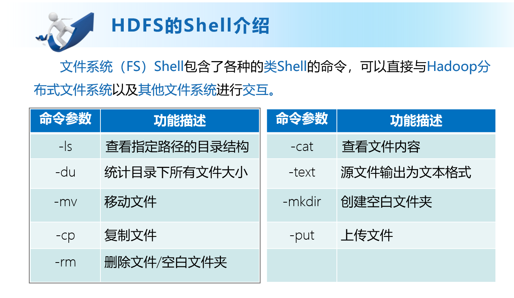

## 常用交互命令

[hadoop@master data]$ hive -help


1）“-e”不进入 hive 的交互窗口执行 sql 语句：

<font color='red'>hive -e </font> "select word, count(*) from hive_wordcount lateral view explode(split(context,' ')) wc as word group by word;"


2）“-f”执行脚本中 sql 语句：


（1）在/opt/modules/hive312/下创建 datas 目录并在 datas 目录下创建 hive.sql 文件：[hadoop@master datas]$ touch hive.sql


（2）文件中写入正确的 sql 语句

select word, count(*) from hive_wordcount lateral view explode(split(context,' ')) wc as word group by word;

（3）执行文件中的 sql 语句

[hadoop@master datas]$ hive -f /opt/modules/hive312/datas/hive.sql


（4）执行文件中的 sql 语句并将结果写入文件中

<font color='red'>hive -f   </font> /opt/modules/hive312/datas/hive.sql > /opt/datas/hive_result.txt


**数据库相关**

创建一个数据库，数据库在HDFS上的默认存储路径是/user/hive/warehouse/*.db。

create database db_hive;

创建一个数据库，指定数据库在HDFS上存放的位置

reate database db_hive2 `location '/db_hive2.db';`

显示数据库详细信息extended ：desc database extended db_hive;

修改数据库：用户可以使用 ALTER DATABASE 命令为某个数据库的 DBPROPERTIES 设置键-值对属性值，来描述这个数据库的属性信息：

alter database db_hive set dbproperties('createtime'='20170830');

强制删除 cascade: drop database db_hive cascade;

建表语句：

```sql
CREATE [EXTERNAL] TABLE [IF NOT EXISTS] table_name

[(col_name data_type [COMMENT col_comment], ...)]

[COMMENT table_comment]

[PARTITIONED BY (col_name data_type [COMMENT col_comment], ...)]

[CLUSTERED BY (col_name, col_name, ...)

[SORTED BY (col_name [ASC|DESC], ...)] INTO num_buckets BUCKETS]

[ROW FORMAT row_format]

[STORED AS file_format]

[LOCATION hdfs_path]

[TBLPROPERTIES (property_name=property_value, ...)]

[AS select_statement]
```

- EXTERNAL 关键字可以让用户创建一个外部表，在建表的同时可以指定一个指向实际数据的路径（LOCATION），在删除表的时候，内部表的元数据和数据会被一起删除，而外部表只删除元数据，不删除数据

- COMMENT：为表和列添加注释

- PARTITIONED BY 创建分区表

- CLUSTERED BY 创建分桶表

- SORTED BY 不常用，对桶中的一个或多个列另外排序

- ROW FORMAT ：

- DELIMITED [FIELDS TERMINATED BY char] [COLLECTION ITEMS TERMINATED BY char]

	 [MAP KEYS TERMINATED BY char] [LINES TERMINATED BY char]

	 | SERDE serde_name [WITH SERDEPROPERTIES (property_name=property_value, 

	property_name=property_value, ...)]

	

	用户在建表的时候可以自定义 SerDe 或者使用自带的 SerDe。如果没有指定 ROW FORMAT 或者 ROW FORMAT DELIMITED，将会使用自带的 SerDe。在建表的时候，用户还需要为表指定列，用户在指定表的列的同时也会指定自定义的 SerDe，Hive 通过 SerDe 确定表的具体的列的数据。SerDe 是 Serialize/Deserilize 的简称， hive 使用 Serde 进行行对象的序列与反序列化。

- STORED AS :指定存储文件类型

	常用的存储文件类型：SEQUENCEFILE（二进制序列文件）、TEXTFILE（文本）、RCFILE（列

	式存储格式文件）

	如果文件数据是纯文本，可以使用STORED AS TEXTFILE。如果数据需要压缩，使用 STORED 

	AS SEQUENCEFILE。 

- LOCATION ：指定表在HDFS上的存储位置。

- AS：后跟查询语句，根据查询结果创建表。

- LIKE 允许用户复制现有的表结构，但是不复制数据

