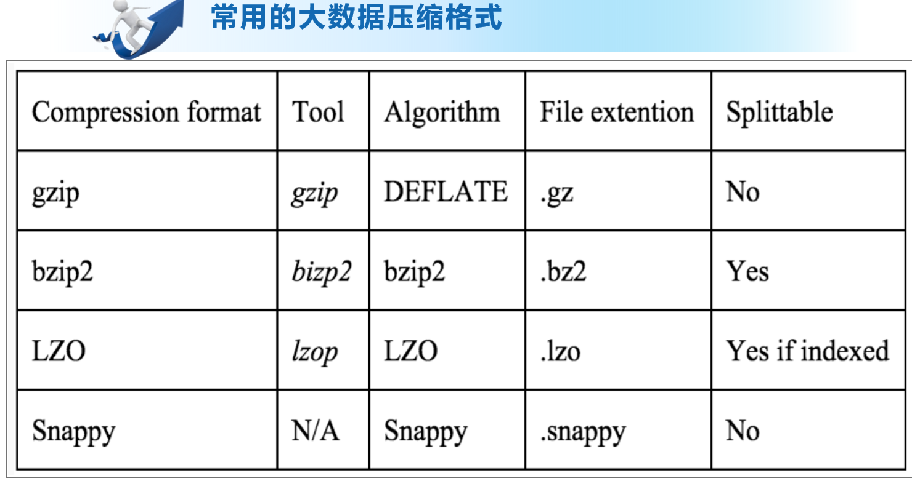

复习建议：

1.按照复习提纲，严格复习重点笔记

2.考前3天，一定要反复手写HQL语句！！！，手写课上讲过的HQL语句

3.论述题，分要点写，字迹工整，思路清晰
	1。。。。。
	2。。。。。
	3。。。。。。

## 填空题（ 2*10=20分）

> 要点：基础概念，基本理论
>
> 特点：好得分

Hive:由Facebook开源用于解决海量结构化日志的数据统计工具。
Hive是基于Hadoop的一个数据仓库工具，可以将结构化的数据文件映射为一张表，并提供类SQL查询功能。

Yarn（Yet Another Resource Negotiator）是Hadoop 2.0中的==资源管理器==

Sqoop是一款开源的数据==导入导出工具==

Hive是基于Hadoop的一个==分布式数据仓库工具==

HDFS（Hadoop Distributed Filesystem）是一个易于扩展的==分布式文件系统==

Hive 处理的数据存储在 ==HDFS==

Hive 分析数据底层的实现是 ==MapReduce==

执行程序运行在 ==Yarn== 上

**Hive优点**

（1）操作接口采用类 SQL 语法，提供快速开发的能力（简单、容易上手）。

（2）避免了去写 MapReduce，减少开发人员的学习成本。 

（3）Hive 的执行延迟比较高，因此 Hive 常用于数据分析，对实时性要求不高的场合。 

（4）Hive 优势在于处理大数据，对于处理小数据没有优势，因为 Hive 的执行延迟比较高。

（5）Hive 支持用户自定义函数，用户可以根据自己的需求来实现自己的函数。无法实现。

**Hive缺点**

Hive 的 HQL 表达能力有限

（1）迭代式算法无法表达

（2）数据挖掘方面不擅长，由于 MapReduce 数据处理流程的限制，效率更高的算法却无法实现。

Hive 的效率比较低

（1）Hive 自动生成的 MapReduce 作业，通常情况下不够智能化

（2）Hive 调优比较困难，粒度较粗

际工作中分区表常常被运用于按照**某一维度**进行统计分析的场景下，数据被按照某一个日期、年月日等等，将一个大的文件切分成一个个小文件，分而治之，这样处理起来性能就会有显著提升。

## 简答题（5*6=30分）

> 要点：
>
> 1. 内部表、外部表、分区表、分桶表
>
> 2. Hive数据表的创建、数据导入和导出
>
> 	`load data`
>
> 	`location`
>
> 	`insert`
>
> 3. HDFS shell 基本命令：增删改HDFS文件和文件夹
>
> 4. 数据表、数据库的基本操作：修改、增加和删除
>
> 5. Hive中的排序

1. 分区表一般在数据量比较大，且有明确的分区字段时使用，这样用分区字段作为查询条件查询效率会比较高。Hive分区分为静态分区和动态分区。

	1、为什么出现分区表？

	假设有海量的数据保存在hdfs的某一个hive表名对应的目录下，使用hive进行操作的时候，会搜索这个目录下的所有的文件，非常耗时。(目录下的文件数据都会被加载到hive表中）

	如果我们知道这些数据的某些特征，然后使用Hive进行操作的时候，就可以在==where子句种对这些特征进行过滤==，那么对数据的操作就会在符合条件的子目录下进行，其他不符合条件的目录下的内容就不会被读取。

	在数据量非常大的时候，这样节省大量的时间，这种把表中的数据分散到子目录下的方式就是分区表。

2. 分桶表：桶表是对某一列数据进行哈希取值以将数据打散，然后放到不同文件中存储。在Hive分区表中，分区中的数据量过于庞大时，建议使用桶。
	在分桶时，对指定字段的值进行hash运算得到hash值，并使用hash值除以桶的个数做取余运算得到的值进行分桶，保证每个桶中有数据但每个桶中的数据不一定相等。做hash运算时，hash函数的选择取决于分桶字段的数据类型，分桶后的查询效率比分区后的查询效率更高。

### 可能考

HiveQL和SQL的区别：举例说明Hie查询语言(HiveQL)和标准SQL之间的至少三个差异。

## 编程题（6*5=30分）

> 要点：
>
> 1. Hive数据库和数据表的基本操作：修改、增加和删除
> 2. Hive基础操作：分组、排序、关键字段的执行顺序
>
> 3. 窗口排序函数  +  lateral  view  +  explode

> [!caution]
>
> 注意细节：
>
> 1.按照题目要求写HQL语句，比如最终输出结果有2个字段：job和job_min_sal
>
> 2.HDFS路径严格遵循题干要求

SELECT 字段1,字段2... FROM 表名

2. 分组、排序、关键字段执行顺序

    SELECT 字段1,字段2... FROM 表名
    
    ​         WHERE 约束条件(表中原始字段)
    
    ​         GROUP BY field(表中原始字段)
    
    ​         HAVING 过滤条件
    
    ​         ORDER BY field(排序字段)
    
    ​         LIMIT 限制条数

1.找到表:from

2.拿着where指定的约束条件，去文件/表中取出一条条记录

3.将取出的一条条记录进行分组group by，如果没有group by，则整体作为一组

4.将分组的结果进行having过滤

5.执行select

6.去重DISTINCT

7.将结果按条件排序：order by

8.限制结果的显示条数

## 论述题（10*2=20分）

> 要点：
>
> 1.性能调优
>
> 2.大数据压缩格式

**大数据压缩**

压缩:使用压缩技术来把数据“减少”的过程

解压缩将压缩过后的数据转换成原始数据的过程

**为什么要使用压缩？**

（1）节省文件的存储空间

（2）加速数据在网络中的传输速度

**就是时间和空间的取舍和博弈**

两种常用的压缩技术：

1.无损压缩(不会有任何数据的丢失，即原始数据和压缩后的数据在解压后一样)通常情况下，不允许有任何数据的丢失；

2.有损压缩 例如应用在图片，视频，音频(高清，超清视频等，允许数据存在小部分的丢失)

==在大数据领域通常使用的是==**无损压缩**

**压缩使用场景**：输入文件的压缩，中间结果的压缩，输出文件结果的压缩 

1、Compressing input files:对应的是mapreduce中的map端的输入，能够自动解压被压缩的文件，不需要写代码去解压被压缩的文件 

2、Compressing output files:对应的是mapreduce中的 reduce输出

3、Compressing map output ：对应的是mapreduce中的map端的输出，首先写到本地的磁盘空间中去，然后通过shuffle将数据传输到reduce端去处理。

**大数据领域的压缩注意事项**

 是否选用压缩要根据集群的实际情况考虑。

1.例如集群的存储空间不够，但是CPU的利用率不高，此时建议使用压缩，因为压缩后，能够缓解磁盘的压力，同时能够提高CPU的利用率；

2.如果集群空间足够大，但CPU的利用率已经很高了，例如已经达到90%了，那么这种情况下，就不要选用压缩，如果选择压缩，会导致CPU的压力过大。

小结：压缩比越高，压缩和解压的时间越长。压缩比和压缩速度是成反比的。

压缩比： bzip2>gzip>lzo

压缩速度：lzo>gzip>bzip2
