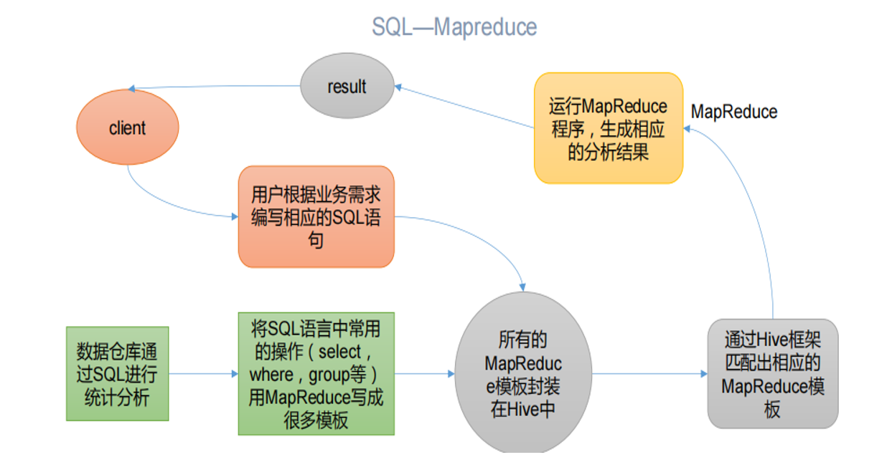

## Hive简介（选择、判断）

### Hive概述

Hive:由Facebook开源用于解决海量结构化日志的数据统计工具。
Hive是基于Hadoop的一个数据仓库工具，可以将结构化的数据文件映射为一张表，并
提供类SQL查询功能。

> 问：
>
> 1. 什么是结构化日志？
>
> 结构化日志，顾名思义不再是自由格式的日志，而是遵循了一定的结构：每一行日志就是一个结构。好处显而易见：简化日志解析，使得日志的后续处理、分析或查询变得方便高效。和结构化日志形成对比的就是传统的日志：一行或多行的字符串，字段之间主要是用空格等分隔符分隔开，输出格式自由定义。
>
> 2. 什么是数据仓库？

#### Hive 本质：将 HQL 转化成 MapReduce 程序

#### **Hive底层运行逻辑**

**（1）Hive 处理的数据存储在 HDFS**

**（2）Hive 分析数据底层的实现是 MapReduce**

**（3）执行程序运行在 Yarn 上**

#### **Hive** **优点**

**（1）操作接口采用类 SQL 语法，提供快速开发的能力（简单、容易上手）。**

**（2）避免了去写 MapReduce，减少开发人员的学习成本。** 

**（3）Hive 的执行延迟比较高，因此 Hive 常用于数据分析，对实时性要求不高的场合。** 

**（4）Hive 优势在于处理大数据，对于处理小数据没有优势，因为 Hive 的执行延迟比较高。**

**（5）Hive 支持用户自定义函数，用户可以根据自己的需求来实现自己的函数。无法实现。**

#### Hive缺点

**Hive 的 HQL 表达能力有限**

（1）迭代式算法无法表达

（2）数据挖掘方面不擅长，由于 MapReduce 数据处理流程的限制，效率更高的算法却无法实现。

**Hive 的效率比较低**

（1）Hive 自动生成的 MapReduce 作业，通常情况下不够智能化

（2）Hive 调优比较困难，粒度较粗

#### Hive和数据库比较

1.查询语句

由于SQL被广泛的应用于数据仓库，因此针对hive专门设计了类SQL的HQL查询语句，方便进行开发

2 数据存储位置

hive是建立在hadoop的基础上，hive的数据储存都是在hdfs中的，而数据库可以将数据保存在块设备或者自己的本地文件系统中

3 数据更新

hive是针对数据仓库应用设计的，数据仓库的内容是读多写少，因此hive不建议对已有的数据进行改写，因为数据都是在加载的时候确定好的

4 索引

hive没有索引，访问满足条的特定值的时候，需要暴力扫描整个数据，因此访问延迟较高

5 执行

hive大多数的查询是通过hadoop提供的MapReduce来实现的，而数据库通常有自己的执行引擎

6 执行延迟

一方面hive访问数据的时候是扫描整个数据，另一方面他的执行是通过MapReduce框架执行的，该框架本身具有延迟性

7 可扩展性

hive是基于hadoop的，所以其扩展性和hadoop一致的

8 数据规模

hive建立在集群上，并且可以利用MapReduce进行并行计算

### Hive架构

### Hive工作原理

### Hive数据类型（重点）

## Hive部署（相关配置）

### Hive-site.xml

## Hive的数据定义语言（简答）

> 参考期中考试复习

### 分区表（重点）

#### 创建分区表

#### 查询分区表

#### 添加分区

#### 重命名分区

#### 移动分区

#### 删除分区（重点）

### 分桶表（重点）

#### 创建分桶表

#### 查看分桶信息

## Hive的数据操作语言（1x简答 、 1x 编程）

## Hive数据查询语言（30分左右）

> 这里以下是小题+1道编程题

### SELECT句式分析

### Hive运算符

#### 关系运算符

#### 算术运算符

#### 逻辑运算符

#### 复杂运算符

### 公用表表达式

> 从这里开始有3道编程题，重点复习

### 分组操作

### 排序操作

### JOIN语句

## Hive函数（10-15分 1x编程 几道小题）

### Hive内置函数（1-2小题  常见的sum avg等函数）

#### 聚合函数

#### 数学函数

### Hive自定义函数（重点）

#### UDF

#### UDTF

#### UDAF

## Hive优化

## 数据存储和压缩（ppt复习）

## 综合项目（1-2小题 5分左右）
