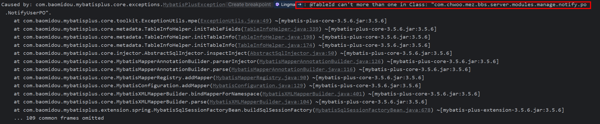

当在映射实体中使用了多个 @TableId 注解标注字段，则会出现如下错误：


修改如下：

```java
@TableName(value ="r_notify_forum")
@Data
public class NotifyForumPO implements Serializable {
   
    @TableId // [!code --]
    @TableField// [!code ++]
    private Long notifyId;
		
 
    @TableId // [!code --]
    @TableField// [!code ++]
    private Long forumId;

    @TableField(exist = false)
    private static final long serialVersionUID = 1L;
}
```


