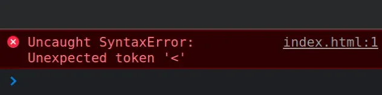
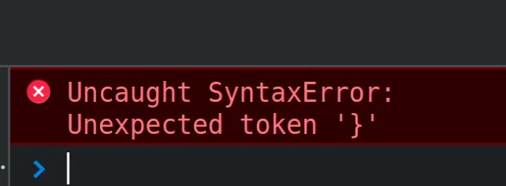
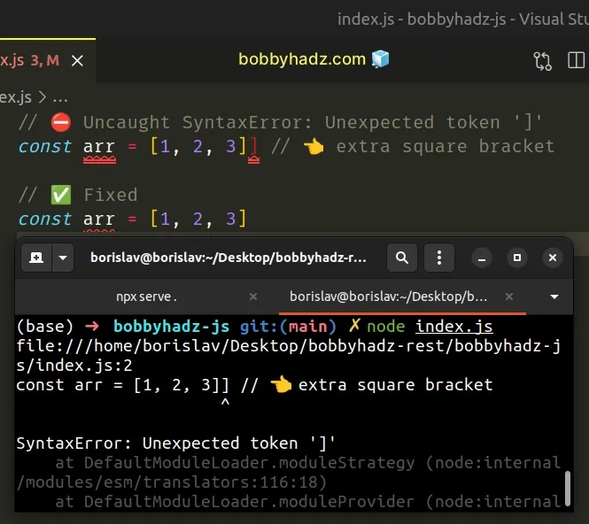
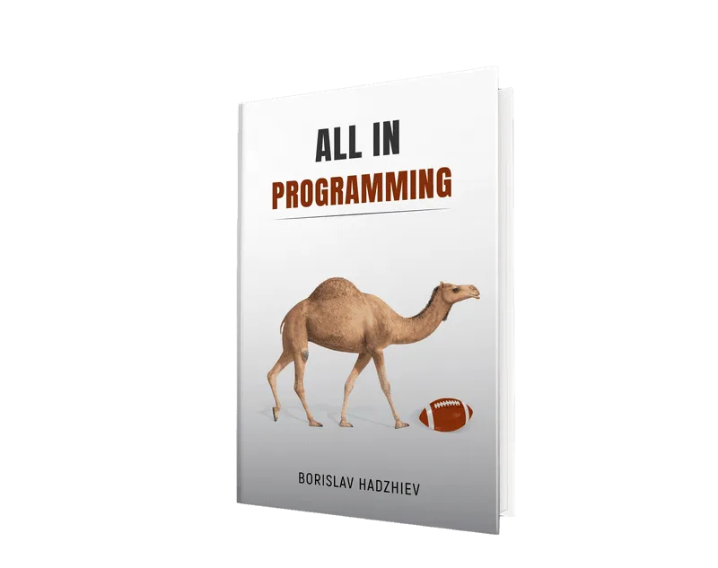

> 转载自https://bobbyhadz.com/blog/javascript-uncaught-syntaxerror-unexpected-token#syntaxerror-unexpected-token--doctype--is-not-valid-json

## Background

> 这个问题源于我在 shiro 中配置了错误的访问路径（ 即权限问题 ），导致的 js 文件不能正常访问需要授权，总归还是要细心啊。

现象是是当引入某个 js 文件到html页面中时，浏览器提示 `SyntaxError: Unexpected token in JavaScript <`，这个 `<` 符号正好在文档的第一行。也就是 html 文档标记的 tag 起始符号，问题是第二种。

相似的问题通常为`SyntaxError: Unexpected token in JavaScript \[Solved\]`

[#](#) Table of Contents
------------------------

1.  [SyntaxError: Unexpected token in JavaScript](https://bobbyhadz.com/blog/javascript-uncaught-syntaxerror-unexpected-token#syntaxerror-unexpected-token-in-javascript)
2.  [SyntaxError: Unexpected token '<', "<!DOCTYPE "... is not valid JSON](https://bobbyhadz.com/blog/javascript-uncaught-syntaxerror-unexpected-token#syntaxerror-unexpected-token--doctype--is-not-valid-json)

> Note: if you got the error **"SyntaxError: Unexpected token '<', "<!DOCTYPE "... is not valid JSON"**, click on the second subheading.

[#](#) SyntaxError: Unexpected token in JavaScript
--------------------------------------------------

**The "Uncaught SyntaxError: Unexpected token" exception occurs for multiple reasons:**

1.  A missing or extra bracket, parenthesis or comma in your code.
2.  A missing closing quote of a string literal.
3.  A `   </body> </html>`

Make sure that your `script` tags point to the correct paths and try renaming all your files to lowercase letters only.

Sometimes the error is caused if the file name contains uppercase letters or special characters.

[#](#) Make sure you haven't forgotten to close a script tag
------------------------------------------------------------

Another common cause of the error is forgetting to close a `script` tag.

index.html

Copied!

`<!DOCTYPE html> <html lang="en">   <head>     <meta charset="UTF-8" />      <!-- 👇️ Forgot to close the script tag  -->     <script       console.log("Uncaught SyntaxError: Unexpected token '<'");     </script>   </head>    <body></body> </html>`

The `<script` line should be `<script>` in the example.

[#](#) Make sure you don't have missing or extra brackets, parentheses and commas
---------------------------------------------------------------------------------

The error also occurs if you have a missing or extra bracket, parenthesis or comma.

index.js

Copied!

`// ⛔️ SyntaxError: Unexpected token '}' function sum(a, b) {   return a + b; }}`

There is an extra curly brace on the third line which caused the error.

Make sure you don't have any missing or extra square brackets in your arrays.

index.js

Copied!

`// ⛔️ Uncaught SyntaxError: Unexpected token ']' const arr = [1, 2, 3]] // 👈️ extra square bracket  // ✅ Fixed const arr = [1, 2, 3]`

The code for this article is available on [GitHub](https://github.com/bobbyhadz/javascript-uncaught-syntaxerror-unexpected-token)

Make sure you don't have a missing comma between the key-value pairs in your objects and the elements in your arrays.

index.js

Copied!

`const obj = {   'name': 'bobby' // 👈️ missing comma   age: 30 }  const obj = {   'name': 'bobby', // ✅ Fixed   age: 30 }  // -----------------------------------------  const arr = ['a', 'b' 'c'] // 👈️ missing comma  const arr = ['a', 'b', 'c'] // ✅ Fixed`

Make sure you have closed all of your string literals.

index.js

Copied!

`const str = "bobbyhadz.com // 👈️ missing double quote  const str = "bobbyhadz.com" // ✅ Fixed`

The code for this article is available on [GitHub](https://github.com/bobbyhadz/javascript-uncaught-syntaxerror-unexpected-token)

You can open your browser's console to check the line on which the error occurred. It will look something like `index.js:4`. This means that the error occurred in the `index.js` file on line `4`.

These syntax errors are very tricky to find, but a general rule of thumb is:

*   If you get the "Uncaught SyntaxError: Unexpected token '<'" (notice the `<`), you are probably trying to read some HTML code that starts with `<`.
*   If your error message contains a curly brace, parenthesis, comma, colon, etc, you most likely have a `SyntaxError` where you have an extra or a missing character in your code.

The error message means that one character was expected, but another character was encountered. This is commonly due to typos.

Here's another example.

index.js

Copied!

`// ⛔️ Uncaught SyntaxError: Unexpected token ':' const obj = {   name:: "Tom", }  // ✅ Fixed const obj = {   name: "Tom", }`

We separated the key and value in the object with 2 colons instead of 1, which caused the error.

This could also occur if you have an extra comma.

index.js

Copied!

`// ⛔️ Uncaught SyntaxError: Unexpected token ',' const obj = {   name: 'Tom',, }  // ✅ Fixed const obj = {   name: 'Tom', }`

However, the brackets and parentheses are the most difficult SyntaxErrors to track down.

You can paste your code into an [online Syntax Validator](https://esprima.org/demo/validate.html) . The validator should be able to tell you on which line the error occurred.

[#](#) SyntaxError: Unexpected token '<', "<!DOCTYPE "... is not valid JSON
---------------------------------------------------------------------------

**The "SyntaxError: Unexpected token '<', "<!DOCTYPE "... is not valid JSON" error is also caused if you make an HTTP request to a server, get back an HTML response and try to parse the response as JSON.**

**To resolve this, `console.log` the response you're getting from your server and make sure it's a valid JSON string that doesn't contain any HTML tags.**

You can also open the developer tools of your browser, then click on the `Network` tab and inspect the response.

If your server sends back the correct data, make sure it's `Content-Type` response header is set to `application/json` and not `text/html`.

When JSON data is sent over the network, the `Content-Type` header should be set to `application/json`.

If you are making an HTTP request, you can also try to set the `Accept` header to `application/json` to indicate to your server that you expect a JSON response.

index.js

Copied!

`const response = await fetch('https://randomuser.me/api/', {   method: 'GET',   headers: {     // set Accept header to application/json     Accept: 'application/json',   }, });`

The [Accept](https://developer.mozilla.org/en-US/docs/Web/HTTP/Headers/Accept) HTTP header indicates to the server which content types the client (browser) is able to understand.

Here is a complete example that uses the `fetch()` method to fetch data from a remote API.

index.js

Copied!

``async function getUser() {   try {     const response = await fetch('https://randomuser.me/api/', {       method: 'GET',       headers: {         Accept: 'application/json',       },     });      if (!response.ok) {       throw new Error(`Error! status: ${response.status}`);     }      const result = await response.json();     return result;   } catch (err) {     console.log(err);   } }  getUser().then(data => {   console.log(data); });``

The code for this article is available on [GitHub](https://github.com/bobbyhadz/javascript-uncaught-syntaxerror-unexpected-token)

Your error will most likely be caused when the `response.json()` method tries to parse the HTML that the server responded with as JSON.

In this case, the `catch()` method will run and will `console.log()` the error.

If you got the error when using [JSON.parse](https://bobbyhadz.com/blog/javascript-parse-json-array), track down where the variable got assigned an HTML string instead of a JSON string.

You can use a `try/catch` statement to handle the parsing error if necessary.

index.js

Copied!

`try {   const parsed = JSON.parse(data); } catch (err) {   console.log('An error occurred: ', err);   console.log('Data is not a valid JSON string: ', data); }`

[#](#) Make sure the URL to which you're making the request is valid and complete
---------------------------------------------------------------------------------

If you are making an HTTP request to your server, make sure the URL to which you're making a request is correct.

The error occurs when you specify an incorrect URL, e.g. when calling `fetch()`.

The URL you are making a request to is sending back an HTML response (`Content-Type` header is set to `text/html`) whereas you're probably expecting to get back a JSON response (`Content-Type` header should be `application/json`).

Make sure to specify the correct and complete URL, including the protocol and the path.

Here are some examples.

shell

Copied!

`http://localhost:3000/books http://localhost:3000/books/10  https://bobbyhadz.com/blog/javascript-uncaught-syntaxerror-unexpected-token`

If you pass an incorrect or incomplete URL to the `fetch()` function, the error occurs due to your server responding with HTML and not JSON.

If you get a 404 Not found response when making the request, you have to correct the URL to which you're making the request or resolve the issue on your server side.

If you get a 500 Internal Server Error when making the response, debug the route on your server and check what causes the error.

[#](#) Conclusion
-----------------

**To solve the "Uncaught SyntaxError: Unexpected token" error, make sure:**

1.  You don't have a `<script />` tag that points to an HTML file, instead of a JS file.
2.  You aren't requesting an HTML file from a server, instead of requesting JSON.
3.  You don't have a `<script />` tag that points to an incorrect path.
4.  You don't have missing or extra brackets, parentheses or commas in your code.
5.  You haven't forgotten to close a `<script` tag.
6.  You don't have a missing closing quote of a string literal.
7.  You haven't called the `fetch()` method with an incorrect URL.

I wrote [a book](https://bobbyhadz.com/blog/all-in-programming) in which I share everything I know about how to become a better, more efficient programmer.

You can use the search field on my [Home Page](https://bobbyhadz.com/) to filter through all of my articles.

[Share](https://twitter.com/intent/tweet?text=SyntaxError: Unexpected token in JavaScript [Solved]&url=https://bobbyhadz.com/blog/javascript-uncaught-syntaxerror-unexpected-token&via=bobbyhadz)[Share](https://www.facebook.com/sharer/sharer.php?u=https://bobbyhadz.com/blog/javascript-uncaught-syntaxerror-unexpected-token)[Share](https://www.linkedin.com/sharing/share-offsite/?url=https://bobbyhadz.com/blog/javascript-uncaught-syntaxerror-unexpected-token)[Share](https://reddit.com/submit?url=https://bobbyhadz.com/blog/javascript-uncaught-syntaxerror-unexpected-token&title=SyntaxError: Unexpected token in JavaScript [Solved]&selftext=true)[Share](https://news.ycombinator.com/submitlink?u=https://bobbyhadz.com/blog/javascript-uncaught-syntaxerror-unexpected-token&t=SyntaxError: Unexpected token in JavaScript [Solved])

## 总结

> [!TIP]
>
> 浏览器出现的问题事先抓一下网络包，不要瞎猜，然后根据响应进行问题溯源。

