免责声明：以下内容转载自：https://blog.arnozeng.com/archives/service-mode-setup-manually.html

 <!--more-->

## Issue

当我们希望Clash接管我们电脑的全局流量，而不是只作为浏览器的代理时，我们则需用到Clash中的TUN模式。而当我们使用Clash的TUN模式时，必须确保Service Mode已经成功安装并处于Active的状态。大多数电脑可以正常安装Service Mode，正常安装的步骤可以参考上一篇博客。

Clash for Windows 下载及安装

Intro当前Clash存在多个版本如Clash For Windows、Clash Meta、Clash Ver...

而有的时候我们会遇到以下这种情况，遇到这种情况的时候Arno推荐我们直接尝试手动安装Service Mode。

[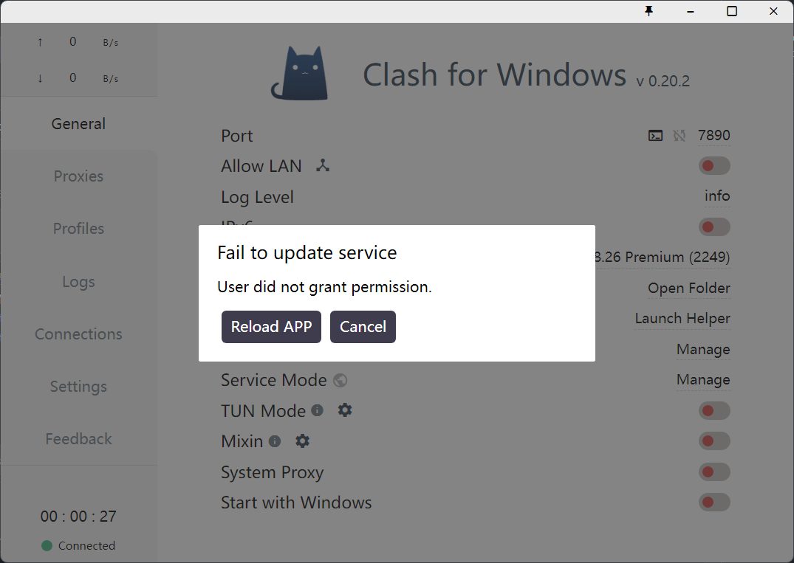](https://img.arnozeng.com/2023/03/27/6420f622f1c01.png)

[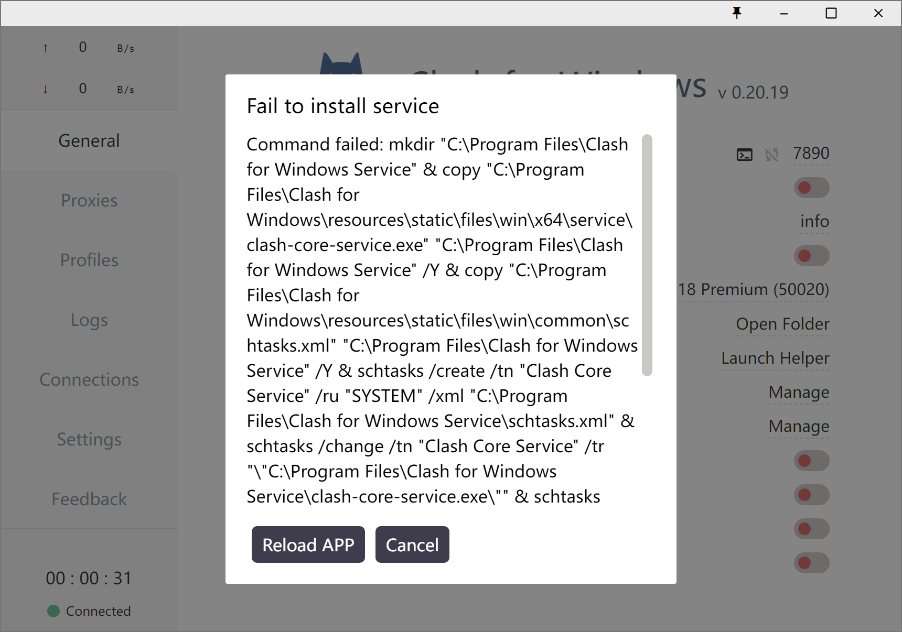](https://img.arnozeng.com/2023/03/28/6422dbcc92639.png)

## Solution

首先我们在C盘创建一个名为`Clash for Windows Service`的文件夹。

[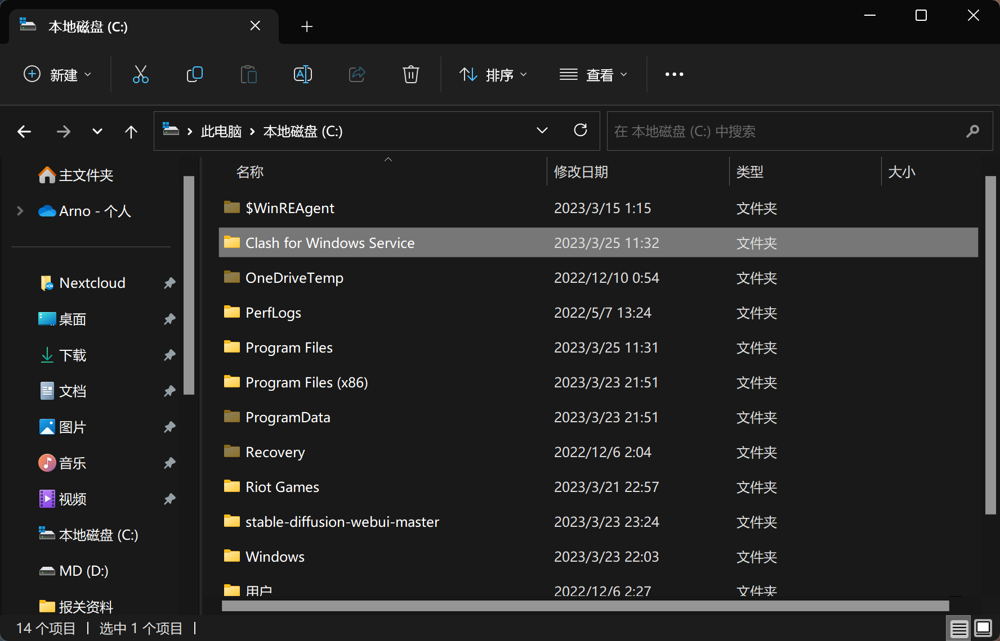](https://img.arnozeng.com/2023/03/25/641e71e50cf0f.png)

然后打开Clash For Windows的安装目录。

[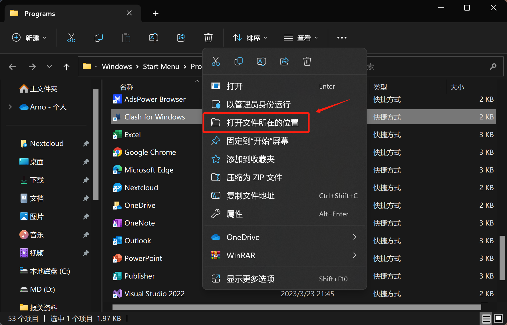](https://img.arnozeng.com/2023/03/25/641e71e826085.png)

打开`resource\static\files\win\x64\service`，复制`clash-core-service.exe`和`service.exe`到刚创建的`Clash for Windows Service`文件夹中。

[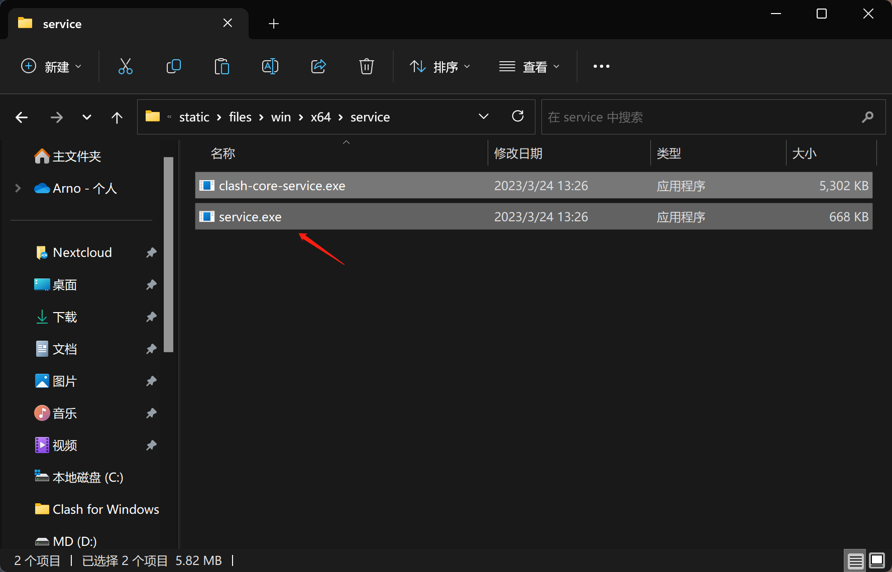](https://img.arnozeng.com/2023/03/25/641e71e50604b.png)

打开`resource\static\files\win\common`，复制`service.yml`到`Clash for Windows Service`文件夹中。

[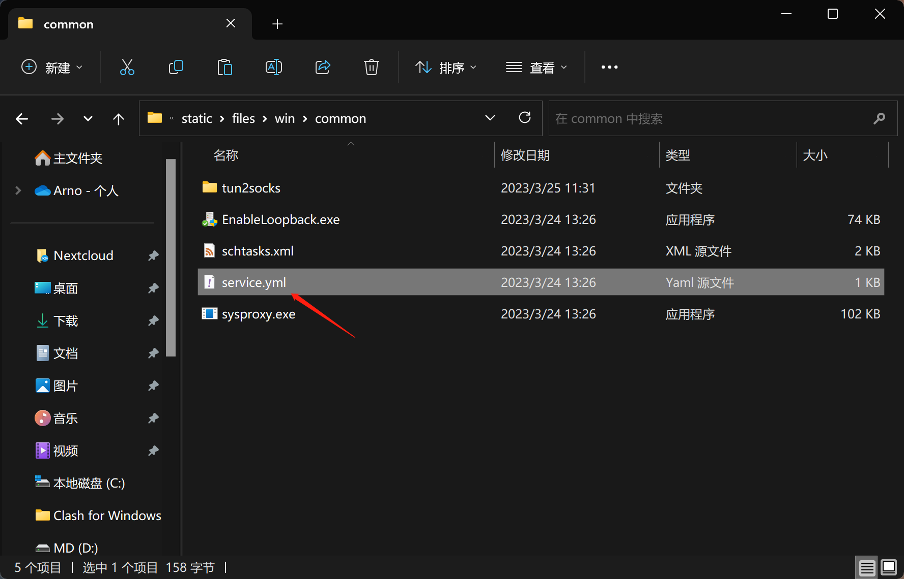](https://img.arnozeng.com/2023/03/25/641e71e88d097.png)

现在`Clash for Windows Service`文件夹中应该有以下三个文件，现在我们复制一下`Clash for Windows Service`的文件路径。

[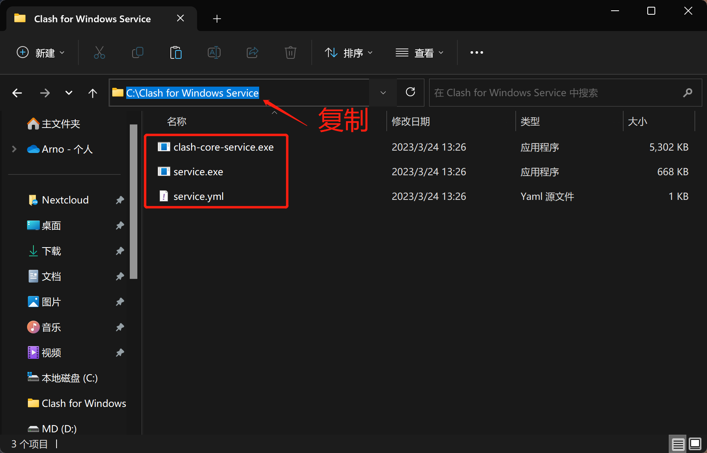](https://img.arnozeng.com/2023/03/25/641e71e16a644.png)

以管理员身份打开CMD。

[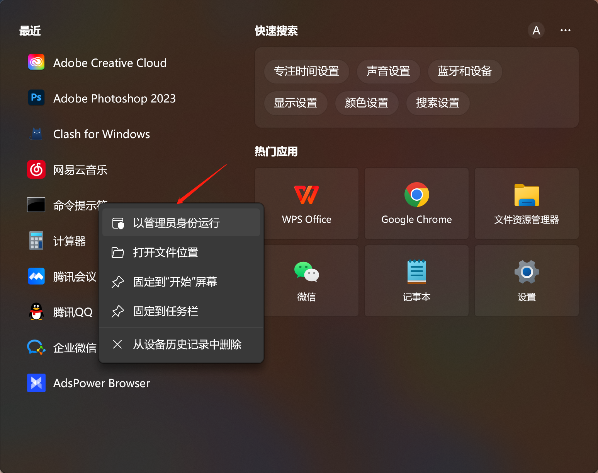](https://img.arnozeng.com/2023/03/25/641e71ef30298.png)

输入`cd C:\Clash for Windows Service`以转到`Clash for Windows Service`文件夹中。

[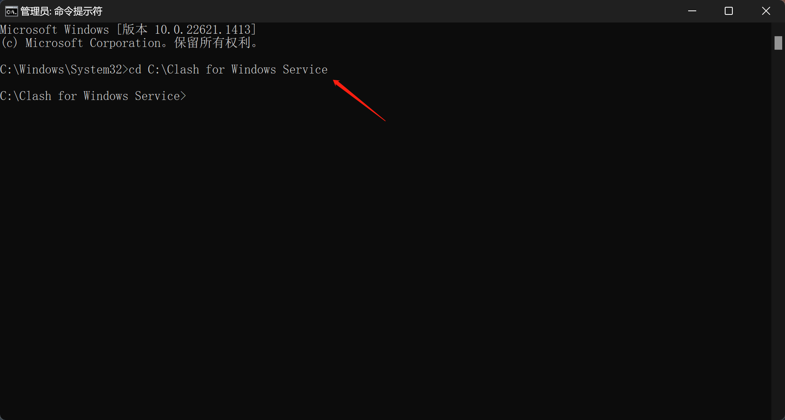](https://img.arnozeng.com/2023/03/25/641e71e00094a.png)

输入`service.exe install`和`service.exe start`以安装Service并启动。

[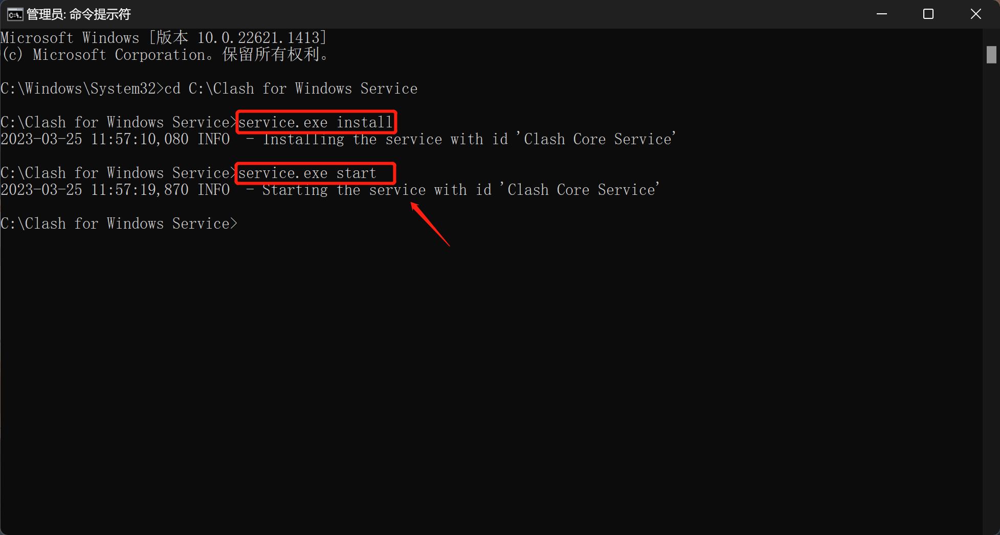](https://img.arnozeng.com/2023/03/25/641e71e2541b7.png)

重启Clash for Windows，检查Service Mode旁的小地球图标，变绿表示Service Mode已经安装成功。

[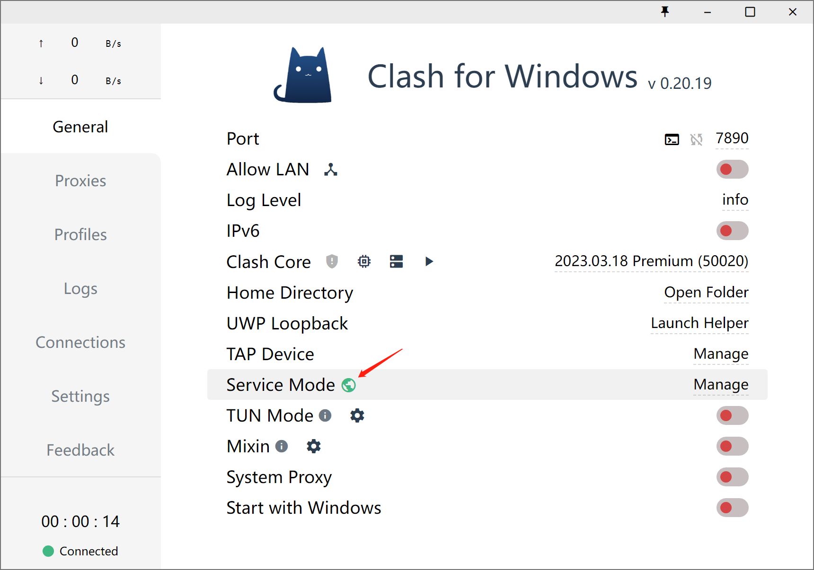](https://img.arnozeng.com/2023/03/25/641e71e1c36b7.png)
