> 部分转载自[Jack_孟-10个技巧，3分钟教会你github高效寻找开源项目](https://www.cnblogs.com/mq0036/p/18047518) 

10个高级搜索技巧
---------

### ⑴、通过`in`关键词搜索

**in关键词可以用来限制搜索范围**，精准搜索仓库名称name，说明description 以及README 文件中的内容。description 就是github界面图中， About 中的信息。

示例

说明

in:name C++

搜索项目名称中包含 "C++" 的所有项目

in:description machine learning

搜索项目描述中包含 "machine learning" 的所有项目

in:readme API

搜索项目介绍文档（README）中包含 "API" 的所有项目

下面以搜索`spring boot`相关的项目为例：

*   如果直接在搜索栏输入`spring boot`并回车，会搜到46w个结果

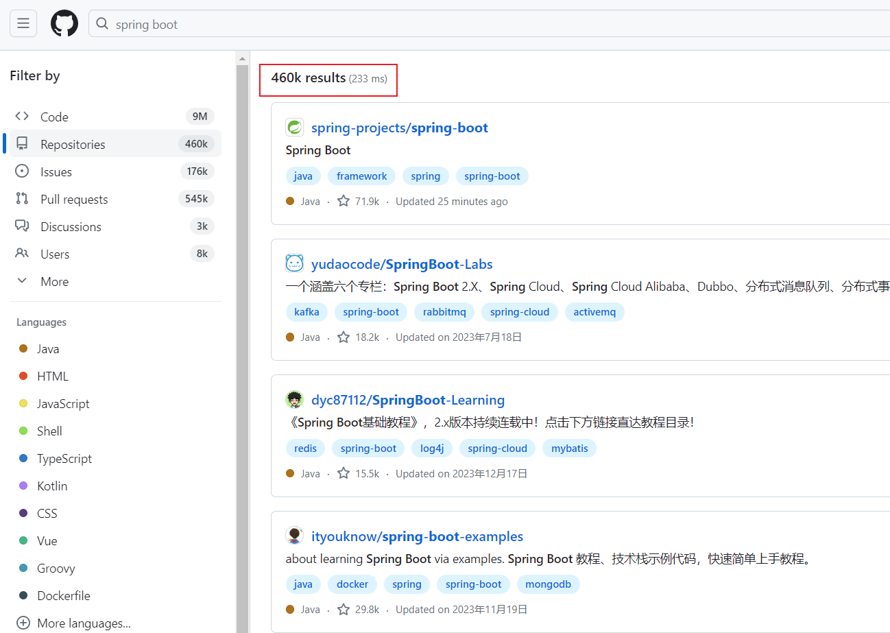

*   做一个限制，这次搜索项目名里含有 spring boot 的
    
    > in:name spring boot
    

 看到没有，数量马上又46w降到29.5w，但是项目数量还是太多了。没关系，我们可以再加其他的搜索限制，接着往下看！

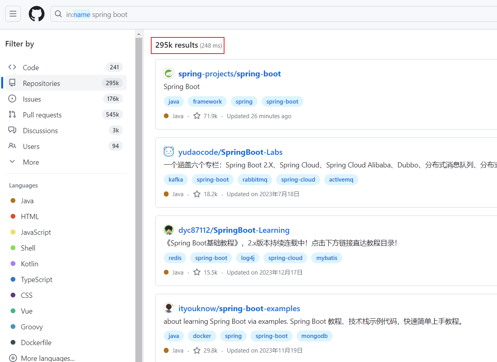

### ⑵、通过 stars、forks 数量搜索

一个优秀的项目 star 数量和 fork 数量肯定不会少，那么我可以使用 `大于`某个数，或者`在某个范围之间`的方式来过滤项目：

1.  **按照星标数量搜索：**
    *   **语法：** `关键字 stars:>=数量` 或 `关键字 stars:数量1..数量2`
2.  **按照分支数量搜索：**
    *   **语法：** `关键字 forks:>=数量` 或 `关键字 forks:数量1..数量2`

示例

说明

javascript stars:>1000

搜索所有星标数量大于1000JavaScript项目

javascript stars:1000..2000

搜索所有星标数量在1000到2000之间的JavaScript项目

web framework forks:>500

搜索所有分支数量大于500的 Web 框架项目

web framework forks:500..1000

搜索所有分支数量在500到1000之间的 Web 框架项目

*   我们进一步限制搜索范围，要求star数量大于2000，数量马上变成只有31个
    
    > in:name spring boot starts:>2000
    
    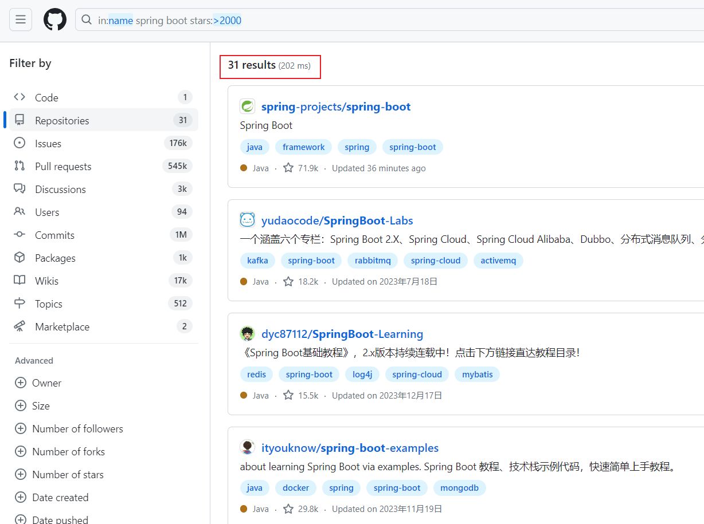
    
*   再要求fork数量大于1000，满足要求的项目数量更少了，只有19个
    
    > in:name spring boot starts:>2000 forks:>1000
    

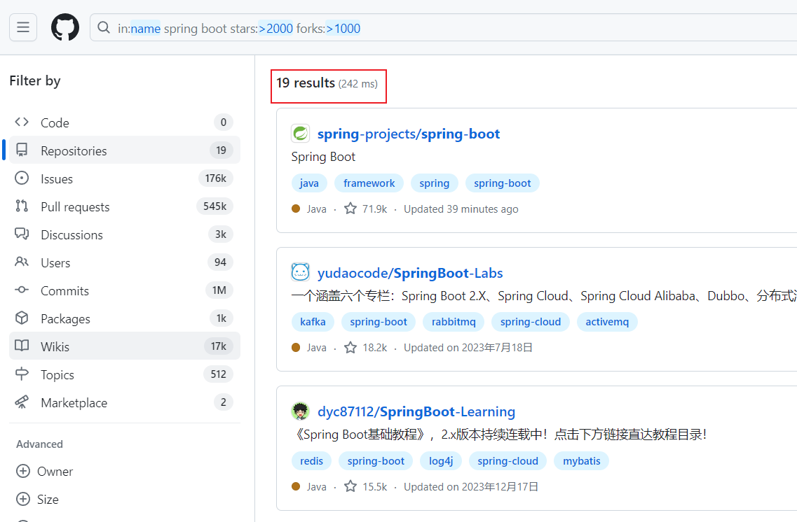

### ⑶、按项目创建时间、更新时间搜索

如果优秀项目比较多，相信大家都会喜欢最新的项目，那么就可以把老旧的项目筛选出去。

要是本来就没几个项目供你选，就没必要做这一步了。

1.  **按照项目创建时间搜索：**
    *   **语法：** `关键字 created:>=日期`
2.  **按照项目更新时间搜索：**
    *   **语法：** `关键字 pushed:>=日期`

示例

说明

java created:>=2022-01-01

搜索在2022年1月1日之后创建的Java项目

android pushed:>=2022-01-01

搜索在2022年1月1日之后更新的Android项目

*   演示：

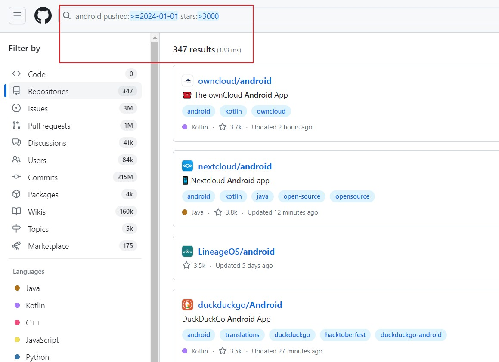

### ⑷、按照地区、编程语言搜索

*   一般我们都是想找到自己会的编程语言写的项目，否则还得专门去学一遍语言才能看懂，那岂不是兜了一大圈。
    
*   另外，要是项目有中文的文档说明，就更好了！(虽然很多优秀的项目都是用英文写的，程序员不能排斥学习英语呀！)
    

1.  **按照地区搜索：**
    *   **语法：** `location:地区 关键字`
2.  **按照编程语言搜索：**
    *   **语法：** `language:编程语言 关键字`

示例

说明

location:china

地区为中国

language:python

编程语言为python

*   例如使用 python 编程语言，且star数量大于1000的国产项目，搜索条件就是：location:china language:python stars:>1000

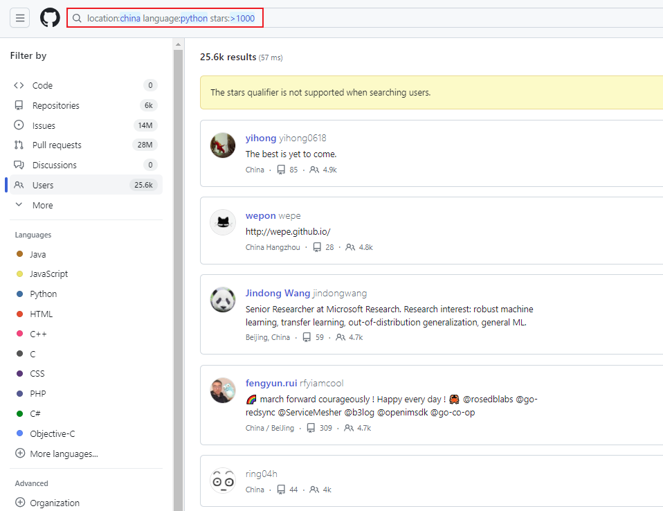

### **⑸、按文件名、仓库大小、扩展名搜索**

*   凡事都是从易到难，一开始我们更倾向于找一些小型的项目来学习，那么可以用`size`来筛选一些简单点的项目。

1.  **按照文件名搜索：**
    *   **语法：** `关键字 filename:文件名`
2.  **按照仓库大小搜索：**
    *   **语法：** `关键字 size:>=大小`
3.  **按照扩展名搜索：**
    *   **语法：** `关键字 extension:扩展名`

示例

说明

machine learning filename:utils

搜索包含文件名为 `utils` 的机器学习项目

data analysis size:<5000

搜索仓库小于5000KB的数据分析项目（默认单位 KB）

web development extension:html

搜索包含HTML文件的 web development 项目

*   举个例子：`data analysis size:<5000 extension:py`

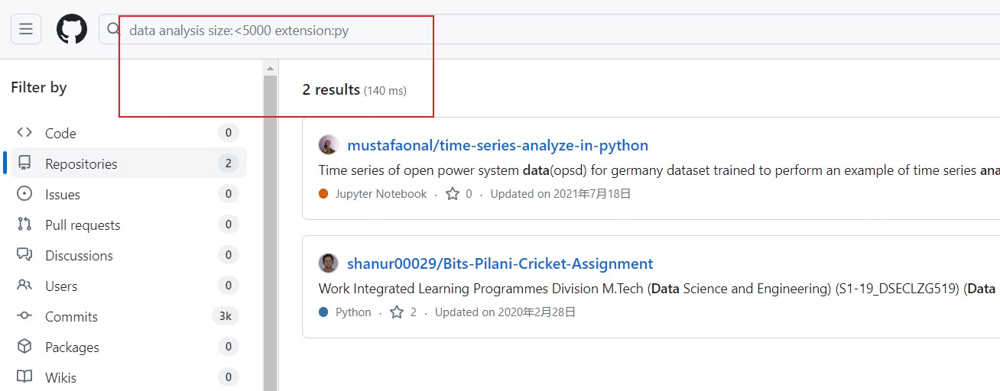

### ⑹、按文件、路径内容搜索

1.  **按照文件内容搜索：**
    
    *   **语法：** `关键字 in:file 搜索内容`
2.  **按照路径内容搜索：**
    
    *   **语法：** `关键字 path:路径/to/search`

示例

说明

machine learning in:file

包含 "machine learning" 内容的所有文件

database path:src/

搜索在路径为 `src/` 下的所有文件中包含关键字 "database" 的项目

**例子：** 假设你想要查找包含 "authentication" 内容的文件，并且这些文件位于名为 `src/` 的路径下，你可以使用如下搜索条件

*   authentication in:file path:src/

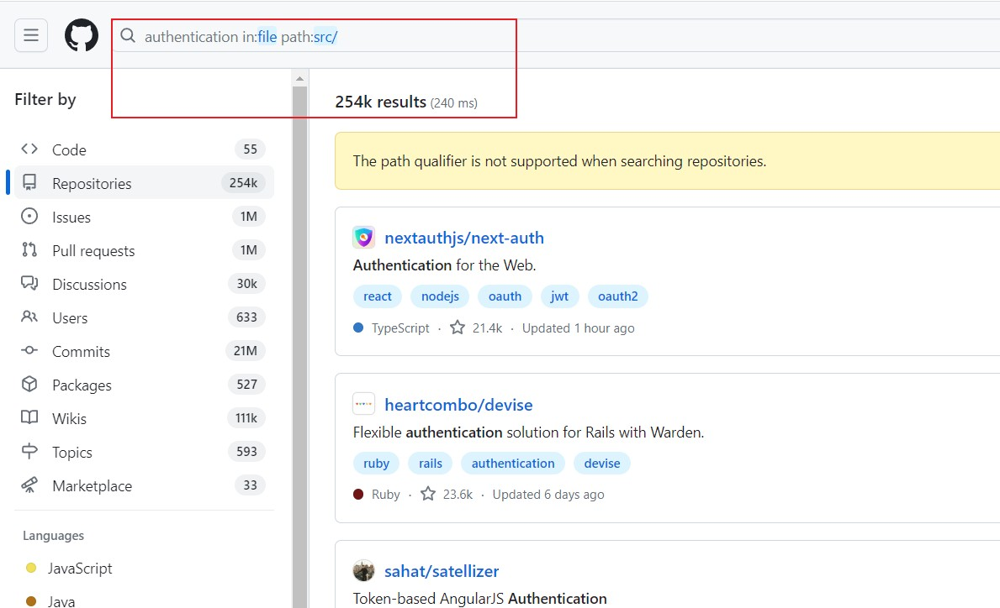

### ⑺、根据某个人或组织进行搜索

*   这个可以用来精准搜索你关注的大神是不是提交了新的项目

1.  **搜索特定个人的项目：**
    *   **语法：** `user:用户名 关键字`
2.  **搜索特定组织的项目：**
    *   **语法：** `org:组织名 关键字`

示例

说明

user:torvalds linux kernel

搜索用户 Linus Torvalds 的项目中包含 "linux kernel" 的内容

org:Microsoft azure cloud

搜索 Microsoft 组织的项目中包含 "azure cloud" 的内容

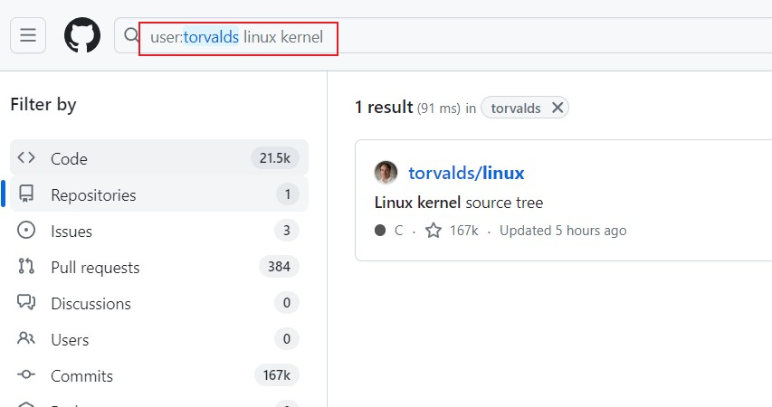

### ⑻、根据仓库的LICENSE搜索

在使用任何开源项目之前，最好详细阅读并理解项目所采用的具体授权协议，因为有的开源项目作者是明确禁止商用的，如果你使用在商业上，后面会很麻烦的！

**按照许可证搜索：**

*   **语法：** `license:许可证类型 关键字`

示例

说明

license:gpl encryption

搜索包含GPL许可证的仓库中含有 "encryption" 关键字的项目

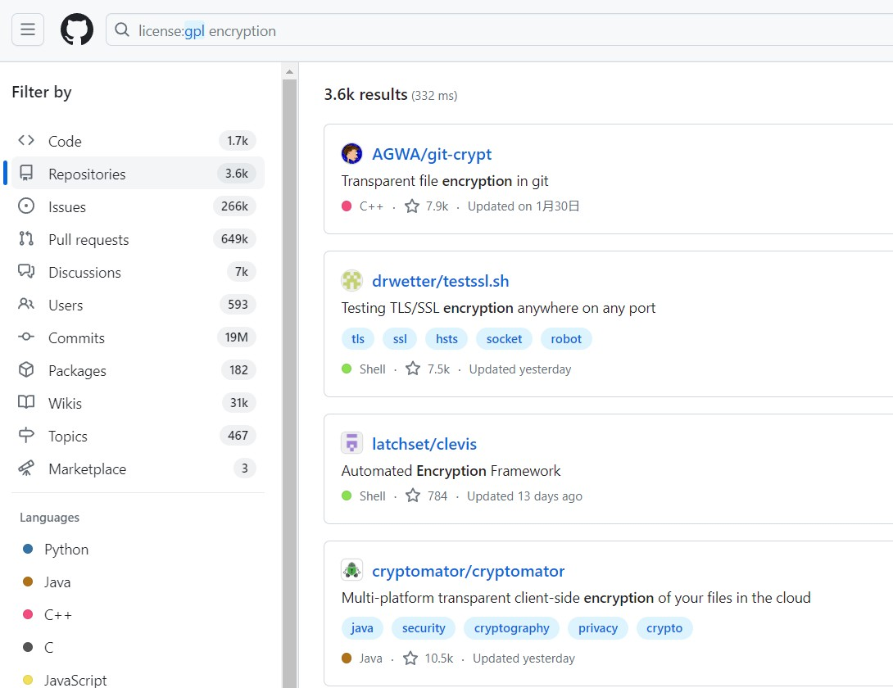

### ⑼、awesome加强搜索

*   `awesome` 往往整合了大量的同一领域的资料，收集学习、工具、书籍类相关的项目，方便大家更好的学习。
    
*   比如搜索优秀的java相关的项目，包括框架、教程等
    

> awesome java

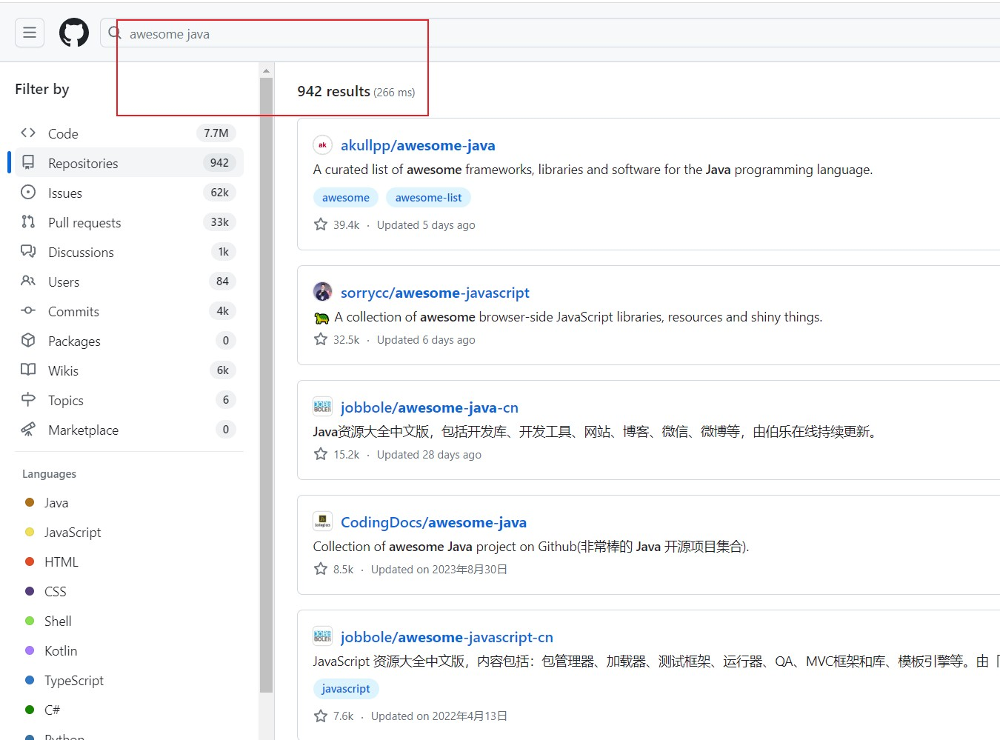

### ⑽、热门搜索（GitHub Trend 和 GitHub Topic）

*   GitHub Trend 允许你查看当前在 GitHub 上受欢迎的项目，根据不同的编程语言和时间范围进行筛选

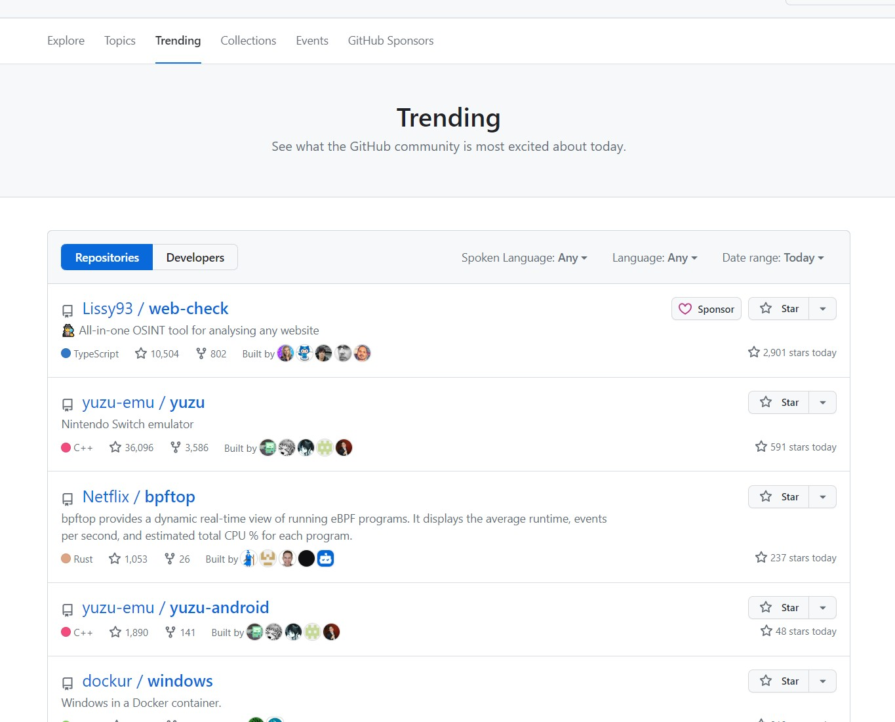

*   GitHub Topic 是一种对项目进行标签分类的方式。GitHub 上的项目可以被分配到不同的主题标签，使得你可以通过主题来浏览和发现项目。

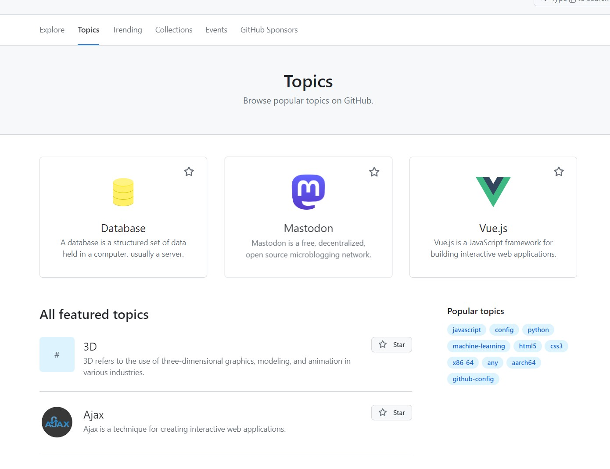

