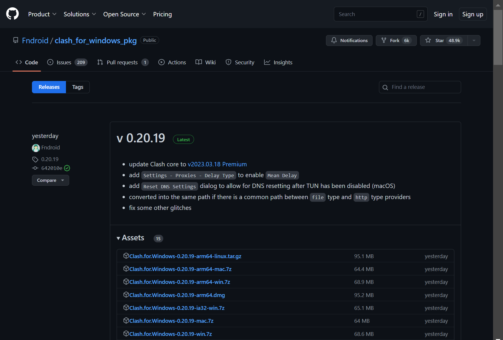
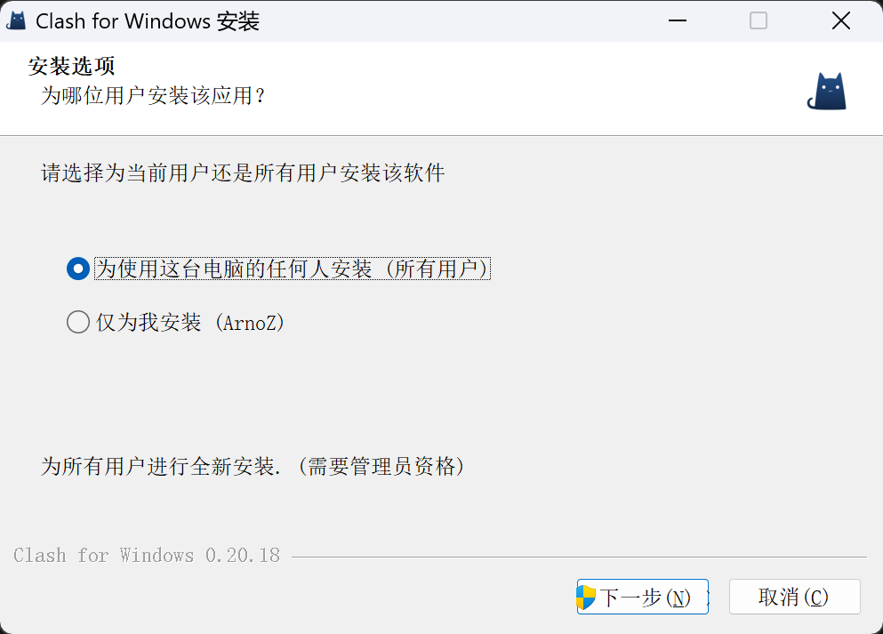
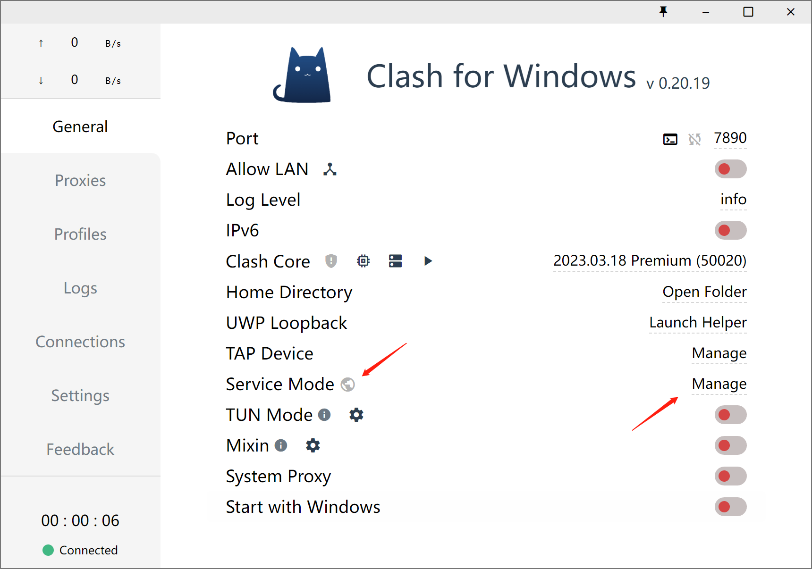
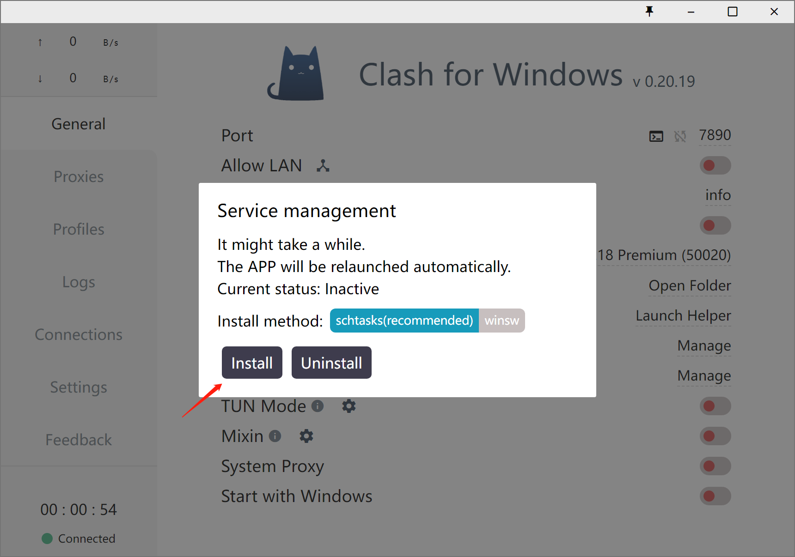
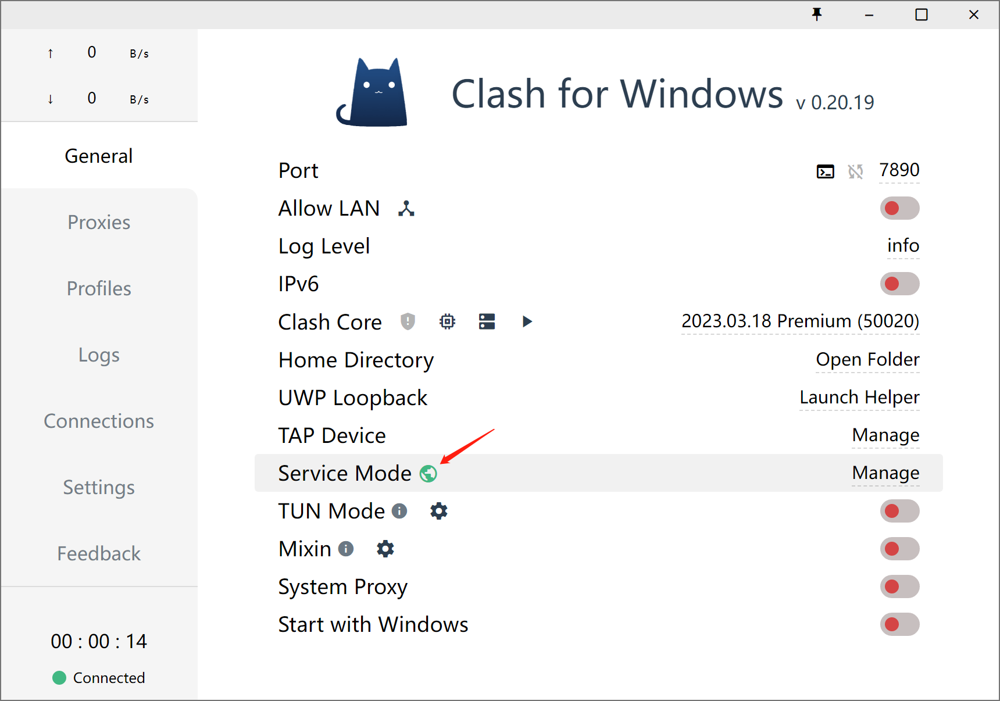
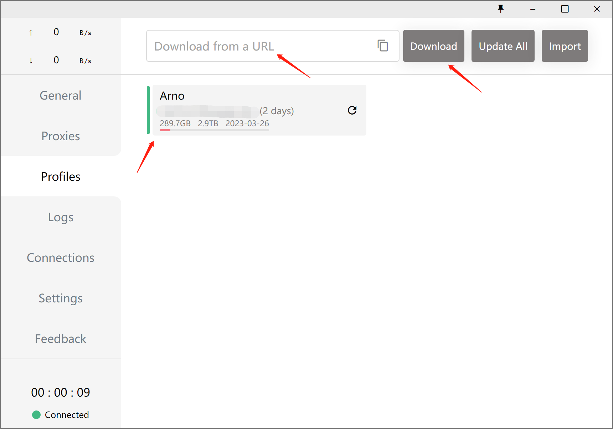
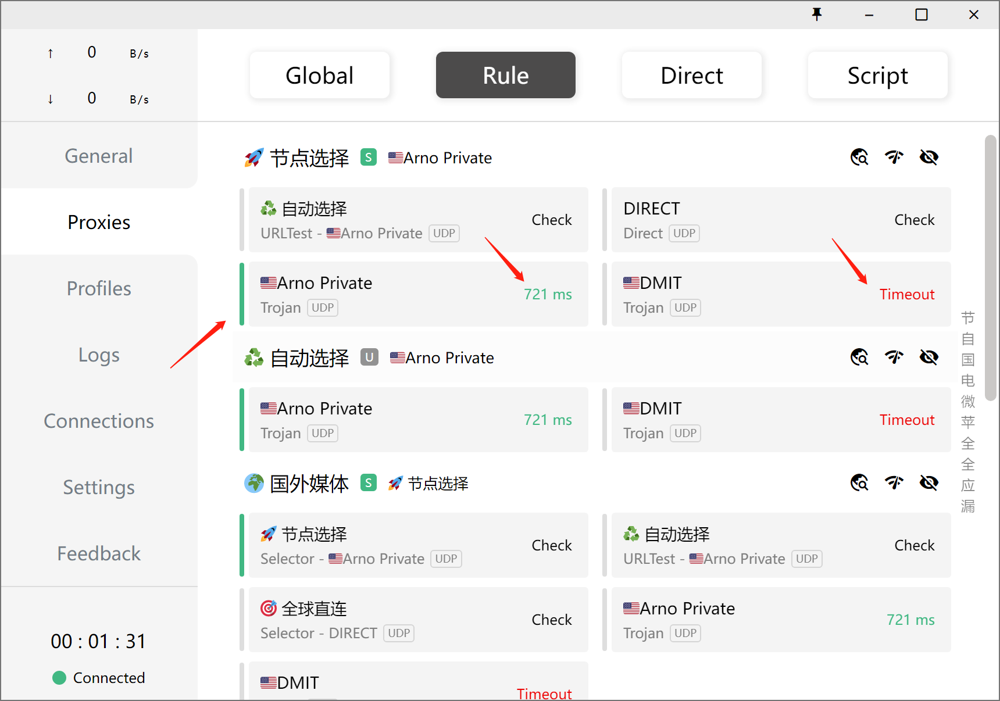
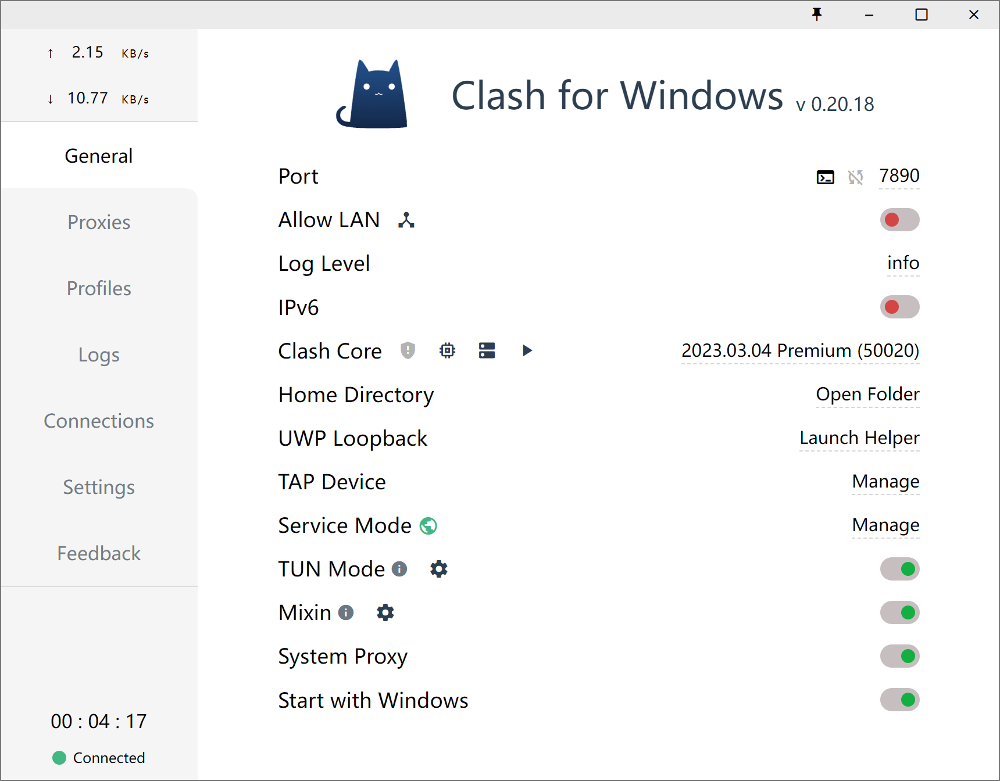

免责声明：该文转载自https://blog.arnozeng.com/archives/cfw-config.html

<!--more-->

## Intro

当前Clash存在多个版本如Clash For Windows、Clash Meta、Clash Verge、ClashX、ClashN以及软路由上的Open Clash等等。不同的Clash版本也有不同的用处，在Windows和MacOS系统上，Arno推荐使用Clash For Windows以下简称CFW。若有使用其他版本需求，安装使用流程与CFW一致。本文以CFW为例。

## Download

Clash For Windows：https://github.com/Fndroid/clash_for_windows_pkg/releases

我以Win11系统为例，下载Windows系统的安装包。具体参考以下表格，下载自己系统对应的安装包。

| 文件名                                      | 说明                         |
| :------------------------------------------ | :--------------------------- |
| Clash.for.Windows-0.20.6-arm64-linux.tar.gz | Linux ARM 64位 版本 压缩包   |
| Clash.for.Windows-0.20.6-arm64-mac.7z       | Mac ARM 64位 版本 压缩包     |
| Clash.for.Windows-0.20.6-arm64-win.7z       | Windows ARM 64位 版本 压缩包 |
| Clash.for.Windows-0.20.6-arm64.dmg          | Mac ARM 64位 版本            |
| Clash.for.Windows-0.20.6-ia32-win.7z        | Windows 32位 版本 压缩包     |
| Clash.for.Windows-0.20.6-mac.7z             | Mac 64位 版本 压缩包         |
| Clash.for.Windows-0.20.6-win.7z             | Windows 64位 版本 压缩包     |
| Clash.for.Windows-0.20.6-x64-linux.tar.gz   | Linux 64位 版本 压缩包       |
| Clash.for.Windows-0.20.6.dmg                | Mac 64位 版本                |
| Clash.for.Windows.Setup.0.20.6.arm64.exe    | Windows ARM 64位 版本        |
| Clash.for.Windows.Setup.0.20.6.exe          | Windows 64位 版本            |
| Clash.for.Windows.Setup.0.20.6.ia32.exe     | Windows 32位 版本            |
| sha256sum                                   | 检测文件完整性的命令         |
| Source code (zip)                           | 源文件压缩包 zip 版本        |
| Source code (tar.gz)                        | 源文件压缩包 tar.gz 版本     |

## Installation

下载安装包后按步骤安装即可。

## Configuration

在第一次安装时，通常电脑上并没有自带Service Mode，此时Service Mode右侧小地球颜色显示为灰色。则需要点击Service Mode右侧的Manage进行安装。成功安装后CFW将重启，再次打开后Service Mode右侧小地球颜色显示为绿色，即表示安装成功。

如果在这里安装Service Mode时发生报错、无法安装的情况，可以参考这篇博客手动安装。

Clash for Windows 手动安装 Service Mode

Issue当我们希望Clash接管我们电脑的全局流量，而不是只作为浏览器的代理时，我们则需用到Clash中的TUN...

安装完成后，我们需要导入我们的节点的配置文件。在“Download from a URL”这一栏粘贴你的订阅链接，然后点击右侧的Download按钮下载配置文件。最后选中刚才下载的配置文件进行使用。

正确安装配置文件后，转到Proxies选项中，展开节点选择部分，选择可用的节点。

**节点状态：**如图所示，若节点右侧显示绿色数值则表示Clash与节点的连接正常，若节点右侧显示红色Timeout字样则表示Clash与该节点无法连接。

值得注意的是，很多新手会将这个绿色的数值理解为节点的速度，认为绿色数值越小的节点上网网速越快，这样的理解是不对的。这里的数值反映的是该节点的端口的响应速度，而非该节点的网络带宽。

## Usage

在完成以上步骤后，依次打开TUN Mode、Mixin、System Proxy、Start with Windows即可。在不需要使用时，关闭System Proxy后退出Clash。
