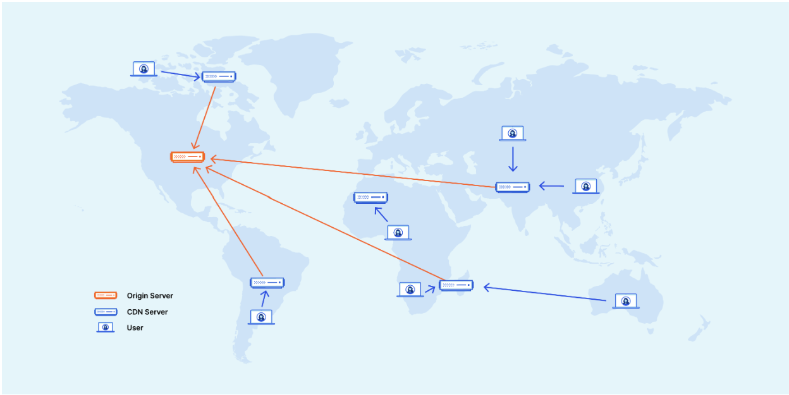
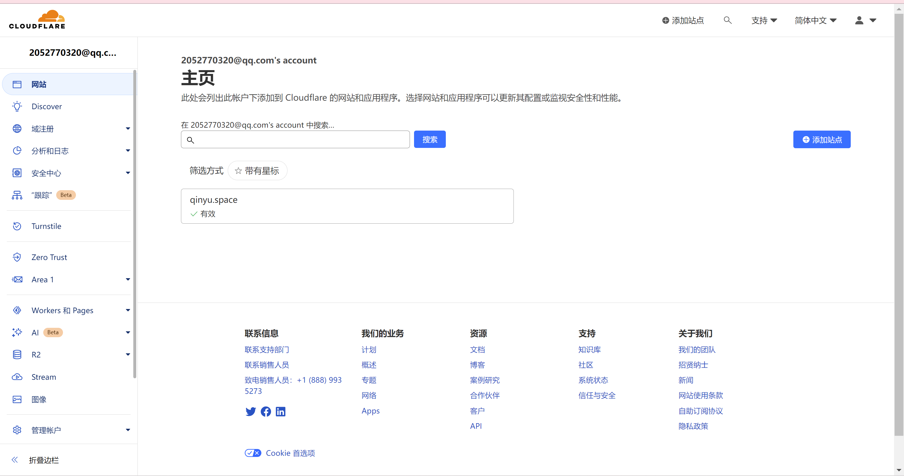
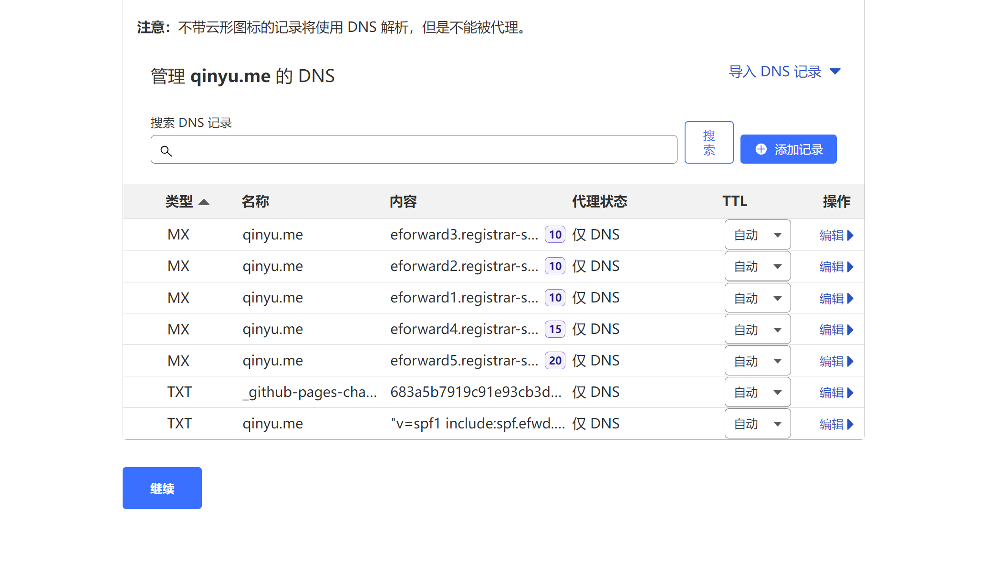
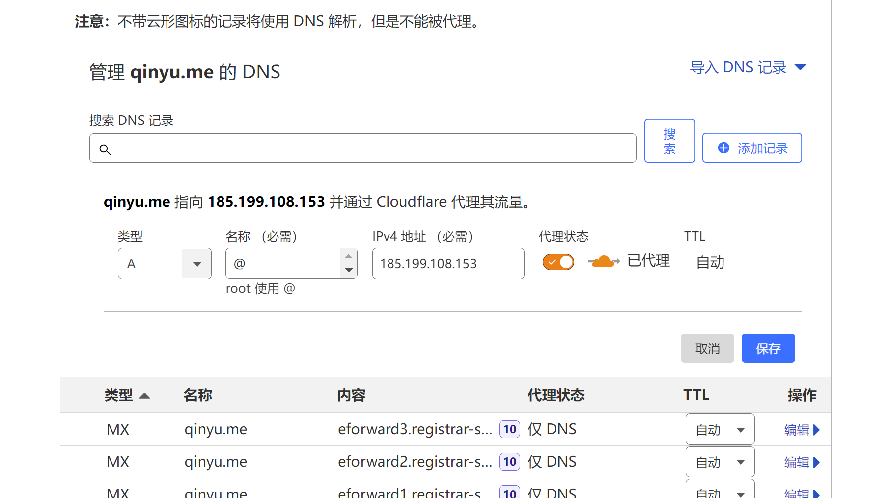
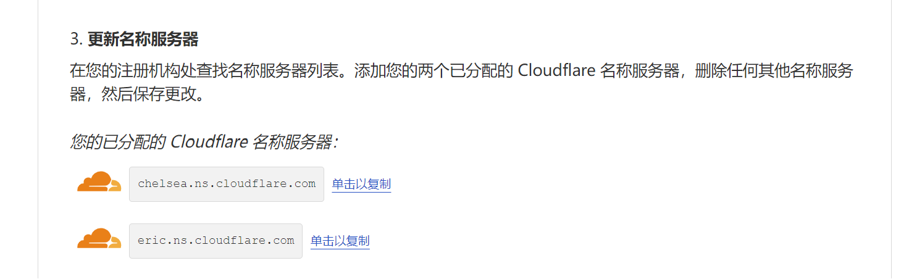
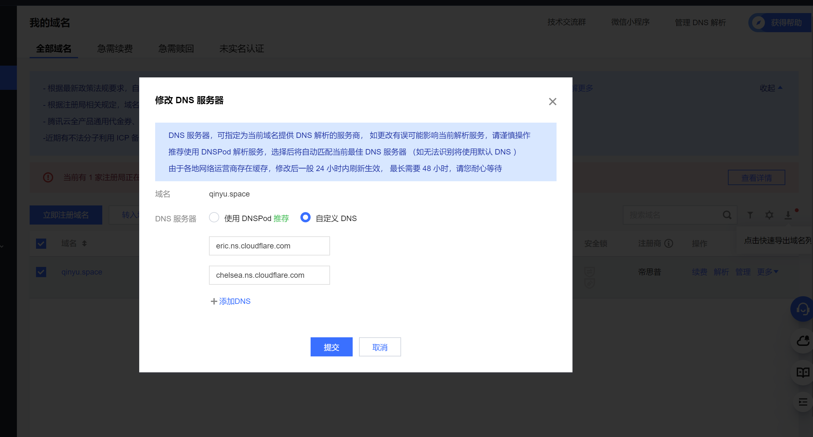
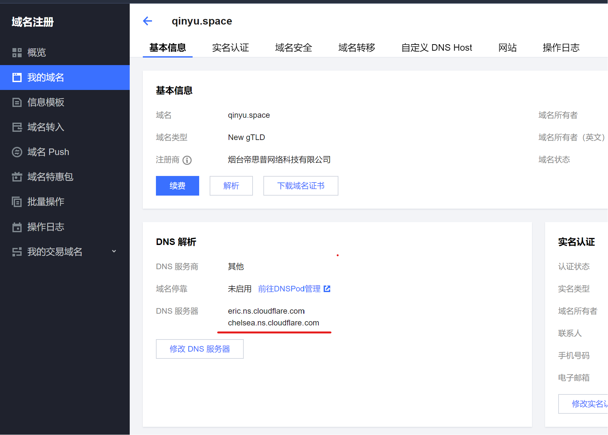
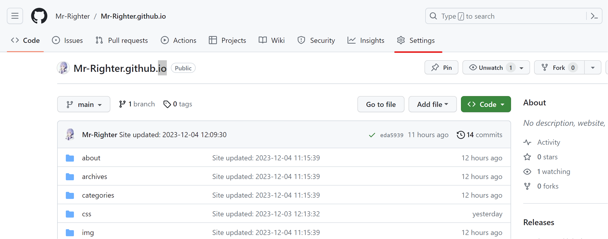
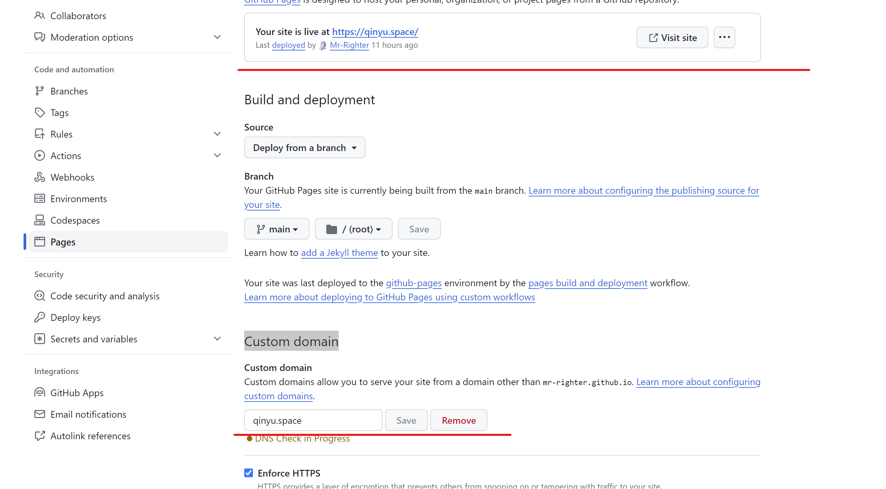
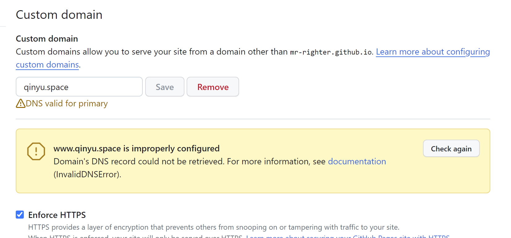

---
tags:
  - 博客
  - 域名
  - CDN
  - solution
title: 利用cloudflare加速githubpages
createTime: 2024/08/26 22:41:01
permalink: /article/o12xr8g9/
---


> 本文引自:[QinYu的博客](https://qinyu.space/%E5%8D%9A%E5%AE%A2%E6%90%AD%E5%BB%BA/%E5%88%A9%E7%94%A8cloudflare%E5%8A%A0%E9%80%9Fgithub%E4%B8%BB%E9%A1%B5%E8%AE%BF%E9%97%AE/#%E5%87%86%E5%A4%87)

## 1. 前言

对于国内大陆用户而言，想要直接访问用 github 托管的个人博客不是件容易的事，为了解决网络不可达问题，可以采用 [CDN(content delivery network)](https://www.cloudflare.com/zh-hans-cn/learning/cdn/what-is-a-cdn/)将网页内容分发到全球各地的服务器上，同时还能缩短网站加载时间。

[](https://pic.qinyu.space/image/image-20231204215539220.png)

但是大部分国内的CDN服务都是收费的，所以就把目光转向了 cloudflare。cloudflare 作为全球最大的网络服务提供商，提供免费的cdn 服务，虽然 cdn 节点都在国外，但还是比直接访问github.io要快的多，不过免费版请求次数限制有10w次的限制，但对于我们博客而言是绰绰有余了，下面介绍配置过程。

## 2. 准备

使用 cloudflare 的 cdn 服务需要我们拥有一个可配置的域名，所以需要先购买一个域名，本人是在腾讯云上购买的`.space`的后缀的域名，10年价格也只要一百多，还是很便宜的，购买域名的教程就跳过了。

## 3. 教程

注：教程中的`qinyu.me`和`qinyu.space`都是本人域名，所以在以下内容中可以视为同一个。

### 3.1 配置 cloudflare

1. 进入https://www.cloudflare-cn.com/，注册账号并登录

2. 在左侧栏中进入`网站`一栏，点击右方`添加站点`

	[](https://pic.qinyu.space/image/image-20231204222749831.png)

3. 输入自己的域名，**注意不要带`www`或者`https`**，比如我的就直接填写`qinyu.space`

	[](https://pic.qinyu.space/image/image-20231204223059530.png)

4. 选择套餐，`free`即可

	[](https://pic.qinyu.space/image/image-20231204223242693.png)

5. 点击继续后 cloudflare 会自动扫描域名的 dns 记录，如果是刚刚创建的域名，可能扫描的结果为空。截图中的几条记录可以不用管

	[](https://pic.qinyu.space/image/image-20231204223942549.png)

6. **这一步很重要，点击添加记录，按照如下方式添加类型为A，名称为@，IPv4地址为`185.199.108.153`**

	[](https://pic.qinyu.space/image/image-20231204224450727.png)

	**按照上述方式再添加以下三条记录，类型和名称和上述相同，IPv4地址分别为：**

	```
	185.199.109.153
	185.199.110.153
	185.199.111.153
	```

	**完成之后应该能看到列表中有以下四条这样的记录，除了`名称`是自己的域名外其他应该都和图中相同**

	[](https://pic.qinyu.space/image/image-20231204225200173.png)

	上述添加的4条ip地址均是GitHub Pages 的 IP 地址，具体可查看【https://docs.github.com/zh/pages/configuring-a-custom-domain-for-your-github-pages-site/managing-a-custom-domain-for-your-github-pages-site】

7. 点击继续后，cloudflare 会要求将我们DNS服务器修改为以下图中所示的的服务器，可以先截个图或者存文档里：

	[](https://pic.qinyu.space/image/image-20231204230559749.png)

8. 点击下方继续后会有一个快速入门指南，里面的配置可以都开启：

	[](https://pic.qinyu.space/image/image-20231204233423686.png)

### 3.2 修改DNS服务器

进入腾讯云控制台，修改的DNS服务器为3.1 第7步中 cloudflare 提供的DNS服务器，如下所示：

[](https://pic.qinyu.space/image/image-20231204231234047.png)

DNS服务器更改后生效需要一段时间，少则几分钟，慢则需要几个小时

过一段时间可以看到 DNS服务器已经修改成功了

[](https://pic.qinyu.space/image/image-20231204232327896.png)

返回 cloudflare，如果看到 **“Cloudflare 正在保护您的站点”**说明已经配置成功了：

[](https://pic.qinyu.space/image/image-20231204233838791.png)

### 3.3 设置Github page

进入github.io对应的仓库，进入 `Settings`：

[](https://pic.qinyu.space/image/image-20231204234453901.png)

进入左栏中的`pages`，在 `Custom domain`中输入自己的域名，点击`save`，如果成功会显示下图：

[](https://pic.qinyu.space/image/image-20231204234850740.png)

这样就可以通过域名来访问自己的博客了，还可以在上图中勾选 `Enforcrs HTTPS`，这样网站仅会通过https提供服务。

如果如下图显示dns配置不正确，推测可能是使用了cloudflare后，GitHub验证DNS时返回的是cdn服务器的ip地址，而不是在cloudflare上开始配置的4个GitHub page的ip地址，可以在线dig一下自己的域名验证一下。不过只要网站能通过域名正常访问就没什么问题。

[](https://pic.qinyu.space/image/image-20231204235122269.png)