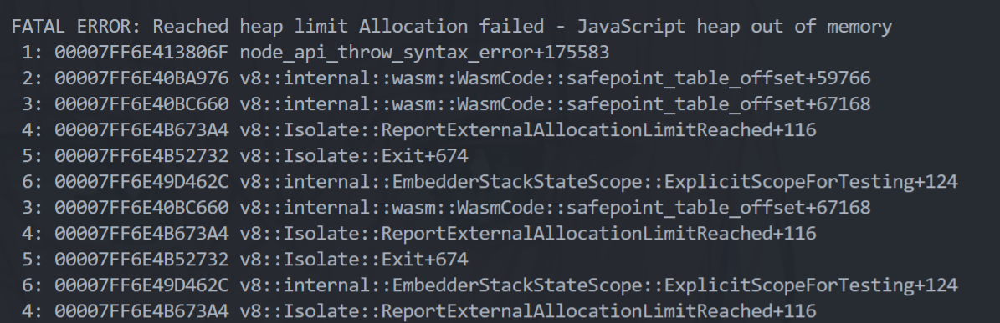
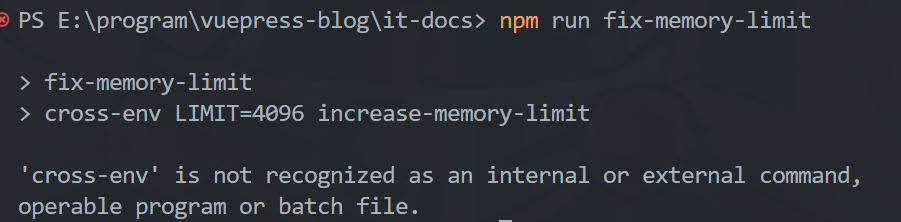
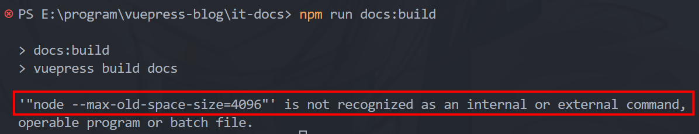
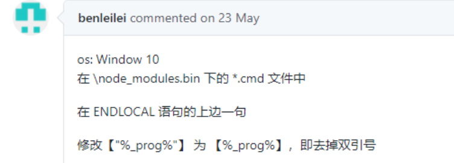

## 现象

之前打包 ( `npm run docs:build` ) 这个网站博客项目的时候，遇到了内存溢出的问题



网上也有描述此类情况的，但是错误信息不同：

> 项目开发中，当项目过大的时候，`node`内存溢出而停止`build`项目，即是项目构建过程中频繁报内存溢出：`FATAL ERROR: CALL_AND_RETRY_LAST Allocation failed - process out of memory`。

## 解决方案

既然是内存溢出，就是内存不够用的问题，加内存就可以解决了。

使用 `increase-memory-limit` 插件，增加node服务器内存限制

1. 新增依赖包`npm install --save-dev increase-memory-limit`，或者在更新package.json后重新 `npm install` 全量更新依赖包
2. 执行`npm run fix-memory-limit`（只需执行一次即可）
	重启项目即可

```javascript
/* package.json 文件 */
"devDependencies": {
	"increase-memory-limit": "^1.0.6",
},
"scripts": {
	/* 添加 fix-memory-limit */
    "fix-memory-limit": "cross-env LIMIT=4096 increase-memory-limit"
  }
```

修改我的文件：

```json
"scripts": {
  "fix-memory-limit": "cross-env LIMIT=4096 increase-memory-limit",
  "docs:dev": "vuepress dev docs",
  "docs:build": "vuepress build docs"
 }
```

重新执行修改内存限制命令时又出现了问题：



看报错，添加依赖`npm install -g cross-env`

然后运行，新问题又出现（ 出师不利啊 ）：



找到这篇博客





https://blog.csdn.net/qq_40608283/article/details/110183017

然后评论区又找到一篇博客;https://blog.csdn.net/weixin_46275928/article/details/109725616


最后还是选择了前者插件的方式然后改prog引用，太麻烦了