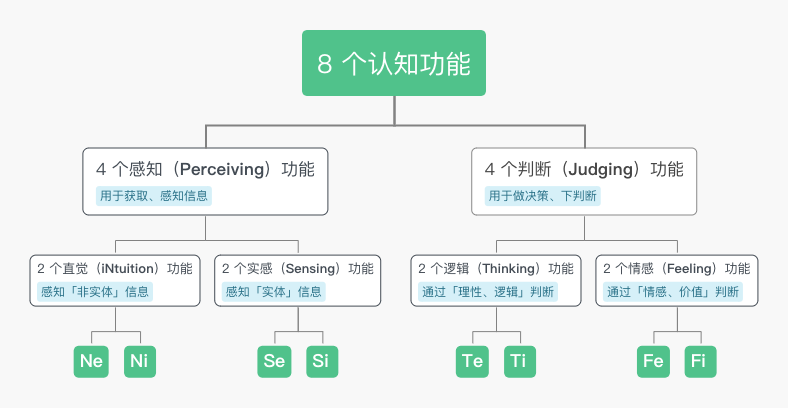
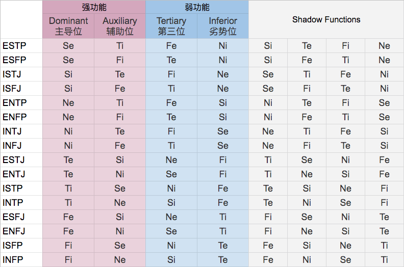
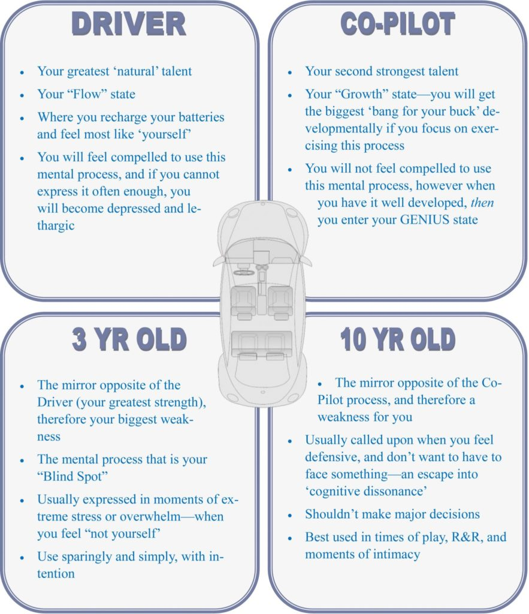

> 该文引自 [不可解的Luca](https://www.lucaluo.com/mbti-introduction/)，如有侵权，请联系我进行删除

<!-- more -->

## MBTI — 16 种人格类型与 8 个认知功能

不可解的Luca博主该系列文章

* [MBTI — 16 种人格类型与 8 个认知功能](https://www.lucaluo.com/mbti-introduction/)
* [为什么测不准自己的 MBTI 人格类型？](https://www.lucaluo.com/reason-of-mbti-mistype/)
* [人格系统 (MBTI) 的实用价值](https://www.lucaluo.com/practical-personality-system/)
* [干货 如何帮别人/自己判断人格类型 (MBTI)？](https://www.lucaluo.com/how-to-help-others-typing/)

为了更好地探究人性，许多心理学家都将人格分类进行分析。MBTI 就是这其中的一种方法，它是基于心理分析家卡尔·荣格的书籍《心理类型》衍生而来的。

MBTI 的主要关注点在于，人是「如何感知世界」，又是「如何做出决策」的。我们每个人在感知与决策这两件事上，都有特定的倾向（或者说偏好），而这些偏好构成了我们兴趣、价值观、动力的基础。

搞清楚 MBTI，可以使我们认识到人与人之间认知思维方式的差异。一方面能帮助我们了解自身，扬长避短；另一方面也帮助我们理解他人，提升人际交往能力。

### 16 种类型

MBTI 体系将所有人格分成 16 种类型：

| ENFJ | INFJ | ENFP | INFP |
| ---- | ---- | ---- | ---- |
| ENTJ | INTJ | ENTP | INTP |
| ESTJ | ISTJ | ESFJ | ISFJ |
| ESTP | ISTP | ESFP | ISFP |

可以看出，每个类型都由 4 个字母标识，这些字母对应着 MBTI 的四维：

1. E (Extravert) 外向 —— I (Introvert) 内向
2. S (Sensing) 实感 —— N (iNtuition) 直觉
3. T (Thinking) 思考 —— F (Feeling) 情感
4. J (Judging) 判断 —— P (Perceiving) 感知

网上的大部分 MBTI 测试都是通过这四维来进行测试的，但其实四维只是表象，单独看四维不但很难准确判断一个人的类型，也不能给我们直接带来多少有价值的理解。

所以在介绍这四维的具体含义之前，我们先说说 MBTI 更本质的深层原理 —— 8 个认知功能（cognitive functions）。

### 8 个认知功能

认知功能（Cognitive Functions）一共有 8 个：**Ne, Ni, Se, Si, Te, Ti, Fe, Fi**。

在下表中，我结合理论知识与自己的实践经验，整理了每个功能的主要特征。此外，最后两列的昵称和特质分别引用自 [PersonalityHacker](https://personalityhacker.com/nicknames-for-8-jungian-cognitive-functions/) 与 [PersonalityJunkie](https://personalityjunkie.com/02/function-roles-8-jungian-functions/)，也放在这边方便大家对这些 Functions 有更直观的印象。

|             |              |                                                              |              |               |
| ----------- | ------------ | ------------------------------------------------------------ | ------------ | ------------- |
| 功能        | 概要         | 简介、特长                                                   | 昵称         | 特质          |
| Ne 外倾直觉 | 发散性联想   | 保持开放，探索不同的可能性 擅长变换视角、全面看待问题        | Exploration  | Creating      |
| Ni 内倾直觉 | 收束性联想   | 寻求不变、共通的真理，相信直觉 擅长发现本质，据此预测未来    | Perspectives | Knowing       |
| Se 外倾实感 | 客观实感     | 寻求感官刺激，喜欢环境变化 擅长适应新环境，观察力敏锐        | Sensation    | Doing         |
| Si 内倾实感 | 主观实感     | 保留并反刍过往的回忆，相信经验 擅长捍卫规则与惯例            | Memory       | Perserving    |
| Te 外倾思考 | 实证主义逻辑 | 相信事实，重视结果 擅长规范流程，改进系统，推动进展          | Effetiveness | Systemizing   |
| Ti 内倾思考 | 怀疑主义逻辑 | 怀疑事实，重视原理 擅长设计独特的行事方法，视情况调整        | Accuracy     | Comtemplating |
| Fe 外倾情感 | 群体的情感   | 注重共识，关注人际间的情感反馈 擅长读人、说服与影响他人      | Harmony      | Persuading    |
| Fi 内倾情感 | 个体的情感   | 注重个性，关注个体的情感与价值 擅长代入他人的情境，同情并支持弱者 | Authenticity | Empathizing   |

#### 认知功能的分类

这 8 个认知功能是按照这样的方式分类的：

可以看到，在最宏观的层面上，它们分为 Perceiving 与 Judging 这两类。

我们的大脑吸收、感受信息的时候，使用的是 Peiceiving 功能（比如看小鸟、闻花香、回忆过往）；而当我们需要一个决定或结论的时候，我们会关闭 Perceiving 功能，转而使用 Judging 功能（比如判断某件事是好是坏，是否采取某个行动）。

### 类型与功能的关联

大家应该比较好奇，这 8 个功能跟我们 MBTI 的类型有什么关系呢？

其实，每个类型都拥有这 8 个功能，区别只在于顺序不同：

可以看到，这 8 个功能的排列顺序（特别注意前两列「强功能」），决定了你的类型。那么顺序代表着什么呢？ —— 功能熟练度。

#### 功能熟练度

关于熟练度，我比较喜欢引用 [PersonalityHacker 的 Car Model](https://personalityhacker.com/personality-development-tools-the-car-diagram/) 来解释：

Car Model 将你的认知模型，类比成一辆 4 座小轿车：

1. 在驾驶座上一直开车的，是你的

	主导位（Dominant）

	功能

	* 这是你平常默认一直在使用的功能
	* 这是你与生俱来的天赋，你无需付出努力就能熟练使用它

2. 在副驾驶上坐着的，是你的

	辅助位（Auxiliary）

	功能

	* 如果驾驶员开车累了，或者遇到了解决不了的问题，你可以换用辅助位功能来处理

	* 这也是你较强的一个天赋，但你需要付出一些努力，才能熟练使用这个功能

3. 在后座右侧，有一个 10 岁小孩，这是你的

	第三位（Tertiary）

	功能

	* 你虽然有这个功能，但功能相对较弱，熟练度不高
	* 在使用的时候，有时候会错误地将该功能用到歧路上

4. 最后，后座左侧，有一个年仅 3 岁的婴儿，这是你的

	劣势位（Inferior）

	功能

	* 这是你最弱的一个功能，你可能甚至意识不到它的存在

	* 通常在你进入压力异常状态的时候，才会展现出来

需要注意的是，功能的熟练度并非一成不变，随着你的不断使用，它会得到锻炼并成长的。但这个成长是存在一定限度的，一个劣势位的功能再怎么成长，也不可能达到主导位的熟练水平。

比如：虽然学者型的 INTP（Ti Ne Si Fe）通常不擅交际，但一个 40-50 岁的中年 INTP 很可能比不少 20 岁的年轻人都更擅长与人打交道；然而要是与热情周到的 ESFJ（Fe Si Ne Ti）相比，那还是逊色许多。

#### 功能位置规律

有些数学好的朋友可能已经有疑问了：为什么有 8 个功能却只有 16 种人格类型呢？不应该有 8! = 40320 种类型么？其实，这里面是有一些隐藏规律的。

##### 一、主要 / 阴影功能规律

首先，我们一般将每个类型的 8 列功能分为：前 4 列主要功能（Primary Functions）与后 4 列阴影功能（Shadow Functions）。

我们能注意到的一个基本规律是：

1. 在前 4 列主要功能里，包括了完整的一套 S, N, T, F 组合
2. 在后 4 列阴影功能里，也包括了完整的一套 S, N, T, F 组合

同时，阴影功能里 S, N, T, F 出现顺序，与主要功能的顺序完全相同，但 e / i 倾向完全对立，就像是物体在阳光照射下投射出的「阴影」一样。

一般来说，我们只讨论前 4 列的主要功能。

##### 二、判断 J / 感知 P 的规律

第二个规律，是有关 J / P 的分工。每个类型前 4 列的主要功能，其类型的排布只有两种可能：

1. P – J – J – P
2. J – P – P – J

即：在前两位的强功能中，必然一个是 Perceiving 功能（N / S），另一个是 Judging 功能（T / F）。

这个道理很好理解，没有人只吸收信息而不作出任何决策与判断，反之，也没有任何人在做出判断之前不需要吸收信息。

同理，两个弱功能也有类似的分工。

##### 三、外倾 e / 内倾 i 的规律

最后一个规律，是有关 e / i 的分工。同样看类型前 4 列的主要功能，其内外倾向的排布也只有两种可能：

1. e – i – e – i
2. i – e – i – e

我们把这个新规律，结合着前文提到的两条规则一起考虑，就会发现一个有趣的事情。对于每个类型来说：

* 主要的 2 个 Perceiving 功能，只能是「Ne – Si」或者「Ni – Se」组合
* 主要的 2 个 Judging 功能，也只能是「Te – Fi」或者「Ti – Fe」组合

没有其它可能，那是凭什么呢？这个问题略微有些复杂，在这里我们就先只拿 N – S 的组合来简单说说：

1. Se – Ni：
	* Se 是「面向当下」的。Se 会收集当前环境的实际信息，告诉使用者外界随时会产生变化
		* Se 需要 Ni，来告诉 Se 未来是没问题的，这样 Se 才能安心地拥抱并享受当下
	* Ni 是「面向未来」的。Ni 希望以不变应万变，寻求的是本质，用共通不变的的本质预测未来
		* Ni 也需要 Se[，去搜集外部环境信息作为 Ni 的材料，之后 Ni 灵光一闪发现本质的时候，用的就是这些 Se 信息](https://www.lucaluo.com/mbti-introduction/#959b9f)
2. Si – Ne：
	* Si 是「面向过去」的。Si 尊重自己记忆中的惯例、传统、文化，为了安全感，Si 倾向于重复那些已经被证明行得通的方式
		* Si 需要 Ne，如果没有 Ne，Si 会永远只生活在过去的重复之中，安全是安全，但一尘不变
	* Ne 是「面向当下」的。Ne 发散性地思考新的可能性，从不同角度思考过去的事情，尝试拓展选择的范围
		* Ne 也需要 Si，如果没有 Si，Ne 很难养成良好的习惯，因为 Ne 总想试试新的方式

可以看到，在同为 Perceiving 功能中，Se – Ni（或者 Si – Ne） 永远是需要彼此的。它们是「对立并合作」的关系，就像太极里的阴与阳一样（Push & Pull）。

另外的几种组合方式，其实也是无法成立的。比如 Ni – Ne 如果组合，那就只有联想（N）而缺乏现实（S）；比如 Ni – Si 如果组合，那就只有主观（i）和缺乏客观（e）。

相应的，同为 Judging 功能的 Te – Fi（或者 Fi – Fe）也有类似的关系。

### 功能与四维的转换

最后，在理解了 8 个认知功能以后，我们回过头来说说 MBTI 的四维。在 8 个认知功能与四维（类型名里的 4 个字母）之间，存在怎样的关联呢？

##### 一、E 内向 / I 外向

第一个字母的 E / I，看的是你主导位功能的内外倾向：

* 如果主导位是「外倾」功能 —— Exxx
	* 如：ESTJ（Fe Si）
* 如果主导位是「内倾」功能 —— Ixxx
	* 如：ISTP（Ti Se）

通常来说，E 类型的人比较外向，I 类型的人比较内向。

当然，特例是存在的，部分 E 可能也挺内向的（但是这不妨碍 Ta 是个 E 类型，因为我们判断类型是以 Function 为准的）。

##### 二、S 实感 / N 直觉

第二个字母的 S / N，看的是你 2 个强功能中的 Perceiving 功能的类别：

* 如果强功能中有 Se 或 Si —— xSxx
	* 如：ESFP（Se Fi），ISFP（Fi Se）
* 如果强功能中有 Ne 或 Ni —— xNxx
	* 如：INTJ（Ni Te），ENTJ（Te Ni）

S / N 的分别，是我觉得 MBTI 这套系统里最容易被感知到的差异。

一般来说，S 类型的人比较喜欢实际的东西，N 类型的人比较喜欢抽象的东西。只要和两种类型分别聊聊天就能感受到，S 与 N 之间的对话通常不在一个频道上。

##### 三、T 思考 / F 情感

第三个字母的 T / F，看的是你 2 个强功能中的 Judging 功能的类别：

* 如果强功能中有 Te 或 Ti —— xxTx
	* 如：INTJ（Ni Te），ENTJ（Te Ni）
* 如果强功能中有 Fe 或 Fi —— xxFx
	* 如：ESFP（Se Fi），ISFP（Fi Se）

通常来说，T 类型的人比较理性，F 类型的人比较感性。

##### 四、J 判断 / P 感知

第四个字母的 J / P 是最复杂的，但可能有些读者已经想到了，J / P 其实就是 Judging / Perceiving 的两个首字母。

它的含义是，从外界（他人的视角）来看你，你是一个经常处于「J 判断」状态的人，还是一个「P 感知」状态的人。具体来说，这个字母看的是你强功能里外倾（Xe）的那个功能的类别：

* 如果强功能中有 Te 或 Fe —— xxxJ
	* 如：INTJ（Ni Te），ENFJ（Fe Ni）
* 如果强功能中有 Ne 或 Se —— xxxP
	* 如：INTP（Ti Ne），ENFP（Ne Fi）

从表象上来说，J 类型的人外界（对人、对事）的控制和操纵欲比较强，而 P 类型的人比较随遇而安。

这个 J / P 的维度，其实也是我觉得很有意思的一个维度。它考量的是从「外部视角」看到的你，并不等同与你实际的最优先采用的认知模式。

比如 INTP（Ti Ne）虽然从外部看来是 Perceiver（辅助位 Ne），但实际本质上是 Judger（主导位 Ti）。他们确实给人感觉很开放随和，看起来不 judge 的样子。但其实在他们的内心是自有一套明确的判断标准的，他们只是不常输出（或者觉得没必要输出）他们的判断结果罢了。

### 小结

好了，关于 MBTI 的基础知识点，我们就介绍到这里，相信大家对 MBTI 的系统已经有相当不错的基础理解了。

在后续的文章中，我会和大家继续分享更多 MBTI 的实践与价值。

