> 该教程引自https://segmentfault.com/a/1190000045016644#item-6

### 引言

对于一个程序员小白来说，拥有一个专属自己的博客网站是很酷炫的事情，接下来我就教大家如何用VuePress+GitHub Pages来打造你的自动化部署个人博客。

### 一、为什么选择VuePress和GitHub Pages

#### VuePress：为开发者量身定制的静态站点生成器

VuePress的核心优势在于：

* **Markdown为中心**：编写文章就像写文档一样简单直接，支持Markdown扩展，让你专注于内容创作。
* **Vue驱动的主题系统**：自定义主题或使用现成的主题，轻松打造个性化界面。
* **性能卓越**：预渲染静态HTML，加载速度快，SEO友好。

#### GitHub Pages：免费且强大的托管服务

GitHub Pages是GitHub提供的一项服务，允许用户免费托管静态网站。与VuePress结合，你可以：

* **自动化部署**：每次推送代码到GitHub仓库，自动更新网站内容。
* **域名绑定**：支持自定义域名，让你的博客更加专业。
* **安全稳定**：依托GitHub的基础设施，无需担心服务器维护问题。

### 二、准备工作

* github账号。
* 依赖环境：Node.Js v20.10.0+。
* 包管理器：pnpm、yarn、npm，推荐使用pnpm。

> * github账号，访问github卡顿可使用[Watt Toolkit (原名Steam++)](https://link.segmentfault.com/?enc=Dv2lfNUosQlrrw1b0dBn6g%3D%3D.0A%2FGA4RKuaxj%2BaSDtdk8LY2KKh5gH4gDlxC4TagWAIA%3D)加速。
> * vuepress官网v2.0.0-rc.14文档写的v18.16.0+似乎不准确，使用v18.17.0运行会报错，需升级nodejs。

### 三、创建GitHub Pages网站

1. 在github中创建仓库，存储库必须命名为`username.github.io`，创建README.md文件。

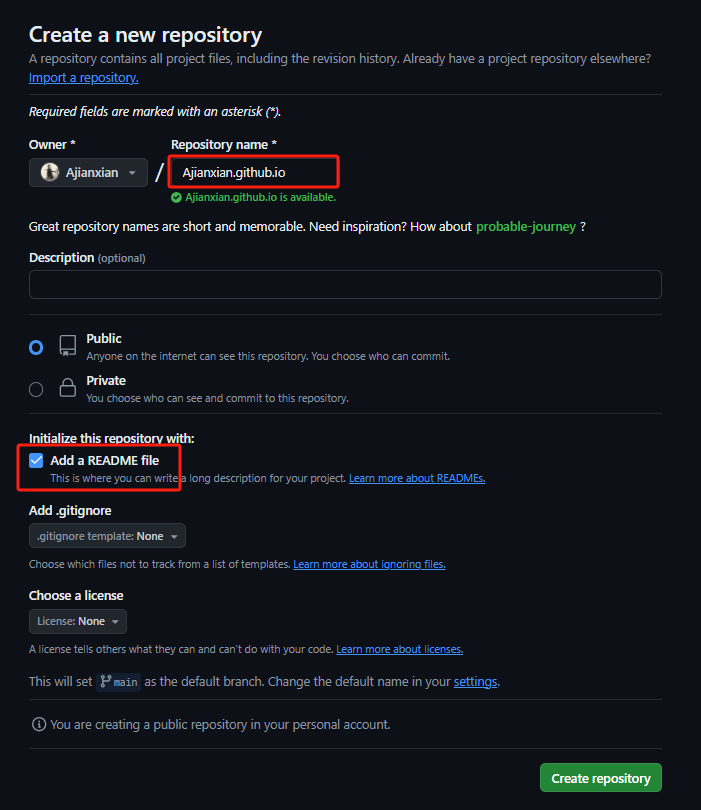

1. 依次点击Settings→Pages→Visit site，打开访问已发布的网站。

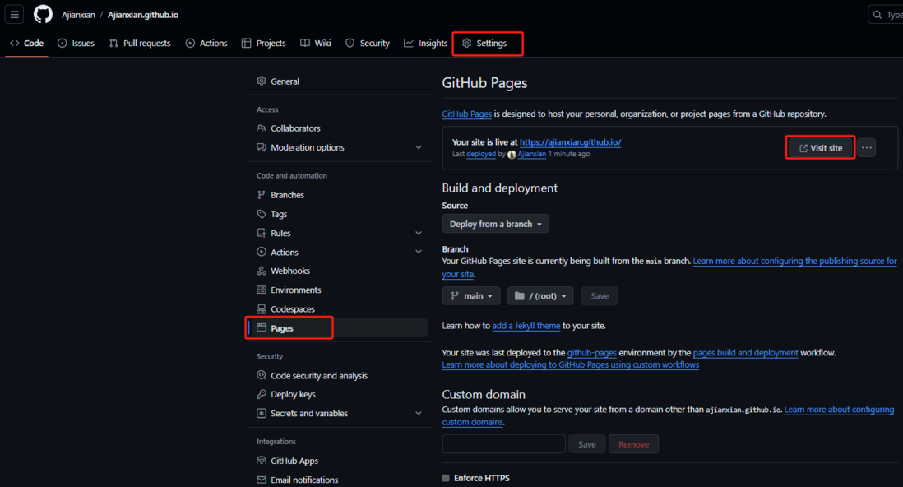

1. 现在你已经拥有一个属于自己的网站啦

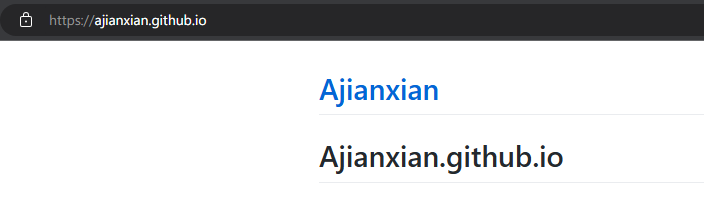

### 四、使用VuePress初始化项目

#### 方式一：命令行创建：

1. 通过 create-vuepress 直接创建项目模板

	项目类型改为docs，回车键一直到最后启动项目，或手动运行命令`pnpm run docs:dev`启动项目。

```bash
pnpm create vuepress vuepress-starter
```

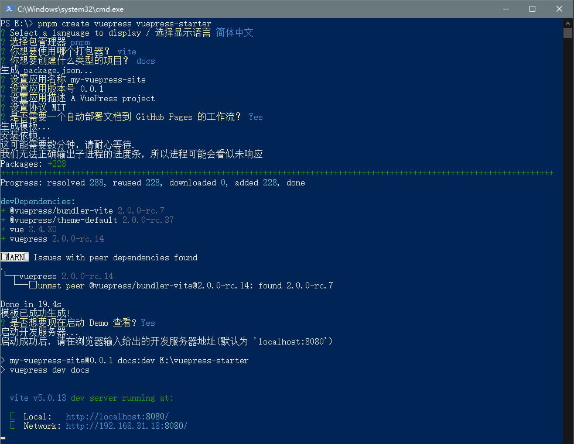

blog和docs项目类型模板的区别？

**blog (博客) 模板**：适用于需要频繁更新内容、注重文章的展示和归档的场景。

* 博客文章的分页。
* 用于显示最近文章、分类和标签的侧边栏或首页。
* 文章的元数据支持，例如发表日期、作者信息等。
* RSS/Atom Feed 支持，便于读者订阅更新。
* 可能会有评论系统集成或其他社交媒体分享功能的支持。

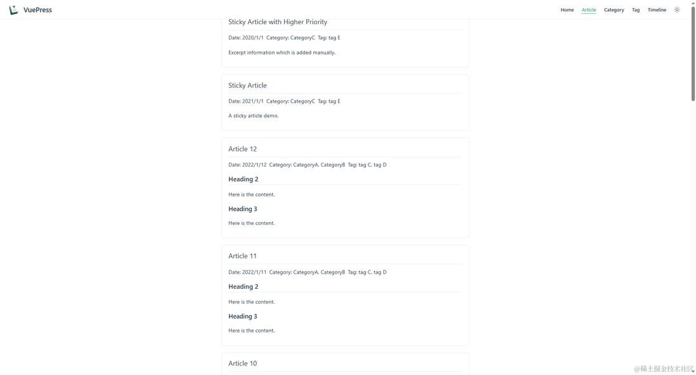

**docs (文档) 模板**：更适合技术文档、产品手册等需要结构化内容展示的场景。

* 以目录结构组织的内容。
* 自动从 Markdown 文件的标题生成导航菜单。
* 更加简洁的页面布局，专注于内容展示。
* 通常不包含博客相关的特性，如分页、文章元数据等。

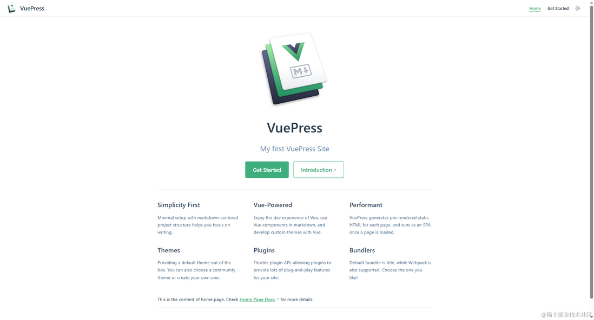

#### 方式二：手动创建：

1. 创建并进入一个新目录

```bash
mkdir vuepress-starter
cd vuepress-starter
```

1. 初始化项目，生成package.json文件

```bash
pnpm init
```

1. 安装VuePress

```bash
# 安装 vuepress
pnpm install -D vuepress@next
# 安装 vue依赖
pnpm install -D vue
# 安装打包工具和主题
pnpm install -D @vuepress/bundler-vite@next @vuepress/theme-default@next
```

⚠️缺失vue依赖会造成项目运行和部署失败，使用pnpm安装vuepress时偶尔会不安装vue依赖，可能与安装的vuepress版本有关。

1. 创建`docs`目录和`docs/.vuepress`目录

```bash
mkdir docs
mkdir docs/.vuepress
```

1. 创建 VuePress 配置文件`docs/.vuepress/config.js`

```javascript
import { viteBundler } from '@vuepress/bundler-vite'
import { defaultTheme } from '@vuepress/theme-default'
import { defineUserConfig } from 'vuepress'

export default defineUserConfig({
  bundler: viteBundler(),
  theme: defaultTheme(),
})
```

1. 新建一篇文档docs/README.md，输入文字# Hello VuePress

```bash
echo '# Hello VuePress' > docs/README.md # 不推荐此方式
```

1. 创建完成后，你项目的目录结构应该是这样的：

```markdown
├─ docs
│  ├─ .vuepress
│  │  └─ config.js
│  └─ README.md
└─ package.json
```

1. 在package.json文件添加以下scripts

```json
{
  "scripts": {
    "docs:dev": "vuepress dev docs",
    "docs:build": "vuepress build docs"
  }
}
```

1. 启动服务器

```bash
pnpm run docs:dev
```

1. 打开[http://localhost:8080](https://link.segmentfault.com/?enc=wMlWgXDKQPEQru939D9rKA%3D%3D.oF9tb826s9F0AE6Qr6AKE8ItaM75dqX3n6FojmmXhmU%3D)，查看运行效果

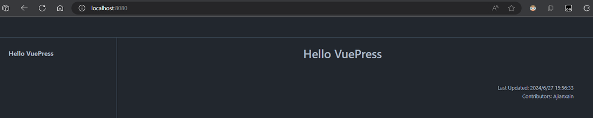

### 五、自动化部署配置

ℹ️ 这里我选择用同一个仓库的**docs分支**用来放项目源代码，**main分支**来存放打包部署后的静态文件。

1. git初始化，并与建立远程仓库关联，以下username需换成自己的github用户名

```awk
git init
git checkout -b docs
git remote add origin https://github.com/username/username.github.io.git
```

1. 添加.gitignore文件

```json
node_modules
# VuePress 默认临时文件目录
docs/.vuepress/.temp
# VuePress 默认缓存目录
docs/.vuepress/.cache
# VuePress 默认构建生成的静态文件目录
docs/.vuepress/dist
```

1. 修改/添加`.github/workflows/docs.yml`工作流配置文件

```nestedtext
name: 部署文档

on:
  push:
    branches:
      # 确保这是你正在使用的分支名称
      - docs

permissions:
  contents: write

jobs:
  deploy-main:
    runs-on: ubuntu-latest
    steps:
      - name: Checkout
        uses: actions/checkout@v3
        with:
          fetch-depth: 0
          # 如果你文档需要 Git 子模块，取消注释下一行
          # submodules: true

      - name: 安装 pnpm
        uses: pnpm/action-setup@v2
        with:
          run_install: true
          version: 8


      - name: 设置 Node.js
        uses: actions/setup-node@v3
        with:
          node-version: 20
          cache: pnpm


      - name: 构建文档
        env:
          NODE_OPTIONS: --max_old_space_size=8192
        run: |-
          pnpm run docs:build
          > docs/.vuepress/dist/.nojekyll

      - name: 部署文档
        uses: JamesIves/github-pages-deploy-action@v4
        with:
          # 这是文档部署到的分支名称
          branch: main
          folder: docs/.vuepress/dist
```

1. 使用命令行/代码编辑器推送代码，触发GitHub Actions自动部署

```avrasm
git add .
git commit -m "first commit"
git push --set-upstream origin docs
```

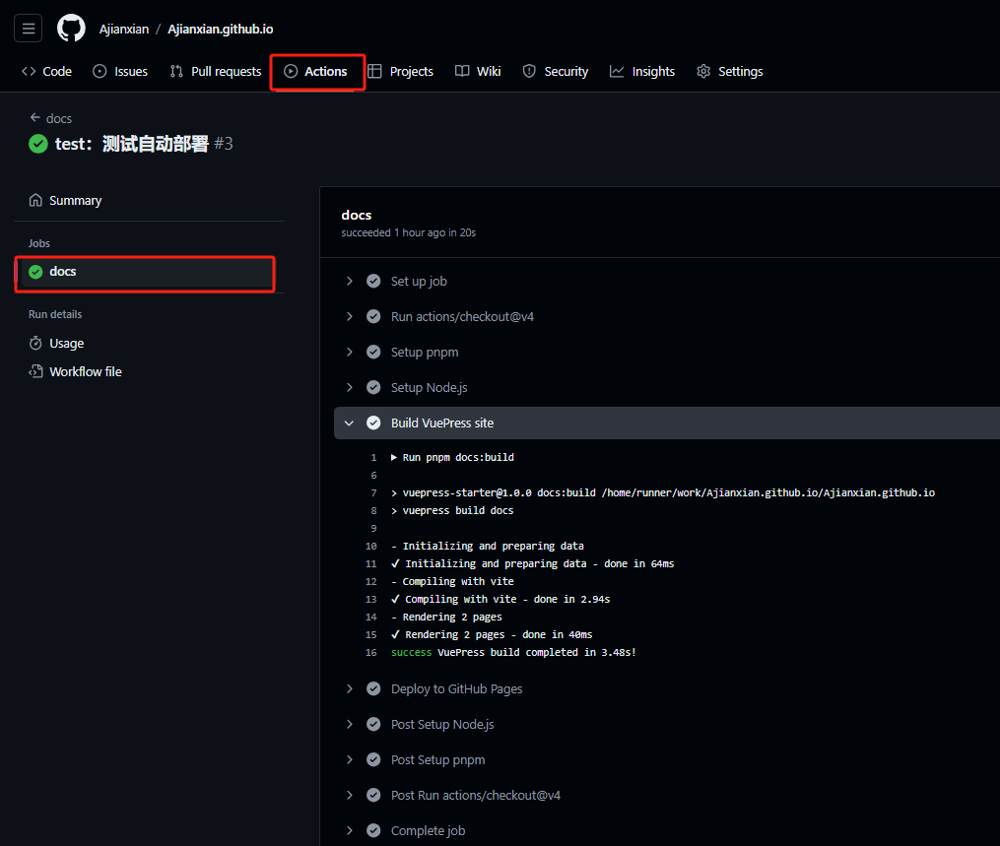

1. 部署成功后，访问已发布的网站，网址为[https://username.github.io](https://link.segmentfault.com/?enc=Suj7C3KHucvMeflDJRc92g%3D%3D.8irn2mLy313S7%2FftvbZPhA%2Fr4lw3B5DquhQqRqKWIsk%3D)

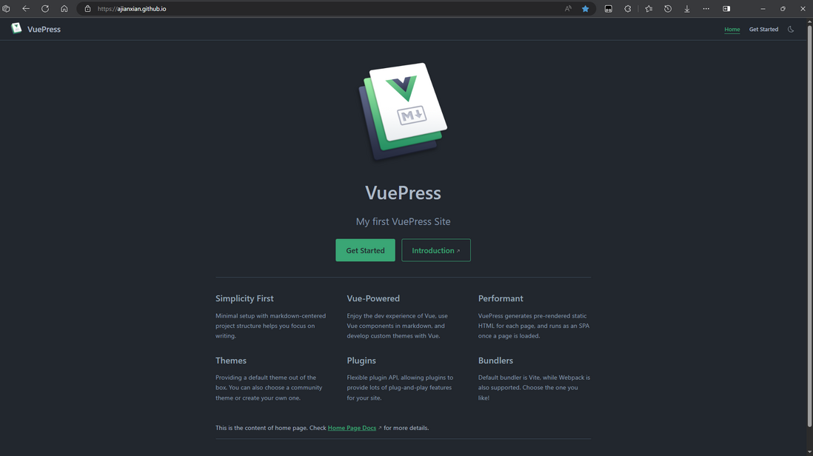

### 六、问题记录

1. 使用node-v18.17.0安装依赖，运行项目报错`'node:events' does not provide an export named 'addAbortListener'`？
	解决方法：需升级nodejs版本，VuePress官网文档v2.0.0-rc.14写的依赖Node.js v18.16.0+似乎不准确；
2. 使用Steam++后，git拉取推送代码报错SSL证书/443 Time out问题？
	解决方法：见[参考文档3](https://link.segmentfault.com/?enc=mCCD0MImS62fhOC5VzJNyg%3D%3D.XWv%2FGwtV4T%2Br1VhI4SsfiEKJR2fqf1uNNA3la1fcv7Uj6oMSDFKfGYBANZANaz%2BHEuwPsdvEgPIlv%2BhYHumB%2FbGeMNWqaKPoxw2oI3EDG%2Fo%3D)。
3. 运行本地项目网页显示乱码问题？
	解决方法：用`echo '# Hello VuePress' > docs/README.md`创建的文件格式为UTF-16LE，网页显示会产生乱码，需使用记事本将文件另存为**所有文件保存**类型**UTF-8编码**格式；
4. 使用VuePress官网文档`.github/workflows/docs.yml`代码配置工作流导致的部署问题？
	解决方法：
	a. 在github网址配置并生成GITHUB_TOKEN
	右上角账户Settings→Developer settings→Personal access tokens→Tokens (classic)→Generate new token (classic)

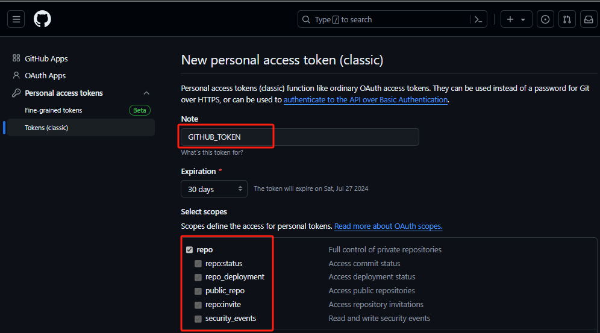

b. 开启Workflow读写仓库权限
修改配置Settings→Actions→General→Workflow permissions，选择支持读写权限，点击save保存。

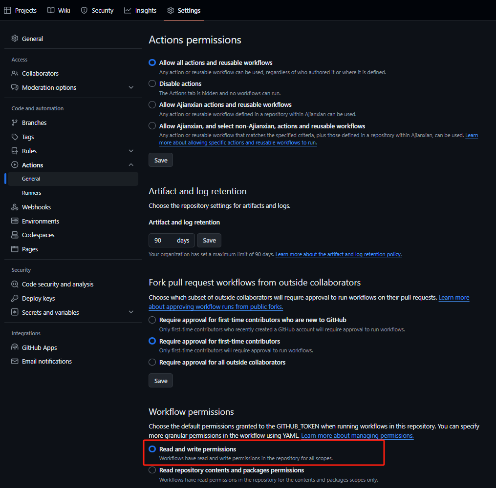

### 七、参考文档

1. [快速上手 | VuePress](https://link.segmentfault.com/?enc=R1m2NFtuzNjw8G%2Fc9TDyFQ%3D%3D.I5iac2Sguw%2B7ehz1pxVvH6rSJP30Aro6C2oULNqIAmmpYbaBGIQrTMKUPWdXhnH3IcMwwSz31nzKh3i%2FJzetvQ%3D%3D)
2. [创建 GitHub Pages 站点 - GitHub 文档](https://link.segmentfault.com/?enc=SSYr%2FrSMho8W9bs0%2BZfh%2BQ%3D%3D.ruyCINkwapoaEXG9SJ0p8ovwWQqkxdgPSKMwoePSckSn5aOSpg2HXkmTnMGKUCuxkel%2BP%2BUWEUbiw%2FM1vZHITmbIqX8Szod19EvrA%2FMg%2Bfdt%2F6BPKcQP7O7aZ9CiUDQ1)
3. [使用Steam++解决github的 443：Timed out问题 · BeyondDimension/SteamTools · Discussion #234](https://link.segmentfault.com/?enc=Ii%2B%2BlQ4Yyrvxr%2B8vIZYpkQ%3D%3D.GsCX9LuFqiAa%2FXTOF1KefnT6bhK5H6hrey69Y2y%2FqIRJE0ad5jjxJ%2Fq7NzZvmpNCgV1tyUKehiIzMzYFWgrsoj4k3frnlXwAT0GCZgsklos%3D)

### 八、结尾

至此，大功告成，你已经成功搭建了一个基于VuePress+GitHub Pages的个人博客。
