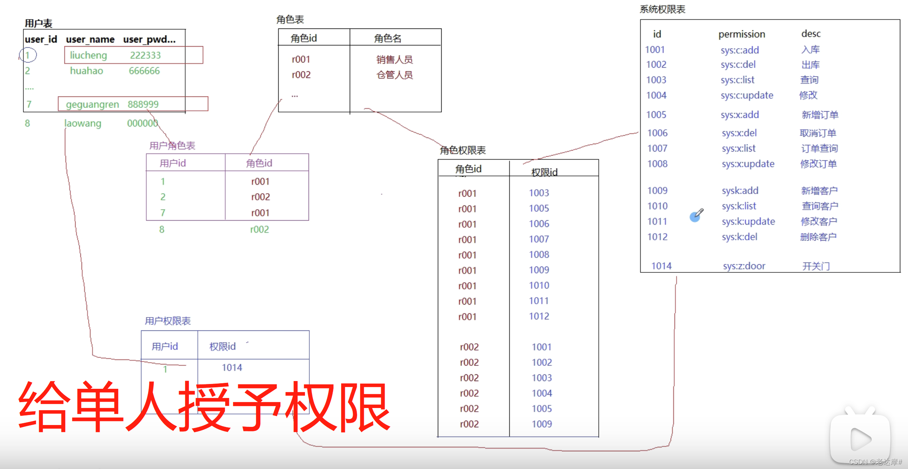

> 本文转载自https://blog.csdn.net/qq_45299673/article/details/122091352作为shiro的参考文档，如有侵权，请联系删除。

* 相关博客：[Springboot2集成shiro](/article/l3s7joo9/)

> Apache Shiro是一个强大且易用的Java安全框架,执行身份验证、授权、密码和会话管理。Shiro 可以非常容易的开发出足够好的应用，其不仅可以用在 JavaSE 环境，也可以用在 JavaEE 环境。

### 一、权限管理

不同身份的人进入系统所完成的操作不同，如下图，当一个系统包含左侧所有菜单功能时，要求不同人员登录展示不同权限下的菜单，这时候就需要学习权限管理，看完本文就可轻松掌握。  


##### 1.1 基于主页的权限管理

设计多种页面，当不同权限的用户访问时，跳转不同的用户，如下图，用户1登录跳转到index1.html，用户2登录跳转到index2.html,缺陷比较大且繁琐，不建议使用。  


缺点：适用于用户级别较少的，不能动态分配权限

##### 1.2 基于用户和权限的权限管理

利用用户表、用户权限表、权限表三张表，每个用户在中间表分配权限  
  
实现权限的动态分配，但是每个用户对应一个用户权限，10个人就得10个，数据比较冗余，这样就衍生了下面的五张表

##### 1.3 基于角色的访问控制（RBAC）

创建用户表、角色表、权限表和两张中间表用户角色表、角色权限表五张表，每次新加用户时只需要授予角色就可获得相对的权限。  
  
给同类人员的其中一个人授予权限可以再加一张用户权限表，直接授予权限。  


### 二、Shiro

##### 2.1 认证和授权

    认证:对用户的身份进行检查（登录验证）
    授权：对用户的权限进行检查（是否有对应的操作权限）


##### 2.2 常见的安全框架

    shiro：Apache Shrio是功能强大并且易用的Java安全框架
    Spring Security：基于Spring的安全框架，依赖Spring
    OAuth2：第三方授权框架（QQ、微信）
    自定义安全认证中心


##### 2.3 shrio核心功能


> Anthentication 认证，验证用户是否有相应的身份 登录认证 Authorization  
> 授权，权限验证，通过认证的用户检查是否有权限或者角色 Session Management  
> 会话管理，用户在认证成功后创建会话，在没有退出之前，当前用户的所有信息都会保存在这个会话中 Cryptograsphy 加密，对敏感信息加密

支持的特性：  
1.Web Support Shrio提供了过滤器，可以通过过滤器拦截web请求来处理web应用的访问控制  
2.Caching 缓存支持，shiro可以缓存用户信息以及用户的角色权限信息，可以提高执行效率  
3.concurrency shiro支持多线程应用  
4.Run As 允许一个用户以另一种身份去访问  
5.Remeber Me 记住密码  
6.Testing 提供测试支持  
Shiro是一个安全框架，不提供用户、权限的维护，用户的权限管理需要我们去设计

##### 2.4 Shiro核心组件

  
Subject、Security Manager、Realms

*   Subject：表示待认证和授权的用户
*   Security Manager：Shiro框架的核心，Shiro就是通过Security Manager来进行内部实例的管理，并通过它来提供安全管理的各种服务
*   Realm：相当于shiro进行认证和授权的数据源  
    

##### 2.5 shiro的使用

1.添加maven依赖

```xml
<dependency>
    <groupId>org.apache.shiro</groupId>
    <artifactId>shiro-core</artifactId>
    <version>1.4.1</version>
</dependency>
```


2.创建shiro的配置文件

在resource下创建ini后缀文件

```ini
[users]
zhangsan=123456,seller
lisi=123123,ckmgr
admin=admin,admin

[roles]
admin=*
seller=order-add,order-del,order-list
ckmgr=ck-add,ck-del,ck-list
```

3.使用测试

```java
public class ShiroTest {
    public static void main(String[] args) {
        Scanner sc=new Scanner(System.in);
        System.out.println("请输入账号：");
        String username = sc.next();
        System.out.println("请输入密码：");
        String password = sc.next();

        //1.创建安全管理器
        DefaultSecurityManager securityManager=new DefaultSecurityManager();
        //2.创建realm
        IniRealm iniRealm=new IniRealm("classpath:shiro.ini");
        //3.将realm设置给安全管理器
        securityManager.setRealm(iniRealm);
        //4.将Realm设置给SecurityUtil工具
        SecurityUtils.setSecurityManager(securityManager);
        //5.通过SecurityUtil工具类获取subject对象
        Subject subject=SecurityUtils.getSubject();

        //认证流程
        //将认证账号和密码封装到token中
        UsernamePasswordToken token=new UsernamePasswordToken(username,password);
        //通过subject对象调用login方法进行认证
        boolean flag=false;
        try{
            subject.login(token);
            flag=true;
        }catch (IncorrectCredentialsException e){
            flag=false;
        }
        System.out.println(flag?"登录成功":"登录失败");

        //授权
        //判断是否有某个角色
        System.out.println(subject.hasRole("seller"));

        //判断是否有某个权限
        System.out.println(subject.isPermitted("order-del"));
    }
}
```


##### 2.6 shrio认证流程


### 三、SpringBoot整合Shiro

##### 3.1 导入依赖

```xml
 <parent>
        <groupId>org.springframework.boot</groupId>
        <artifactId>spring-boot-starter-parent</artifactId>
        <version>2.0.1.RELEASE</version>
    </parent>
    <dependencies>
        <dependency>
            <groupId>com.alibaba</groupId>
            <artifactId>druid-spring-boot-starter</artifactId>
            <version>1.1.10</version>
        </dependency>
        <dependency>
            <groupId>org.springframework.boot</groupId>
            <artifactId>spring-boot-starter-web</artifactId>
        </dependency>
        <!--mybatis起步依赖-->
        <dependency>
            <groupId>org.mybatis.spring.boot</groupId>
            <artifactId>mybatis-spring-boot-starter</artifactId>
            <version>1.1.1</version>
        </dependency>
        <!-- MySQL连接驱动 -->
        <dependency>
            <groupId>mysql</groupId>
            <artifactId>mysql-connector-java</artifactId>
        </dependency>

        <dependency>
            <groupId>org.apache.shiro</groupId>
            <artifactId>shiro-spring</artifactId>
            <version>1.4.1</version>
        </dependency>

    </dependencies>
```

###### application.yml配置

```yml
spring:
  datasource:
    druid:
      driver-class-name: com.mysql.jdbc.Driver
      url: jdbc:mysql://localhost:3306/mybatis?useUnicode=true&characterEncoding=utf8
      username: root
      password: 123456
      initial-size: 1
      min-idle: 1
      max-active: 20
mybatis:
  type-aliases-package: com.zx.entity
  mapper-locations: classpath:com/zx/dao/*Mapper.xml
```


##### 3.2 Shiro配置

SpringBoot没有提供对Shiro的自动配置，因为Spring家族有自己的安全框架

*   config/shiroConfig.java

    ```java
    mport org.apache.shiro.realm.text.IniRealm;
    import org.apache.shiro.spring.web.ShiroFilterFactoryBean;
    import org.apache.shiro.web.mgt.DefaultWebSecurityManager;
    import org.springframework.context.annotation.Bean;
    import org.springframework.context.annotation.Configuration;
    import java.util.HashMap;
    import java.util.Map;
    
    @Configuration
    public class ShiroConfig {
        @Bean
        public IniRealm getIniRealm(){
            IniRealm iniRealm=new IniRealm("classpath:shiro.ini");
            return iniRealm;
        }
        @Bean
        public DefaultWebSecurityManager getDefaultWebSecurityManager(IniRealm iniRealm){
            DefaultWebSecurityManager securityManager=new DefaultWebSecurityManager();
            //securityManager要完成校验，需要realm
            securityManager.setRealm(iniRealm);
            return securityManager;
        }
        @Bean
        public ShiroFilterFactoryBean getShiroFilterFactoryBean(DefaultWebSecurityManager defaultWebSecurityManager){
            ShiroFilterFactoryBean filter=new ShiroFilterFactoryBean();
            filter.setSecurityManager(defaultWebSecurityManager);
            //设置shiro的拦截规则
            //anon 匿名用户可访问   authc  认证用户可访问
            //user 使用RemeberMe的用户可访问  perms  对应权限可访问
            //role  对应的角色可访问
            Map<String,String> filterMap=new HashMap<>();
            filterMap.put("/","anon");
            filterMap.put("/login.html","anon");
            filterMap.put("/register.html","anon");
            filterMap.put("/user/login","anon");
            filterMap.put("/user/register","anon");
            filterMap.put("/static/**","anon");
            filterMap.put("/**","authc");
            filter.setFilterChainDefinitionMap(filterMap);
    
      filter.setLoginUrl("/login.html");
        //设置未授权页面跳转到登录页面
        filter.setUnauthorizedUrl("/login.html");
        return filter;
    }
    
    }
    
    
    ```

##### 3.3 测试

*   UserServiceImpl.java
    
    ```java
    @Service
    public class UserServiceImpl {
        public void checkLogin(String username,String Password) throws Exception{
            Subject subject= SecurityUtils.getSubject();
            UsernamePasswordToken token=new UsernamePasswordToken(username,Password);
            subject.login(token);
        }
    }
    ```
    
*   UserController.java
    
    ```java
    @Controller
    @RequestMapping("/user")
    public class UserController {
        @Autowired
        UserServiceImpl userService;
        @RequestMapping("/login")
        public String login(String username,String password){
            try {
                userService.checkLogin(username,password);
                return "index";
            } catch (Exception e) {
                System.out.println("密码错误");
                return "login";
            }
        }
    }
    ```
    
*   login.html

	```html
	<!DOCTYPE html>
	<html lang="en">
	<head>
	    <meta charset="UTF-8">
	    <title>Title</title>
	</head>
	<body>
	    login页面
	    <form action="user/login" method="get">
	        账号：<input type="text" name="username">
	        密码：<input type="text" name="password">
	        <input type="submit" value="登录">
	    </form>
	</body>
	</html>
	```

	

*   通过shiro.ini定义正确的登录密码
    
    ```ini
    [user]
    admin=admin
    ```
    
    

  
密码正确跳转到index.html  
密码错误跳转到login.html

##### 3.4 内置JDBCRealm作为数据源

  
如果使用JdbcRealm，则必须提供JdbcRealm所需要的表结构（权限设计)

###### JdbcRealm规定的表结构

  
表中的字段必须保持一致，可以加字段

*   用户信息表：users
    
    ```sql
    create table users(
    	id int primary key auto_increment,
    	username varchar(60) not null unique,
    	password varchar(20) not null,
    	password_salt varchar(20)
    );
    ```
    
*   角色信息表: user\_roles
    
    ```sql
    create table user_roles(
    	id int primary key auto_increment,
        username varchar(60) not null,
        role_name varchar(100) not null
    );
    ```
    
*   权限信息表：roles\_permissions
    
    ```sql
    create table roles_permissions(
    	id int primary key auto_increment,
        role_name varchar(100) not null,
        permission varchar(100) not null
    );
    ```
    
    

  
从图中可以看出用户所对应的权限

创建SpringBoot整合Mybatis  
添加shiro依赖

配置Shiro

```java
@Configuration
public class ShiroConfig {
    @Bean
    public JdbcRealm getJDBCRealm(DataSource dataSource){
        JdbcRealm jdbcRealm=new JdbcRealm();
        //JdbcRealm会自行从数据库查询用户及权限数据（数据库表结构必须符合JdbcRealm规范）
        jdbcRealm.setDataSource(dataSource);
        //JdbcRealm默认开启认证功能，需要手动开启授权功能
        jdbcRealm.setPermissionsLookupEnabled(true);
        return jdbcRealm;
    }
    @Bean
    public DefaultWebSecurityManager getDefaultWebSecurityManager(JdbcRealm jdbcRealm){
        DefaultWebSecurityManager securityManager=new DefaultWebSecurityManager();
        //securityManager要完成校验，需要realm
        securityManager.setRealm(jdbcRealm);
        return securityManager;
    }
    @Bean
    public ShiroFilterFactoryBean getShiroFilterFactoryBean(DefaultWebSecurityManager defaultWebSecurityManager){
        ShiroFilterFactoryBean filter=new ShiroFilterFactoryBean();
        filter.setSecurityManager(defaultWebSecurityManager);
        //设置shiro的拦截规则
        //anon 匿名用户可访问   authc  认证用户可访问
        //user 使用RemeberMe的用户可访问  perms  对应权限可访问
        //role  对应的角色可访问
        Map<String,String> filterMap=new HashMap<>();
        filterMap.put("/","anon");
        filterMap.put("/login.html","anon");
        filterMap.put("/register.html","anon");
        filterMap.put("/user/login","anon");
        filterMap.put("/user/register","anon");
        filterMap.put("/static/**","anon");
        filterMap.put("/**","authc");
        filter.setFilterChainDefinitionMap(filterMap);

        filter.setLoginUrl("/login.html");
        //设置未授权页面跳转到登录页面
        filter.setUnauthorizedUrl("/login.html");
        return filter;
    }
}
```

测试结果同上  


##### 3.5 shiro的标签的使用

 当用户认证进入到主页之后，需要显示用户信息及当前用户的权限信息，shiro提供了一套标签用于在页面来进行权限数据的呈现

Shiro提供了可供JSP使用的标签以及Thymeleaf标签

*   JSP页面中引用
    
    ```jsp
    <%@ taglib prefix="shiro" uri="http://shiro.apache.org/tags"%>
    ```
    
*   Thymeleaf模板中引用
    
    *   在pom.xml中导入thymeleaf模板对shiro标签的支持依赖
    
        <!---->
        
        ```xml
        <dependency>
           <groupId>com.github.theborakompanioni</groupId>
            <artifactId>thymeleaf-extras-shiro</artifactId>
            <version>2.0.0</version>
        </dependency>
        ```
        
        
        
    *   在ShiroConfig中配置Shiro的方言支持
    
        ```java
        @Configuration
        public class ShiroConfig {
            @Bean
            public ShiroDialect getShiroDialect(){
                return new ShiroDialect();
            }
        }
        ```
        
        
        
    *   Thymeleaf模板中引入shiro的命名空间
    
        ```jsp
        <html xmlns:th="http://www.thymeleaf.org"
          xmlns:shiro="http://www.pollix.at/thymeleaf/shiro">
        </html>
        ```
        
        
    

###### 常用标签

```html
<shiro:guest>标签，登录后不显示，游客状态下显示
<shiro:user>标签 ,登录后显示
<shiro:principal/>  显示登录用户的用户名
<shiro:hasRole name="#">##</shiro:hasRole>  显示用户角色
<shiro:hasPermission name="#">##</shiro:hasPermission>  显示用户权限
```

具体用法如下：  
数据库添加如下信息  


> [!NOTE]
>
> “zhangsan”是管理员admin角色，拥有所有*权限
> “lisi”是仓库管理员cmanager角色，拥有sys:c:*权限
> “wangwu”是行政人员xmanager角色，拥有sys:X:*权限
> 实现当不同用户登录后显示不同的权限菜单


```html
<!DOCTYPE html>
<html xmlns:th="http://www.thymeleaf.org"
      xmlns:shiro="http://www.pollix.at/thymeleaf/shiro">
<head>
    <meta charset="UTF-8">
    <title>Title</title>
</head>
<body>
        index页面
    <shiro:guest>
        欢迎游客访问，去<a href="login.html">登录</a>
    </shiro:guest>
    <shiro:user>
        <p>已登录用户访问</p>
        <p>用户：<shiro:principal/>欢迎你！</p>
        <p>当前用户为<shiro:hasRole name="admin">超级管理员</shiro:hasRole>
                <shiro:hasRole name="xmanager">行政人员</shiro:hasRole>
                <shiro:hasRole name="cmanager">仓管人员</shiro:hasRole></p>
    </shiro:user>
        仓库管理
        <ul>
            <shiro:hasPermission name="sys:c:add"><li>入库</li></shiro:hasPermission>
            <shiro:hasPermission name="sys:c:del"><li>出库</li></shiro:hasPermission>
            <shiro:hasPermission name="sys:c:update"><li>修改</li></shiro:hasPermission>
            <shiro:hasPermission name="sys:c:list"><li>查询</li></shiro:hasPermission>
        </ul>
        订单管理
        <ul>
            <shiro:hasPermission name="sys:x:add"><li>添加订单</li></shiro:hasPermission>
            <shiro:hasPermission name="sys:x:del"><li>删除订单</li></shiro:hasPermission>
            <shiro:hasPermission name="sys:x:update"><li>修改订单</li></shiro:hasPermission>
            <shiro:hasPermission name="sys:x:list"><li>查询查询</li></shiro:hasPermission>
        </ul>
</body>
</html>
```

当游客身份登录  
  
当admin管理员登录  
  
当仓管人员登录  
  
当行政人员登录  


### 四、自定义Realm实现权限管理

当要使用自己定义的数据结构表，就需要告诉Realm，更改为自己设计的数据源

##### 4.1 数据库设计


SQL语句

```sql
SET FOREIGN_KEY_CHECKS=0;

-- ----------------------------
-- Table structure for `tb_permissions`
-- ----------------------------
DROP TABLE IF EXISTS `tb_permissions`;
CREATE TABLE `tb_permissions` (
  `permission_id` int NOT NULL AUTO_INCREMENT,
  `permission_code` varchar(60) CHARACTER SET utf8mb4 COLLATE utf8mb4_0900_ai_ci NOT NULL,
  `permission_name` varchar(60) DEFAULT NULL,
  PRIMARY KEY (`permission_id`)
) ENGINE=InnoDB AUTO_INCREMENT=13 DEFAULT CHARSET=utf8mb4 COLLATE=utf8mb4_0900_ai_ci;

-- ----------------------------
-- Records of tb_permissions
-- ----------------------------
INSERT INTO `tb_permissions` VALUES ('1', 'sys:c:save', '入库');
INSERT INTO `tb_permissions` VALUES ('2', 'sys:c:delete', '出库');
INSERT INTO `tb_permissions` VALUES ('3', 'sys:c:update', '修改');
INSERT INTO `tb_permissions` VALUES ('4', 'sys:c:find', '查询');
INSERT INTO `tb_permissions` VALUES ('5', 'sys:x:save', '新增订单');
INSERT INTO `tb_permissions` VALUES ('6', 'sys:x:delete', '删除订单');
INSERT INTO `tb_permissions` VALUES ('7', 'sys:x:update', '修改订单');
INSERT INTO `tb_permissions` VALUES ('8', 'sys:x:find', '查询订单');
INSERT INTO `tb_permissions` VALUES ('9', 'sys:k:save', '新增客户');
INSERT INTO `tb_permissions` VALUES ('10', 'sys:k:delete', '删除客户');
INSERT INTO `tb_permissions` VALUES ('11', 'sys:k:update', '修改客户');
INSERT INTO `tb_permissions` VALUES ('12', 'sys:k:find', '查询客户');

-- ----------------------------
-- Table structure for `tb_roles`
-- ----------------------------
DROP TABLE IF EXISTS `tb_roles`;
CREATE TABLE `tb_roles` (
  `role_id` int NOT NULL AUTO_INCREMENT,
  `role_name` varchar(60) NOT NULL,
  PRIMARY KEY (`role_id`)
) ENGINE=InnoDB AUTO_INCREMENT=6 DEFAULT CHARSET=utf8mb4 COLLATE=utf8mb4_0900_ai_ci;

-- ----------------------------
-- Records of tb_roles
-- ----------------------------
INSERT INTO `tb_roles` VALUES ('1', 'admin');
INSERT INTO `tb_roles` VALUES ('2', 'cmanager');
INSERT INTO `tb_roles` VALUES ('3', 'xmanager');
INSERT INTO `tb_roles` VALUES ('4', 'kmanager');
INSERT INTO `tb_roles` VALUES ('5', 'zmanager');

-- ----------------------------
-- Table structure for `tb_roles_permission`
-- ----------------------------
DROP TABLE IF EXISTS `tb_roles_permission`;
CREATE TABLE `tb_roles_permission` (
  `rid` int NOT NULL,
  `pid` int NOT NULL,
  KEY `FK_pid` (`pid`)
) ENGINE=InnoDB DEFAULT CHARSET=utf8mb4 COLLATE=utf8mb4_0900_ai_ci;

-- ----------------------------
-- Records of tb_roles_permission
-- ----------------------------
INSERT INTO `tb_roles_permission` VALUES ('2', '1');
INSERT INTO `tb_roles_permission` VALUES ('2', '2');
INSERT INTO `tb_roles_permission` VALUES ('2', '3');
INSERT INTO `tb_roles_permission` VALUES ('2', '4');
INSERT INTO `tb_roles_permission` VALUES ('3', '5');
INSERT INTO `tb_roles_permission` VALUES ('3', '6');
INSERT INTO `tb_roles_permission` VALUES ('3', '7');
INSERT INTO `tb_roles_permission` VALUES ('3', '8');
INSERT INTO `tb_roles_permission` VALUES ('3', '9');
INSERT INTO `tb_roles_permission` VALUES ('3', '10');
INSERT INTO `tb_roles_permission` VALUES ('3', '11');
INSERT INTO `tb_roles_permission` VALUES ('3', '12');
INSERT INTO `tb_roles_permission` VALUES ('3', '4');
INSERT INTO `tb_roles_permission` VALUES ('4', '11');
INSERT INTO `tb_roles_permission` VALUES ('4', '12');
INSERT INTO `tb_roles_permission` VALUES ('5', '4');
INSERT INTO `tb_roles_permission` VALUES ('5', '8');
INSERT INTO `tb_roles_permission` VALUES ('5', '12');

-- ----------------------------
-- Table structure for `tb_users`
-- ----------------------------
DROP TABLE IF EXISTS `tb_users`;
CREATE TABLE `tb_users` (
  `user_id` int NOT NULL AUTO_INCREMENT,
  `username` varchar(20) NOT NULL,
  `password` varchar(20) NOT NULL,
  `password_salt` varchar(60) DEFAULT NULL,
  PRIMARY KEY (`user_id`)
) ENGINE=InnoDB AUTO_INCREMENT=6 DEFAULT CHARSET=utf8mb4 COLLATE=utf8mb4_0900_ai_ci;

-- ----------------------------
-- Records of tb_users
-- ----------------------------
INSERT INTO `tb_users` VALUES ('1', 'zhangsan', '123456', null);
INSERT INTO `tb_users` VALUES ('2', 'lisi', '123456', null);
INSERT INTO `tb_users` VALUES ('3', 'wangwu', '123456', null);
INSERT INTO `tb_users` VALUES ('4', 'zhaoliu', '123456', null);
INSERT INTO `tb_users` VALUES ('5', 'chenqi', '123456', null);

-- ----------------------------
-- Table structure for `tb_users_roles`
-- ----------------------------
DROP TABLE IF EXISTS `tb_users_roles`;
CREATE TABLE `tb_users_roles` (
  `uid` int NOT NULL,
  `rid` int NOT NULL,
  KEY `FK_role` (`rid`)
) ENGINE=InnoDB DEFAULT CHARSET=utf8mb4 COLLATE=utf8mb4_0900_ai_ci;

-- ----------------------------
-- Records of tb_users_roles
-- ----------------------------
INSERT INTO `tb_users_roles` VALUES ('1', '1');
INSERT INTO `tb_users_roles` VALUES ('2', '2');
INSERT INTO `tb_users_roles` VALUES ('3', '3');
INSERT INTO `tb_users_roles` VALUES ('4', '4');
INSERT INTO `tb_users_roles` VALUES ('5', '5');
INSERT INTO `tb_users_roles` VALUES ('1', '2');
INSERT INTO `tb_users_roles` VALUES ('1', '3');
INSERT INTO `tb_users_roles` VALUES ('1', '4');
INSERT INTO `tb_users_roles` VALUES ('1', '5');
```


  
从表中就可以查询出lisi的角色为cmanager，权限有\[入库，出库，修改，查询\]

一个人可以关联多个角色，权限取多个角色的并集

##### 4.2 创建DAO层

```java
//UserDao.java
//根据用户名查询用户信息
@Mapper
public interface UserDao {
    User getUserByUsername(String username);
}
//RoleDao.java
//根据用户名查询角色
@Mapper
public interface RoleDao {
    Set<String> getRoleNamesByUsername(String username);
}
//PermissionDao.java
//根据用户明查询权限
@Mapper
public interface PermissionDao {
    Set<String> getPermissionByUsername(String username);
}
```


编写Mapper映射

UserMapper.xml

```xml
<?xml version="1.0" encoding="UTF-8" ?>
<!DOCTYPE mapper
        PUBLIC "-//mybatis.org//DTD Mapper 3.0//EN"
        "http://mybatis.org/dtd/mybatis-3-mapper.dtd">
<mapper namespace="com.zx.shiro2.dao.UserDao">
    <resultMap id="userMap" type="User">
        <id column="user_id" property="userId"/>
        <result column="username" property="username"/>
        <result column="password" property="password"/>
        <result column="password_salt" property="passwordSalt"/>
    </resultMap>
    <select id="getUserByUsername" resultMap="userMap">
        select * from tb_users where username=#{username}
    </select>
</mapper>
```


RoleMapper.xml

```xml
<?xml version="1.0" encoding="UTF-8" ?>
<!DOCTYPE mapper
        PUBLIC "-//mybatis.org//DTD Mapper 3.0//EN"
        "http://mybatis.org/dtd/mybatis-3-mapper.dtd">
<mapper namespace="com.zx.shiro2.dao.RoleDao">
    <select id="getRoleNamesByUsername" resultSets="java.util.Set" resultType="String">
        select role_name from tb_users inner join tb_users_roles on user_id=uid inner join tb_roles
        on rid=role_id where username=#{username}
    </select>
</mapper>
```


PermissionMapper.xml

```xml
<?xml version="1.0" encoding="UTF-8" ?>
<!DOCTYPE mapper
        PUBLIC "-//mybatis.org//DTD Mapper 3.0//EN"
        "http://mybatis.org/dtd/mybatis-3-mapper.dtd">
<mapper namespace="com.zx.shiro2.dao.PermissionDao">
    <select id="getPermissionByUsername" resultSets="java.util.Set" resultType="String">
        select permission_code from tb_users inner join tb_users_roles on user_id=uid inner join tb_roles on tb_users_roles.rid=role_id inner join tb_roles_permission on role_id=tb_roles_permission.rid inner join tb_permissions on pid=permission_id where username=#{username}
    </select>
</mapper>
```

##### 4.3 application.yml

```yml
spring:
  datasource:
    druid:
      driver-class-name: com.mysql.cj.jdbc.Driver
      url: jdbc:mysql://localhost:3306/shiro?useUnicode=true&characterEncoding=utf8
      username: root
      password: 123456
      initial-size: 1
      min-idle: 1
      max-active: 20
mybatis:
  type-aliases-package: com/zx/shiro2/beans
  mapper-locations: classpath:mappers/*.xml
```


##### 4.4 pom.xml

```xml
<?xml version="1.0" encoding="UTF-8"?>
<project xmlns="http://maven.apache.org/POM/4.0.0" xmlns:xsi="http://www.w3.org/2001/XMLSchema-instance"
         xsi:schemaLocation="http://maven.apache.org/POM/4.0.0 https://maven.apache.org/xsd/maven-4.0.0.xsd">
    <modelVersion>4.0.0</modelVersion>
    <parent>
        <groupId>org.springframework.boot</groupId>
        <artifactId>spring-boot-starter-parent</artifactId>
        <version>2.6.1</version>
        <relativePath/> <!-- lookup parent from repository -->
    </parent>
    <groupId>com.zx</groupId>
    <artifactId>shiro2</artifactId>
    <version>0.0.1-SNAPSHOT</version>
    <name>shiro2</name>
    <description>Demo project for Spring Boot</description>
    <properties>
        <java.version>1.8</java.version>
    </properties>
    <dependencies>
        <dependency>
            <groupId>org.springframework.boot</groupId>
            <artifactId>spring-boot-starter-thymeleaf</artifactId>
        </dependency>
        <dependency>
            <groupId>org.springframework.boot</groupId>
            <artifactId>spring-boot-starter-web</artifactId>
        </dependency>

        <dependency>
            <groupId>org.projectlombok</groupId>
            <artifactId>lombok</artifactId>
            <optional>true</optional>
        </dependency>
        <dependency>
            <groupId>org.springframework.boot</groupId>
            <artifactId>spring-boot-starter-test</artifactId>
            <scope>test</scope>
        </dependency>
        <dependency>
            <groupId>com.alibaba</groupId>
            <artifactId>druid-spring-boot-starter</artifactId>
            <version>1.1.10</version>
        </dependency>
        <!--mybatis起步依赖-->
        <dependency>
            <groupId>org.mybatis.spring.boot</groupId>
            <artifactId>mybatis-spring-boot-starter</artifactId>
            <version>1.1.1</version>
        </dependency>
        <!-- MySQL连接驱动 -->
        <dependency>
            <groupId>mysql</groupId>
            <artifactId>mysql-connector-java</artifactId>
        </dependency>

        <dependency>
            <groupId>org.apache.shiro</groupId>
            <artifactId>shiro-spring</artifactId>
            <version>1.4.1</version>
        </dependency>
        <dependency>
            <groupId>com.github.theborakompanioni</groupId>
            <artifactId>thymeleaf-extras-shiro</artifactId>
            <version>2.0.0</version>
        </dependency>
        <dependency>
            <groupId>junit</groupId>
            <artifactId>junit</artifactId>
            <scope>test</scope>
        </dependency>
    </dependencies>
</project>
```


##### 4.5 自定义Realm配置类

要使用自己设计的权限数据库，这个时候的Realm就要继承AuthorizingRealm类使它成为一个Realm类。

在config配置包里创建MyRealm.java

```java
/**
 * 1.创建一个类继承AuthorizingRealm类（实现了Realm接口类）
 * 2.重写doGetAuthorizationInfo和doGetAuthenticationInfo方法
 * 3.重写getName方法返回当前realm的自定义名称
 */
public class MyRealm extends AuthorizingRealm {

    @Resource
    private UserDao userDao;
    @Resource
    private RoleDao roleDao;
    @Resource
    private PermissionDao permissionDao;

    @Override
    public String getName() {
        return "myRealm";
    }

    /**
     * 获取授权数据(角色权限信息)
     * @param principalCollection
     * @return
     */
    @Override
    protected AuthorizationInfo doGetAuthorizationInfo(PrincipalCollection principalCollection) {
        //获取用户的用户名
        String username  = (String) principalCollection.iterator().next();
        //根据用户名查询用户角色
        Set<String> roles = roleDao.getRoleNamesByUsername(username);
        //根据用户名查询用户权限
        Set<String> permissions = permissionDao.getPermissionByUsername(username);
        SimpleAuthorizationInfo info=new SimpleAuthorizationInfo();
        info.setRoles(roles);
        info.setStringPermissions(permissions);
        return info;
    }

    /**
     * 获取认证的安全数据（从数据库查询到的用户正确数据）
     * @param authenticationToken
     * @return
     * @throws AuthenticationException
     */
    @Override
    protected AuthenticationInfo doGetAuthenticationInfo(AuthenticationToken authenticationToken) throws AuthenticationException {
        //参数authenticationToken就是传递的 subject.login(token)
        UsernamePasswordToken token= (UsernamePasswordToken) authenticationToken;
        //从token中获取用户名
        String username = token.getUsername();
        //根据用户名从数据库查询用户安全数据
        User user = userDao.getUserByUsername(username);
        AuthenticationInfo info=new SimpleAuthenticationInfo(username,user.getPassword(),getName());
        return info;
    }
}
```


##### 4.6 shiro配置

ShiroConfig.java

```java
@Configuration
public class ShiroConfig {
    //Shiro的方言
    @Bean
    public ShiroDialect getShiroDialect(){
        return new ShiroDialect();
    }
    //自定义Realm
    @Bean
    public MyRealm getMyRealm(){
        MyRealm myRealm=new MyRealm();
        return myRealm;
    }
    //SecurityManager安全管理器
    @Bean
    public DefaultWebSecurityManager getDefaultWebSecurityManager(MyRealm myRealm){
        DefaultWebSecurityManager securityManager=new DefaultWebSecurityManager();
        //securityManager要完成校验，需要realm
        securityManager.setRealm(myRealm);
        return securityManager;
    }
    //过滤器
    @Bean
    public ShiroFilterFactoryBean getShiroFilterFactoryBean(DefaultWebSecurityManager defaultWebSecurityManager){
        ShiroFilterFactoryBean filter=new ShiroFilterFactoryBean();
        filter.setSecurityManager(defaultWebSecurityManager);
        //设置shiro的拦截规则
        //anon 匿名用户可访问   authc  认证用户可访问
        //user 使用RemeberMe的用户可访问  perms  对应权限可访问
        //role  对应的角色可访问
        Map<String,String> filterMap=new HashMap<>();
        filterMap.put("/","anon");
        filterMap.put("/login.html","anon");
        filterMap.put("/register.html","anon");
        filterMap.put("/user/login","anon");
        filterMap.put("/user/register","anon");
        filterMap.put("/static/**","anon");
        filterMap.put("/**","authc");
        filter.setFilterChainDefinitionMap(filterMap);

        filter.setLoginUrl("/login.html");
        //设置未授权页面跳转到登录页面
        filter.setUnauthorizedUrl("/login.html");
        return filter;
    }
}
```


##### 4.7 shiro业务层

```java
@Service
public class UserServiceImpl {
    public void checkLogin(String username,String Password){
        Subject subject= SecurityUtils.getSubject();
        UsernamePasswordToken token=new UsernamePasswordToken(username,Password);
        subject.login(token);
    }
}
```


##### 4.8 Controller层

```java
@Controller
@RequestMapping("/user")
public class UserController {
    @Autowired
    UserServiceImpl userService;
    @RequestMapping("/login")
    public String login(String username,String password){
        try {
            userService.checkLogin(username,password);
            return "index";
        } catch (Exception e) {
            System.out.println("密码错误");
            return "login";
        }
    }
}
```


##### 4.9 整合layUI

导入layui包，官网复制后台框架代码

```html
<!DOCTYPE html>
<html xmlns:shiro="http://www.pollix.at/thymeleaf/shiro">
<head>
    <meta charset="utf-8">
    <meta name="viewport" content="width=device-width, initial-scale=1, maximum-scale=1">
    <title>Shiro管理系统</title>
    <link rel="stylesheet" href="/layui/css/layui.css">
</head>
<body>
<div class="layui-layout layui-layout-admin">
    <div class="layui-header">
        <div class="layui-logo layui-hide-xs layui-bg-black">菜单显示</div>
        <!-- 头部区域（可配合layui 已有的水平导航） -->
        <ul class="layui-nav layui-layout-left">
            <!-- 移动端显示 -->
            <li class="layui-nav-item layui-show-xs-inline-block layui-hide-sm" lay-header-event="menuLeft">
                <i class="layui-icon layui-icon-spread-left"></i>
            </li>

            <li class="layui-nav-item layui-hide-xs"><a href="">nav 1</a></li>
            <li class="layui-nav-item layui-hide-xs"><a href="">nav 2</a></li>
            <li class="layui-nav-item layui-hide-xs"><a href="">nav 3</a></li>
            <li class="layui-nav-item">
                <a href="javascript:;">nav groups</a>
                <dl class="layui-nav-child">
                    <dd><a href="">menu 11</a></dd>
                    <dd><a href="">menu 22</a></dd>
                    <dd><a href="">menu 33</a></dd>
                </dl>
            </li>
        </ul>
        <ul class="layui-nav layui-layout-right">
            <li class="layui-nav-item layui-hide layui-show-md-inline-block">
                <a href="javascript:;">
                    
                    <shiro:principal/>
                </a>
                <dl class="layui-nav-child">
                    <dd><a href="">Your Profile</a></dd>
                    <dd><a href="">Settings</a></dd>
                    <dd><a href="">Sign out</a></dd>
                </dl>
            </li>
            <li class="layui-nav-item" lay-header-event="menuRight" lay-unselect>
                <a href="javascript:;">
                    <i class="layui-icon layui-icon-more-vertical"></i>
                </a>
            </li>
        </ul>
    </div>

    <div class="layui-side layui-bg-black">
        <div class="layui-side-scroll">
            <!-- 左侧导航区域（可配合layui已有的垂直导航） -->
            <ul class="layui-nav layui-nav-tree" lay-filter="test">

                <li class="layui-nav-item layui-nav-itemed">
                    <a class="" href="javascript:;">仓库管理</a>
                    <dl class="layui-nav-child">
                        <shiro:hasPermission name="sys:c:save"><dd><a href="javascript:;">入库</a></dd></shiro:hasPermission>
                        <shiro:hasPermission name="sys:c:delete"><dd><a href="javascript:;">出库</a></dd></shiro:hasPermission>
                        <shiro:hasPermission name="sys:c:update"><dd><a href="javascript:;">修改</a></dd></shiro:hasPermission>
                        <shiro:hasPermission name="sys:c:find"><dd><a href="javascript:;">查询</a></dd></shiro:hasPermission>
                    </dl>
                </li>
                <li class="layui-nav-item layui-nav-itemed">
                    <a class="" href="javascript:;">订单管理</a>
                    <dl class="layui-nav-child">
                        <shiro:hasPermission name="sys:x:save"><dd><a href="javascript:;">新增订单</a></dd></shiro:hasPermission>
                        <shiro:hasPermission name="sys:x:delete"><dd><a href="javascript:;">删除订单</a></dd></shiro:hasPermission>
                        <shiro:hasPermission name="sys:x:update"><dd><a href="javascript:;">修改订单</a></dd></shiro:hasPermission>
                        <shiro:hasPermission name="sys:x:find"><dd><a href="javascript:;">查询订单</a></dd></shiro:hasPermission>
                    </dl>
                </li>
                <li class="layui-nav-item layui-nav-itemed">
                    <a class="" href="javascript:;">客户管理</a>
                    <dl class="layui-nav-child">
                        <shiro:hasPermission name="sys:k:save"><dd><a href="javascript:;">新增客户</a></dd></shiro:hasPermission>
                        <shiro:hasPermission name="sys:k:delete"><dd><a href="javascript:;">删除客户</a></dd></shiro:hasPermission>
                        <shiro:hasPermission name="sys:k:update"><dd><a href="javascript:;">修改客户</a></dd></shiro:hasPermission>
                        <shiro:hasPermission name="sys:k:find"><dd><a href="javascript:;">查询客户</a></dd></shiro:hasPermission>
                    </dl>
                </li>
            </ul>
        </div>
    </div>

    <div class="layui-body">
        <!-- 内容主体区域 -->
        <div style="padding: 15px;">内容主体区域。记得修改 layui.css 和 js 的路径</div>
    </div>

    <div class="layui-footer">
        <!-- 底部固定区域 -->
        底部固定区域
    </div>
</div>
<script src="/layui/layui.js"></script>
<script>
    //JS
    layui.use(['element', 'layer', 'util'], function(){
        var element = layui.element
            ,layer = layui.layer
            ,util = layui.util
            ,$ = layui.$;

        //头部事件
        util.event('lay-header-event', {
            //左侧菜单事件
            menuLeft: function(othis){
                layer.msg('展开左侧菜单的操作', {icon: 0});
            }
            ,menuRight: function(){
                layer.open({
                    type: 1
                    ,content: '<div style="padding: 15px;">处理右侧面板的操作</div>'
                    ,area: ['260px', '100%']
                    ,offset: 'rt' //右上角
                    ,anim: 5
                    ,shadeClose: true
                });
            }
        });

    });
</script>
</body>
</html>
```


实现不同权限的管理员登录，展示的菜单不同

zhangsan 超级管理员 显示全部菜单  
  
wangwu xmanager管理员，对仓库管理只有查看的权限  


layui实现点击左边菜单，内容右边显示  
  


### 五、加密

用户密码在存储到数据库之前根据一定的加密规则加密为密文。加密规则可以自定义，在项目开发中通常使用BASE64和MD5编码方式进行加密

 BASE64：可以反编码的编码方式。

 MD5：不可逆的编码方式（网站上常见的MD5解密，只不过是列出常见密码的密文进行查询，密码一旦复杂就解密不出来了，为了防止暴力穷举破解，可以加盐加密）


    Shiro提供了加密功能，对输入的密码进行加密后再认证


##### 5.1 Shiro加密

~~~java
```java
@RequestMapping("/register")
public String register(String username,String password){
    //注册时对密码进行加密
    Md5Hash md5Hash=new Md5Hash(password);
            //加盐加密
    int salt=new Random().nextInt(90000)+10000;  //10000-99999
    Md5Hash md5Hash1=new Md5Hash(password,salt+"");
   //加盐加密+Hash次数
    Md5Hash md5Hash2=new Md5Hash(password,salt+"",1);
    //TODO 此处省略存储到数据库代码
    return "login";
}
```
~~~


##### 5.2 密码认证

在ShiroConfig中配置加密规则

修改上文的ShiroConfig.java，设置加密规则认证时就生效，没有设置加密规则，默认明文校验

```java


@Bean
    public HashedCredentialsMatcher getHashedCredentialsMatcher(){
        HashedCredentialsMatcher matcher=new HashedCredentialsMatcher();
        //matcher就是用来指定加密规则
        //加密方式
        matcher.setHashAlgorithmName("md5");
        //hash次数,这里的hash次数要与存储时加密的hash次数保持一致
        matcher.setHashIterations(1);
        return matcher;
    }

    //自定义Realm
    @Bean
    public MyRealm getMyRealm(HashedCredentialsMatcher matcher){
        MyRealm myRealm=new MyRealm();
        //设置加密规则
        myRealm.setCredentialsMatcher(matcher);
        return myRealm;
    }

```


可以正常登录,如果密码加盐了，Realm在返回认证信息时需要返回盐数据，在自定义Realm中修改

      ByteSource.Util.bytes(user.getPasswordSalt()),


### 六、Shiro的退出登录

*   在Shiro过滤器中进行配置，配置logout对应的路径  
    
*   在页面的退出按钮上添加路径/logout  
      
    当点击退出登录按钮时，shiro会拦截logout的路径调用subject.logout()登出。

### 七、授权

 一般的授权方式有两种：一、HTML授权，即用户登录只显示自己权限的菜单，没有权限的菜单不显示。二、过滤器授权，对所有用户显示所有菜单功能，当用户点击菜单后再验证是否有此权限，无权限提示权限不足。

##### 7.1 HTML授权

*   shiro标签

    ```html
    <shiro:hasPermission name="sys:c:save"><dd><a href="/c_add.html" target="mainFrame">入库</a></dd></shiro:hasPermission>
    ```

##### 7.2 过滤器授权


##### 7.3 注解授权

```java
 配置Spring对Shiro的注解支持

	//使Shiro的注解可以加载执行
	    @Bean
	    public DefaultAdvisorAutoProxyCreator getDefaultAdvisorAutoProxyCreator(){
	        DefaultAdvisorAutoProxyCreator autoProxyCreator=new DefaultAdvisorAutoProxyCreator();
	        autoProxyCreator.setProxyTargetClass(true);
	        return autoProxyCreator;
	    }
	    //权限注解加载
	    @Bean
	    public AuthorizationAttributeSourceAdvisor getAuthorizationAttributeSourceAdvisor(DefaultWebSecurityManager defaultWebSecurityManager){
	        AuthorizationAttributeSourceAdvisor advisor=new AuthorizationAttributeSourceAdvisor();
	        advisor.setSecurityManager(defaultWebSecurityManager);
	        return advisor;
	    }

   在请求的控制器添加权限注解

	//没有sys:k:find权限不允许访问
	@RequiresPermissions("sys:k:find")
	@RequestMapping("/list")
	public String list(){
	    return "list";
	}
```

当无权人员访问时会抛出AuthorizationException异常，可以配置全局异常类。

```java
@ControllerAdvice
public class GlobalException {
    @ExceptionHandler
    public String doException(Exception e){
        if(e instanceof AuthorizationException){
            return "error";
        }
        return null;
    }
}
```


##### 7.4 手动授权

在代码中进行权限校验，一般写在业务层

```java
Subject subject=SecurityUtils.getSubject();
if(subject.isPermitted("sys:k:find")){
    //业务逻辑
}else{
    //无权限处理
}
```

