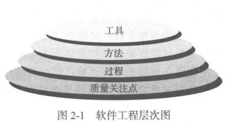

## 软件工程

软件工程包括过程、一系列方法（实践）和大量工具，专业人员借由这些来构建高质量的计算机软件 

​													——《软件工程 实践者的研究方法》

### 定义软件工程学科

软件工程是：

1. 将系统化的、规范的、可量化的方法应用于软件的开发、运行和维护，即将工程化方法应用于软件；
2. 对第一条所描述方法的研究										——IEEE

### 软件过程

软件工程是工作产品构建时所执行的一系列活动、动作和任务的集合，活动（ activity ）主要实现宽泛的目标 （ 如与利益相关者进行沟通 ），与应用领域、项目大小、结果复杂性或者实施软件工程的重要程度没有直接关系。动作（ action，如体系结构设计）包含了主要工作产品（ 如体系结构设计模型 ）生产过程中的一系列任务。任务（ task）关注小而明确的目标，能够产生实际产品（如构建一个单元测试）。

#### 过程框架

**过程框架（ process framework ）**定义了若干个**框架活动（ framework activity ）**，为实现完成的软件工程过程建立了基础。

这些框架可以广泛运用于所有软件开发项目，无论项目的规模和复杂性。

框架还包含一些**普适性活动（ umbrella  activity ）**

通用的软件工程过程框架通常包含以下 5 个活动：

1. 沟通：在技术活动开始前，和客户（或其他利益相关者）进行沟通和协作。目的是理解利益相关者的项目目标，并收集需求以定义软件特性和功能。

2. 策划：策划活动就好比地图，称为软件项目计划，用以指导团队的项目旅程，它定义和描述了软件工程工作，包括需要执行的技术任务、可能的风险、资源需求、工作产品和工作进度计划。

3. 建模：一个描述项目构想的草图，用以理解整个项目的体系结构、不同构件如何结合以及其他特性。如果有需要，可以将草图不断细化，以更好理解问题并找到解决方案。

	> [!TIP]
	> 总体来说就是利用模型来理解软件需求，并完成这些需求的软件设计。

4. 构建：对所做设计进行构建，包含编码和测试。

5. 部署：软件（ 全部或者部分增量 ）交付给用户，用户对其评测并给出反馈意见。

> [!NOTE]
>
> 对于许多项目来说，随着项目的开展，框架活动可以迭代运用，以上五个活动会不断重复。每次项目迭代都会产生一个 **软件增量（ software increment ）**，每个软件增量实现了部分软件特性和功能。随着每次软件增量的产生，软件逐渐完善。

::: detail 利益相关者

在项目成功中分享利益的人，包括业务经理、最终用户、软件工程师、支持人员等。

:::

#### 普适性活动

软件工程过程框架活动由很多普适性活动补充实现。这些普适性活动贯穿项目始终，帮助软件团队管理和控制项目进度、质量、变更和风险。

典型的普适性活动包含：

1. 软件项目跟踪和控制：项目组根据计划来评估项目进度，并且采取必要的措施保证项目按进度计划执行。
2. 风险管理：对可能影响项目成果或者产品质量的风险进行评估。
3. 软件质量保证：确定和执行保证软件质量的活动。
4. 技术评审：评估软件工程产品，尽量在错误传播到下一个活动之前发现并清除错误。
5. 测量：定义和收集过程、项目以及产品的度量，以帮助团队在发布软件时满足利益相关者的要求。测量可以和其他框架活动和普适性活动配合使用。
6. 软件配置管理：在整个软件过程中管理变更所带来的影响。
7. 可复用管理：定义工作产品复用的标准（ 包括软件构件 ），并且建立构件复用机制。
8. 工作产品的准备和生产：包括生产产品（ 建模、文档、日志、表格、列表等 ）所必须的活动。 

> [!TIP]
>
> 上述的普适性活动在后续详细讨论

#### 过程的适应性调整

软件工程过程不是教条的法则，也不要求软件团队机械性地执行，而应该是灵活可适应的（ 软件所解决的问题、项目特点、开发团队和组织文化等进行适应性调整 ）。

不同项目采用的项目过程可能有很大不同，主要体现为：

* 活动、动作和任务的总体流程以及相互依赖关系。
* 在每一个框架活动中，动作和任务细化的程度。
* 工作产品的定义和要求的程度。
* 质量保证活动应用的方式。
* 项目跟踪和控制活动应用的方式。
* 过程描述的详细程度和严谨程度。
* 客户和利益相关者对项目的参与程度。
* 软件团队所赋予的自主权。
* 队伍组织和角色的明确程度。

### 软件工程实践

上几节讨论到通用的框架活动包含：沟通、策划、建模、构建和部署这些一般性的活动和普适性活动构成了软件工程工作的体系结构的轮廓。

下面将讨论如何在事件中融入这些活动：

#### 实践的精髓

计算机发明之前，一本经典著作《How to Solve it》这本书提到了解决我们日常问题的精髓：

1. 理解问题（ 沟通和分析 ）
2. 策划解决方案（ 建模和软件设计 ）
3. 实施计划（ 代码生成 ）
4. 检查结果的正确性（ 测试和质量保证 ）

这些通常也是软件开发的常识性步骤，更本质的是：

**理解问题**

> [!NOTE]
>
> 一般要考虑如下问题：
>
> * 谁会从问题的解决中获益？（ 谁是利益相关者？）
> * 哪些是未知的？（ 哪些数据、功能和特性是解决问题所必须的？ ）
> * 问题是否可以划分？（ 是否可以描述为更小的、更容易理解的问题？ ）
> * 问题可以图形化描述吗？（ 可以建立分析模型吗？ ）

**策划解决方案**：理解了问题后，慢下来进行一些设计。

> [!NOTE]
>
> 一般要考虑如下问题：
>
> * 以前是否遇到类似的问题？（ 在潜在的解决方案中是否可以识别一些模式？是否已经有软件实现了所需要的数据、功能和特性？ ）
> * 类似问题是否解决过？（ 如果是，解决方案包含元素是否可以复用？ ）
> * 可以定义子问题吗？（ 如果可以，子问题是否已有解决方案？ ）
> * 能用一种可以很快实现的方式来描述解决方案吗？能构建出设计模型吗？

**实施计划**：前面的策划设计后，可能存在没有想到的解决方法，也可能在该过程发现更好的解决方法。但是这个计划可以保证在实施过程中不至迷失方向。

> [!NOTE]
>
> 需要考虑的是：
>
> * 解决方案和计划一致吗？源码是否可追溯到设计模型？
> * 解决方案的每个组成部分是否可以证明正确？设计和代码是否经过评审？或者采用更好的方式，算法是否经过正确性证明？

**检查结果**：不能保证解决方案是最完美的，但是可以保证设计足够的测试来发现尽可能多的错误。

> [!NOTE]
>
> 需要解决的是：
>
> * 能否测试解决方案的每个部分？是否实现了合理的测试策略？
> * 解决方案是否产生了与所要求的数据、功能和特性一致的结果？是否按照项目利益相关者的需求进行了确认？

### 通用原则