## 缓存穿透

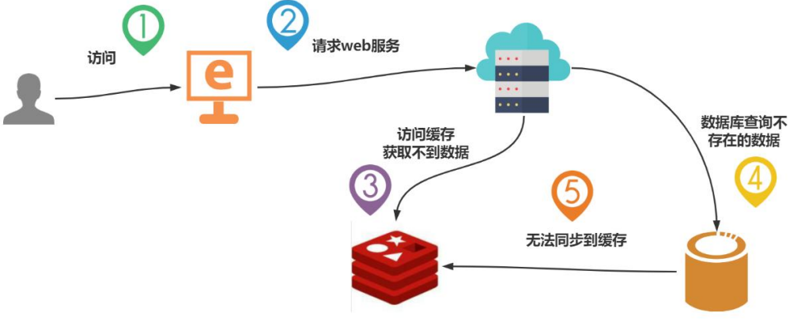

**缓存穿透的原因**

key 对应的数据在数据源并不存在，每次针对此 key 的请求从缓存获取不到，请求都会压到数据源, 可能压垮数据源 

比如用一个不存在的用户 id 获取用户信息，不论缓存还是数据库都没有，若黑客利用此漏洞进行攻击可能压垮数据库 

如果从存储层查不到数据则不会写入缓存，这将导致这个不存在的数据每次请求都要到存储层去查询, 失去了缓存的意义

**缓存穿透的现象/表象**

* 应用服务器压力变大 
* Redis 命中率降低
* 一直查数据库

**解决方案**

* 对空值缓存

> [!NOTE]
>
> 思路：如果一个查询返回的数据为空，我们仍然把这个空结果（null）进行缓存，设置空结果的过期时间应该短些，最长不超过五分钟或者在查询该 key 对应的数据 insert 后再进行清理缓存

*  设置可访问的名单(白名单) 

> [!NOTE]
>
> 思路：定义一个可以访问的名单，每次访问和白名单的 id 进行比较，如果访问id 不在白名单里面，进行拦截，不允许访问, 比如使用 bitmaps 实现.

* 采用布隆过滤器

>  [!NOTE]
>
> 特点：布隆过滤器可以用于检索一个元素是否在一个集合中。它的优点是空间效率和查询时间都远远超过一般的算法，缺点是有一定的误识别率和删除困难
>
> 思路：在查询的时候先去布隆过滤器查询 key 是否存在，如果不存在就直接返回，存在再查缓存和DB（推荐）

* 进行实时监控 

> [!NOTE]
>
> 当发现 Redis 的命中率开始急速降低, 需要排查访问对象和访问的数据, 和运维人员配合, 可以设置黑名单限制服务

::: info 建议

一般性的采用 `空值缓存` 和 `布隆过滤器` 的方案

:::

::: details 布隆过滤器

布隆过滤器（Bloom Filter）

* 用于检索一个元素是否在一个集合中，优点是空间效率和查询时间都比一般的算法要好的多，缺点是有一定的误识别率和删除困难
* 布隆过滤器实际上是一个 bit 向量或者说 bit 数组，使用多个不同的哈希函数生成多个哈希值，并对每个生成的哈希值对应的 bit 位置 1
* 核心思想
	* 使用多个哈希函数，增大随机性，减少 hash 碰撞的概率
	* 扩大数组范围，使 hash 值均匀分*布*，进一步减少 hash 碰撞的概率

更详细查看这篇[博客](https://blog.csdn.net/Xin_101/article/details/129066363)

:::

## 缓存击穿

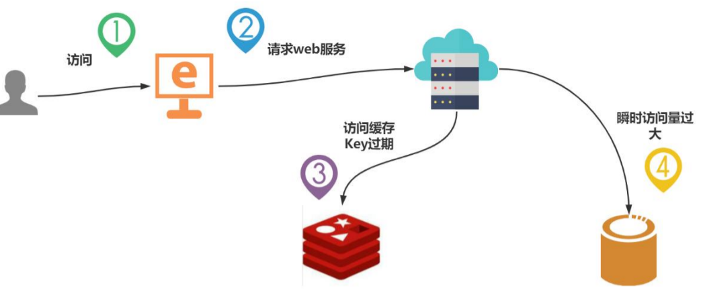

> 缓存击穿，指的是在缓存失效的同时，有大量的并发读请求，这些读请求会在同一时间穿透缓存层到达数据库，使数据库的压力变大，严重的时候，会导致数据库宕机。

比如某个热点数据, 可能会在某些时间点, 被超高并发地访问, 容易出现缓存击穿

**缓存击穿的现象/表象**

* 数据库访问压力瞬时增加
* Redis 里面没有出现大量 key 过期
* Redis 正常运行状态, 但是数据库可能瘫痪了

**解决方案**

* 预先设置热门数据 

> [!NOTE]
> 在 redis 高峰访问之前，把一些热门数据提前存入到 redis 里面，加大这些热门数据key的时长

* 实时调整 

> [!NOTE]
> 现场监控哪些数据热门，实时调整 key 的过期时长

* 用锁控制访问的线程

> [!NOTE]
> 在缓存失效的时候（判断拿出来的值为空），不是立即去load db。先使用缓存工具的某些带成功操作返回值的操作（比如 Redis 的SETNX）去set 一个mutexkey 
>
> 当操作返回成功时，再进行 load db 的操作，并回设缓存,最后删除mutex key；
>
> 当操作返回失败，证明有线程在 load db，当前线程睡眠一段时间再重试整个get 缓存的方法 
>
> 但是使用锁效率会有影响

::: info 建议

一般采用分布式锁来控制访问线程的方案

:::

## 缓存雪崩

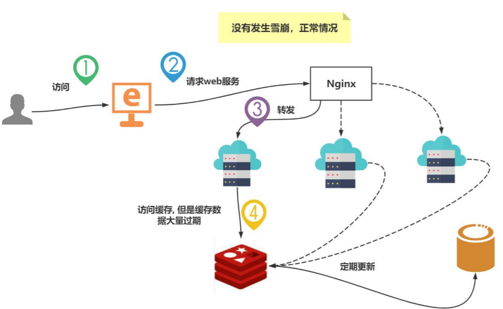

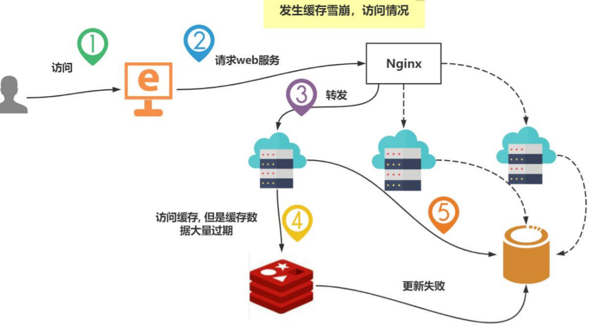

> 当缓存服务器重启或者大量缓存集中在某一个时间段失效，这样在失效的时候，也会给后端系统(比如 DB)带来很大压力 

::: info 区分缓存击穿

缓存雪崩与缓存击穿的区别在于这里针对很多 key 缓存

:::

**缓存雪崩的现象/表象**

* 数据库访问压力变大, 服务器崩溃 

* 在极短时间内, 访问大量 Key, 而这些 Key 集中过期

**解决方案/思路**

* 构建多级缓存架构

> [!NOTE]
> nginx 缓存 + redis 缓存 +其他缓存（ehcache 等） , 这种方式开发/维护成本较高

* 使用锁或队列

> [!NOTE]
> 用加锁或者队列的方式来保证不会有大量的线程对数据库一次性进行读写，从而避免失效时大量的并发请求落到底层存储系统上。

> [!CAUTION]
> 不适用高并发情况

* 设置过期标志更新缓存

> [!NOTE]
> 记录缓存数据是否过期，如果过期会触发通知另外的线程在后台去更新实际key 的缓存。

* 将缓存失效时间分散开

> [!NOTE]
> 可以在原有的失效时间基础上增加一个随机值，比如1-5 分钟随机，这样每一个缓存的过期时间的重复率就会降低，就很难引发集体失效的事件

::: info 建议

一般采用给不同的key设置不同过期时间来避免缓存雪崩

:::

## 分布式锁

### 前言

单体单机部署的系统被演化成分布式集群系统后，由于分布式系统多线程、多进程并且分布在不同机器上，这将使原单机部署情况下的并发控制锁策略失效，单纯的 Java API 并不能提供分布式锁的能力 

为了解决这个问题就需要一种跨 JVM 的互斥机制来控制共享资源的访问，这就是分布式锁要解决的问题 

> [!TIP]
> 我们探讨的分布式锁是针对分布式项目/架构而言

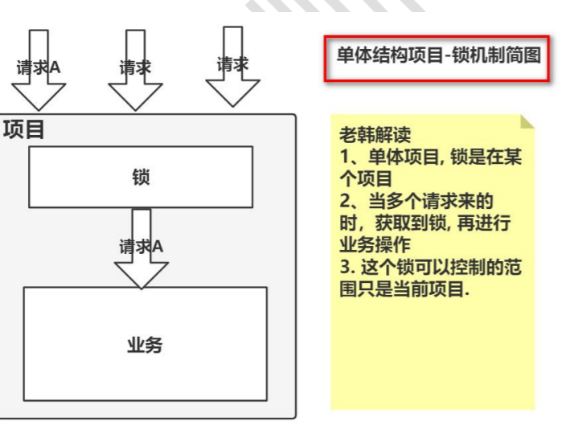

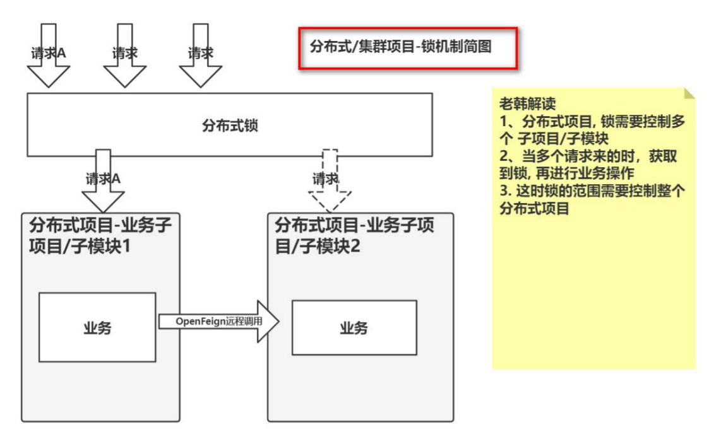

### 分布式锁主流实现方案

1. 基于数据库实现分布式锁

2. 基于缓存（Redis 等）

3. 基于 Zookeeper

> [!TIP]
> 性能：redis 最高 
> 可靠性：zookeeper 最高

**Redis 实现分布式锁**

1. 指令:` setnx key value `

setnx 可以理解是上锁/加锁指令，key 是锁的键，value 是锁的值，在这个 key 没有删除前, 不能执行相同 key 的上锁指令.

2. 指令: `del key`

就是删除 key, 可以理解成就是释放锁

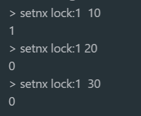

可以看到，设置了lock:1这把锁，如果不进行删除就会导致后面的重新设置这个值的操作失败

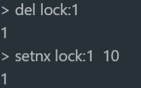

可以看到删除该键后（相当于释放锁）又可以重新设置这个键值

3. 指令: `expire key seconds`

给锁-key ，设置过期时间，目的是防止死锁

4. 指令：`ttl key`

查看某个锁-key，过期时间，过期后删除原来设置的 key-value

比如：setnx lock:1 100 ，expire lock:1 60（设置60秒过期），然后期间ttl就可以实时查看当前过期的剩余时间

5. 指令：`set key value nx ex seconds`

设置锁的同时, 指定该锁的过期时间，防止死锁，过期时间到后, 会自动删除

> [!TIP]
> 这个指令是原子性的，防止` setnx key value / expire key seconds` 两条指令中间执行被打断。

### 实例

#### Springboot集成Redis实现分布式锁

模拟一个并发需求，几个线程任务同时操作一个业务

思路：

1. 获取到分布式锁

该情况执行正常业务，在开始阶段先设置一下锁key（获取锁），然后执行正常业务逻辑，最后再释放锁。

2. 没有获取到分布式锁

线程休眠几秒，然后重新尝试获取锁，如果还没有获取到就再次重复以上过程。

```java
@GetMapping("/testLock")
public viod testLock(){
	//获取锁，setnx操作
	Boolean lock = redisTemplate.opsForValue().setIfAbsent("lock", "ok");
	
	
	if (lock) {
	
		Object value = redisTemplate.opsForValue().get("num")
		
        if (StringUtils.isEmpty(value)) {
       		 return;
        }
        int num = Integer.parseInt(value + "");
        redisTemplate.opsForValue().set("num", ++num);
        
        //释放锁
        redisTemplate.delete("lock");
    }else{
		//获取锁失败、每隔 0.1 秒再获取
        try {
                Thread.sleep(100);
            	testLock();
            } catch (InterruptedException e) {
            e.printStackTrace();
        }
	}


}
```

使用ab工具测试：

`ab -n 1000 -c 100 http://192.168.198.1:8080/redisTest/testLock`

> 192.168.198.1 是 linux 访问本机的地址


> [!CAUTION]
> 以上代码容易造成死锁的产生

#### 堆栈溢出问题

**递归调用**：在获取锁失败时，代码使用递归调用 `testLock()`。在每次调用前会进行 `Thread.sleep(100);` 的等待，但由于递归调用并没有限制重试的次数，可能会导致栈溢出，进而导致应用程序崩溃，可以采用循环重试的方式代替递归方式或者限制重试的次数。

#### 死锁问题

分析如上代码，没有考虑异常情况。如果某一次的业务操作失败（堆栈异常），后续的逻辑中断了。锁没有成功释放，其他线程任务无法获取锁。

优化

* 在发生异常的时候释放锁，利用finally

* 可以设置锁的过期时间来防止死锁情况的产生。

```java
//获取锁，setnx操作，设置过期时间为3秒
Boolean lock = redisTemplate.opsForValue().setIfAbsent("lock", "ok", 3, TimeUnit.SECONDS);
```

使用ab工具测试：

`ab -n 1000 -c 100 http://192.168.198.1:8080/redisTest/testLock`

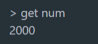


#### 误删锁问题-锁唯一性

问题分析：

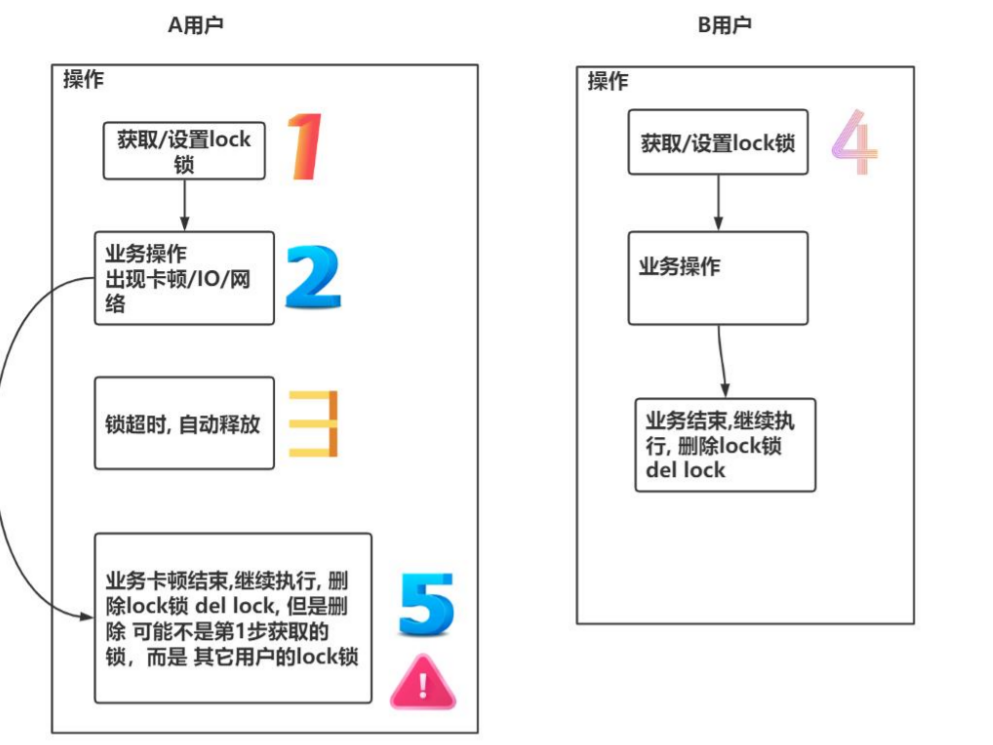

分析：在获取锁的时候, 给锁设置的值是唯一的 `uuid`，在释放锁时,判断释放的锁是不是同一把锁，造成这个问题的本质原因, 是因为删除操作缺乏原子性

```java
@GetMapping("testLock")
public void testLock() {
    //1 获取锁，setnx
    //得到一个 uuid 值，作为锁的值
    String uuid = UUID.randomUUID().toString();
    Boolean lock = redisTemplate.opsForValue().setIfAbsent("lock", uuid, 3, TimeUnit.SECONDS);
    //2 获取锁成功、查询 num 的值
    if (lock) {
        Object value = redisTemplate.opsForValue().get("num");
        //2.1 判断 num 为空 return
        if (StringUtils.isEmpty(value)) {
        	return;
      	}
        //2.2 有值就转成成 int
        int num = Integer.parseInt(value + "");
        //2.3 把 redis 的 num 加 1
       redisTemplate.opsForValue().set("num", ++num);
        //2.4 释放锁，del
        //为了防止误删锁, 进行判断
        //判断当前这个锁是不是前面获取到的锁, 相同才进行删除/释放
        if (uuid.equals((String) redisTemplate.opsForValue().get("lock"))) {
                redisTemplate.delete("lock");
        }
    	} else {
          //3 获取锁失败、每隔 0.1 秒再获取
            try {
            Thread.sleep(100);
            testLock();
            } catch (InterruptedException e) {
            e.printStackTrace();
            }
      	}
}
```

使用ab工具测试：

`ab -n 1000 -c 100 http://192.168.198.1:8080/redisTest/testLock`


#### 原子性问题

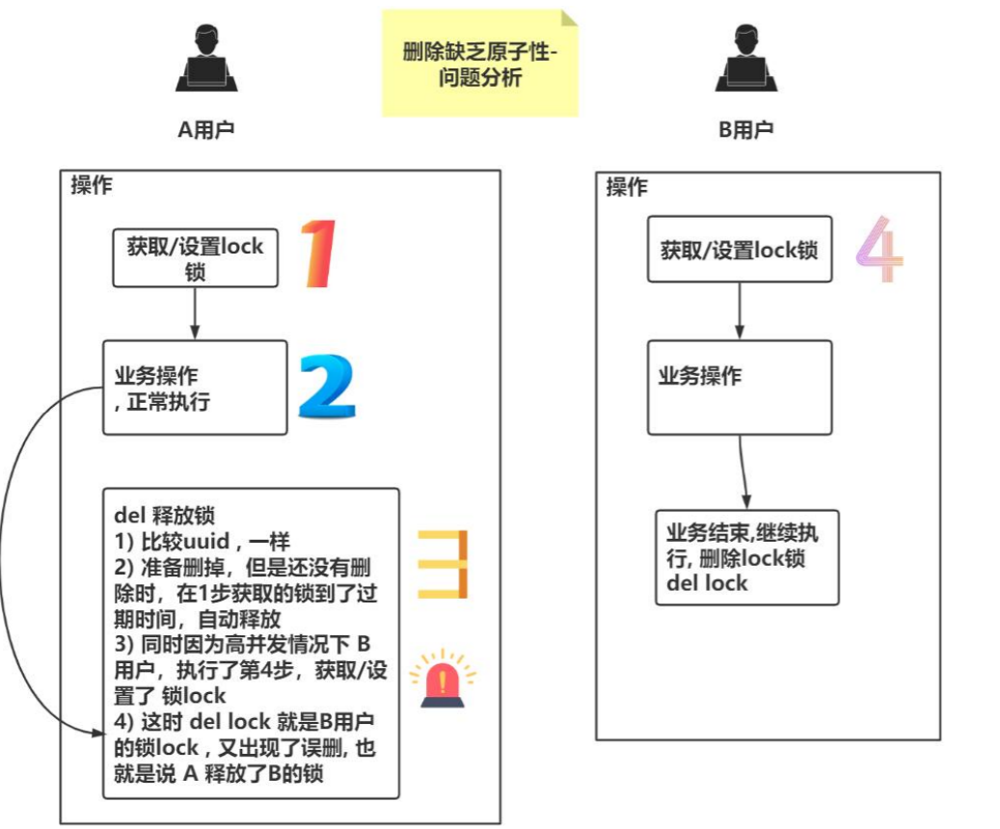

分析：

1) 删除操作缺乏原子性
2) 使用 Lua 脚本保证删除原子性

```java
@GetMapping("testLock")
public void testLock() {
            //1 获取锁，setnx
            //得到一个 uuid 值，作为锁的值
            String uuid = UUID.randomUUID().toString();
            Boolean lock =
            redisTemplate.opsForValue().setIfAbsent("lock", uuid, 3, TimeUnit.SECONDS);
            //2 获取锁成功、查询 num 的值
            if (lock) {
            Object value = redisTemplate.opsForValue().get("num");
                //2.1 判断 num 为空 return
                if (StringUtils.isEmpty(value)) {
                   return;
                }
      		  //2.2 有值就转成成 int
            int num = Integer.parseInt(value + "");
         	//2.3 把 redis 的 num 加 1
            redisTemplate.opsForValue().set("num", ++num);
            //2.4 释放锁，del
                
                
            //=====使用 lua 脚本来锁, 控制删除原子性========
            // 定义 lua 脚本
            String script = "if redis.call('get', KEYS[1]) == ARGV[1] then return redis.call('del', KEYS[1]) else return 0 end";
            // 使用 redis 执行 lua 执行
            DefaultRedisScript<Long> redisScript = new DefaultRedisScript<>();
            redisScript.setScriptText(script);
            // 设置一下返回值类型 为 Long
            // 因为删除判断的时候，返回的 0,给其封装为数据类型。如果不封装那么默认返回String类型，
            // 那么返回字符串与 0 会有发生错误。
            redisScript.setResultType(Long.class);
            // 第一个是 script 脚本 ，第二个需要判断的 key，第三个就是key 所对应的值//Arrays.asList("lock") 会 传 递 给 script 的 KEYS[1] , uuid 会传递给ARGV[1] 
            redisTemplate.execute(redisScript, Arrays.asList("lock"), uuid);
            //=====为了防止误删锁, 进行判断====
           //判断当前这个锁是不是前面获取到的锁, 相同才进行删除/释放
            //if (uuid.equals((String) redisTemplate.opsForValue().get("lock"))) {
            // redisTemplate.delete("lock");
            //}
            //=======================
        } else {
            //3 获取锁失败、每隔 0.1 秒再获取
            try {
                Thread.sleep(100);
                testLock();
            } catch (InterruptedException e) {
                e.printStackTrace();
            }
        }
}
```

Lua脚本解析：

* 如果服务器返回OK，当前客户端获得锁
* 服务端返回NIL，客户端获取锁失败，可以在稍后重试

设置过期的时间达到自动释放锁

通过以下优化可以使该锁更加健壮：

* 不使用规定的字符串作为键的值，而是设置一个不可猜测（non-guessable）的长随机字符串，作为token。
* 不使用 `DEL` 命令释放锁，而是发送一个 `Lua` 脚本，这个脚本只在客户端传入的值和键的token匹配时才对键进行删除。

使用ab工具测试：

`ab -n 1000 -c 100 http://192.168.198.1:8080/redisTest/testLock`


#### 小结

* 定义锁的 key

key 可以根据业务, 分别设置，比如操作某商品, key 应该是为每个sku定义的，也就是每个 sku 有一把锁

::: details  sku是什么

**SKU** (Stock Keeping Unit) 是库存单位的缩写，是指商品管理中的最小库存单元。SKU 通常用于标识和区分不同的商品，包括商品的型号、规格、颜色等属性。

在电商平台、仓储系统或商品管理系统中，SKU 是用来唯一标识一个具体商品的编号。例如，同一种产品可能有不同颜色和不同尺寸，这些不同的版本就会有不同的 SKU 编号。

具体特点：

* **唯一性**：每个 SKU 都是唯一的，可以帮助商家跟踪库存、销售情况等。
* **层次性**：SKU 可以细分到商品的不同属性，比如同款衣服的不同颜色和尺码，可能对应不同的 SKU。
* **管理性**：在商品管理系统中，通过 SKU，可以实现商品的库存管理、销售统计等功能。

举例：

* 一双鞋的基本型号是 "运动鞋"，那么：
	* 红色、42 码的鞋子 SKU 可能是：SHOES-RED-42
	* 蓝色、40 码的鞋子 SKU 可能是：SHOES-BLUE-40

通过 SKU，商家可以精确管理每个具体商品的库存和销售情况。

:::

* 为了确保分布式锁可用，要确保锁的实现同时满足以下四个条件:
	* 互斥性。在任意时刻，只有一个客户端能持有锁。 
	* 不会发生死锁。即使有一个客户端在持有锁的期间崩溃而没有主动解锁，也能保证后续其他客户端能加锁。 
	* 加锁和解锁必须是同一个客户端，A 客户端不能把 B 客户端加的锁给解了
	* 加锁和解锁必须具有原子性

