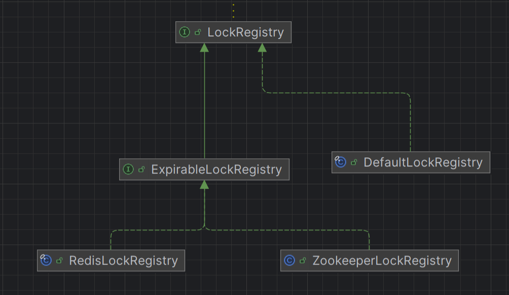

## redis实现

> [!TIP]
> 查看[集成redis常见问题和解决方案](https://chgoh7.site/notes/JavaEE/k6kk3ojb/)(包含redis分布式锁的应用)

### org.springframework.integration.redis.util.RedisLockRegistry类



#### 获取锁

> Acquires the lock only if it is free at the time of invocation.
> Acquires the lock if it is available and returns immediately with the value true. If the lock is not available then this method will return immediately with the value false.
>
> A typical usage idiom for this method would be:
>
> ```java
> Lock lock = ...; 
> if (lock. tryLock()) {   
>  try {  
>    // manipulate protected state  
>  } finally {   
>      lock. unlock();  
>  } 
> } else {   
>  // perform alternative actions
> }
> ```
>
> This usage ensures that the lock is unlocked if it was acquired, and doesn't try to unlock if the lock was not acquired.
>
> Returns: `true` if the lock was acquired and `false `otherwise

```java{3}
public boolean tryLock() {
            try {
                return this.tryLock(0L, TimeUnit.MILLISECONDS);
            } catch (InterruptedException var2) {
                Thread.currentThread().interrupt();
       return false;
}
```

查看tryLock方法

```java{10}
 public boolean tryLock(long time, TimeUnit unit) throws InterruptedException {
            long now = System.currentTimeMillis();
            if (!this.localLock.tryLock(time, unit)) {
                return false;
            } else {
                try {
                    long expire = now + TimeUnit.MILLISECONDS.convert(time, unit);

                    boolean acquired;
                    while(!(acquired = this.obtainLock()) && System.currentTimeMillis() < expire) {
                        Thread.sleep(100L);
                    }

                    if (!acquired) {
                        this.localLock.unlock();
                    }

                    return acquired;
                } catch (Exception var9) {
                    Exception e = var9;
                    this.localLock.unlock();
                    this.rethrowAsLockException(e);
                    return false;
                }
            }
        }
```

查看obtain方法，查看execute方法的第一个参数`RedisLockRegistry.this.obtainLockScript`，参数为` RedisLockRegistry`的属性

```java{2}
  private boolean obtainLock() {
            Boolean success = (Boolean)RedisLockRegistry.this.redisTemplate.execute(RedisLockRegistry.this.obtainLockScript, Collections.singletonList(this.lockKey), new Object[]{RedisLockRegistry.this.clientId, String.valueOf(RedisLockRegistry.this.expireAfter)});
            boolean result = Boolean.TRUE.equals(success);
            if (result) {
                this.lockedAt = System.currentTimeMillis();
            }

            return result;
        }
```

这里是用了Lua脚本，是为了保证原子性，所有操作使用一个lua脚本完成，就不会有并发安全问题。详细查看[链接](https://chgoh7.site/notes/JavaEE/k6kk3ojb/#%E5%8E%9F%E5%AD%90%E6%80%A7%E9%97%AE%E9%A2%98)。

```java{8}
  public RedisLockRegistry(RedisConnectionFactory connectionFactory, String registryKey, long expireAfter) {
        this.locks = new ConcurrentHashMap();
        this.clientId = UUID.randomUUID().toString();
        this.executor = Executors.newCachedThreadPool(new CustomizableThreadFactory("redis-lock-registry-"));
        Assert.notNull(connectionFactory, "'connectionFactory' cannot be null");
        Assert.notNull(registryKey, "'registryKey' cannot be null");
        this.redisTemplate = new StringRedisTemplate(connectionFactory);
        this.obtainLockScript = new DefaultRedisScript("local lockClientId = redis.call('GET', KEYS[1])\nif lockClientId == ARGV[1] then\n  redis.call('PEXPIRE', KEYS[1], ARGV[2])\n  return true\nelseif not lockClientId then\n  redis.call('SET', KEYS[1], ARGV[1], 'PX', ARGV[2])\n  return true\nend\nreturn false", Boolean.class);
        this.registryKey = registryKey;
        this.expireAfter = expireAfter;
    }
```

脚本解释：

1. 获取当前锁的客户端ID:

	1. 脚本首先获取键 KEYS[1] 的值，这个值表示当前锁的持有者。
	2. 判断锁的状态:
		1. 如果锁的持有者是当前客户端（lockClientId == ARGV[1]），则更新锁的有效期。
		2. 如果锁的持有者不存在（not lockClientId），则设置新的锁。
		3. 如果锁的持有者不是当前客户端，则返回 false 表示无法获取锁。

2. 示例
	如果有以下几个参数：

	```
	KEYS[1] = "my_lock"
	ARGV[1] = "client1"
	ARGV[2] = 30000 （30秒）
	```

	1. 获取锁的客户端ID:
		1. 脚本执行 redis.call('GET', 'my_lock') 获取当前锁的持有者。
		2. 判断锁的状态:
			1. 如果当前锁的持有者是 "client1"，则执行 redis.call('PEXPIRE', 'my_lock', 30000) 更新锁的有效期，并返回 true。
			2. 如果当前锁的持有者不存在，则执行 redis.call('SET', 'my_lock', 'client1', 'PX', 30000) 设置新的锁，并返回 true。
			3. 如果当前锁的持有者不是 "client1"，则返回 false。
	2. 总结
		这段Lua脚本主要用于实现Redis中的分布式锁功能，通过检查和设置锁的状态来确保只有一个客户端能够获得锁，并且可以更新锁的有效期。这种实现方式可以有效地防止竞态条件，并保证锁的一致性和安全性。

## zookeeper实现

> https://zhuanlan.zhihu.com/p/639756647

```
RedisLockRegistry
```


## 案例

利用Spring AOP实现分布式锁

