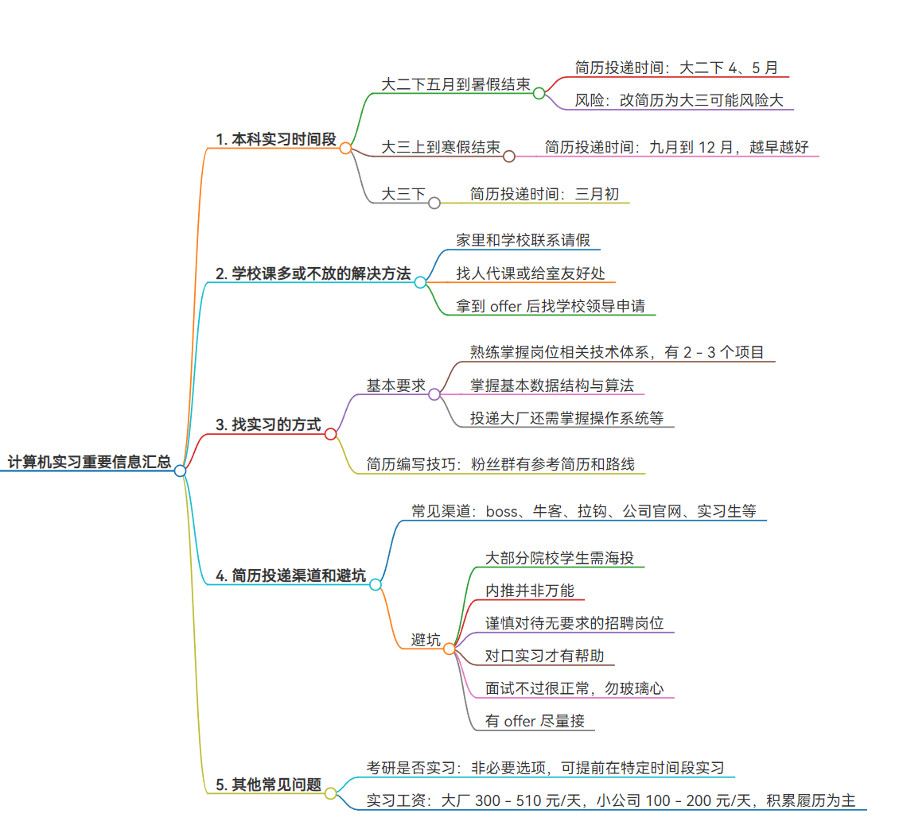

## **计算机实习重要信息汇总**

### **1. 本科实习时间段**

- 大二下五月到暑假结束
	- 简历投递时间：大二下 4、5 月
	- 风险：改简历为大三可能风险大
- 大三上到寒假结束
	- 简历投递时间：九月到 12 月，越早越好
- 大三下
	- 简历投递时间：三月初

### **2. 学校课多或不放的解决方法**

- 家里和学校联系请假（不要和导员说要去实习）
- 找人代课或给室友好处
- 拿到 offer 后找学校领导申请

### **3. 找实习的方式**

- 基本要求
	- 熟练掌握岗位相关技术体系，有 2 - 3 个项目
	- 掌握基本数据结构与算法
	- 投递大厂还需掌握操作系统等
- 简历编写技巧：粉丝群有参考简历和路线

### **4. 简历投递渠道和避坑**

- 常见渠道：boss、牛客、拉钩、公司官网、实习生等
- 避坑
	- 大部分院校学生需海投
	- 内推并非万能
	- 谨慎对待无要求的招聘岗位
	- 对口实习才有帮助
	- 面试不过很正常，勿玻璃心
	- 有 offer 尽量接

### **5. 其他常见问题**

- 考研是否实习：非必要选项，可提前在特定时间段实习
- 实习工资：大厂 300 - 510 元/天，小公司 100 - 200 元/天，积累履历为主

## 一些博主的案例

### 案例一：**实习一年的感受与分享**

#### **1. 个人背景与经历**

- 背景：大三结束（去年六月）至今年五月实习，来自民办本科郑州西亚斯学院
- 经历：
	- 感谢学校计算机学院务实的政策和老师的教导
	- 从java课程入门，老师提供学习资源
	- 受到第二位老师鼓励，锻炼独立编码能力

#### **2. 独立编码与项目实践**

- 从简单项目开始，自己是产品经理、开发、测试和运维
- 不断重构代码，积累项目经验
- 学习新技术融入项目，增强面试自信

#### **3. 工作经历与建议**

- 第一份工作：小公司，待遇低，感觉不对及时换
- 第二份工作：抓住机会成功入职
- 建议：机会比努力更重要，不要等准备好再面试

#### **4. 就业环境与思考**

- 就业情况不乐观，公司裁员
- 思考：不要纠结考研还是工作，衡量成本和风险自己做决定

#### **5. 学习与面试建议**

* 投递简历的时间段很重要，最好是在周一到周四的早上九点半到11点投递。

- 培养独立思考能力，做项目树立自信
- 面试注重语言表达和给人的感觉
- 注重能力培养，不过分追求新技术
- 学会spring boot和mysql可应付实习工作，强调学习能力
- 多投简历，创造机会

#### **6. 公司降本增效与职场为人处事**

- 降本增效方式：压榨加班、用更少的人做更多需求
- 考虑成本和性能的平衡
- 在职场要学会做人做事，说话做事圆滑些，有助于升职加薪

相关问题参考：

* [计算机专业该如何找实习工作](https://zhuanlan.zhihu.com/p/337349223)
* [秋招和春招是什么？该如何准备？](https://zhuanlan.zhihu.com/p/288229812)
* [秋招是啥意思，到时候会有企业来学校招聘，还是自己网上找啊，二本的秋招重要吗？](https://www.zhihu.com/question/463106191)
* [以过来人的身份聊聊实习招聘、秋招、春招(给应届毕业生)](https://www.cnblogs.com/kissazi2/p/3602483.html)
* [马上大四了，秋招还是春招好？先找工作还是找实习](https://blog.csdn.net/MarkerHub/article/details/125734597)
* [马上开学大四，大四上是实习还是秋招？如何选择最明智？](https://zhuanlan.zhihu.com/p/557353336)
* [什么是应届生?为何应届生身份如此重要?](https://zhuanlan.zhihu.com/p/103694344)
* [应届生三方协议该怎么签？](https://zhuanlan.zhihu.com/p/149609479)
* [签了三方就不是应届生了么？](https://new.qq.com/rain/a/20231118A077EK00)
* [就业 | 应届生必读：三方协议、两方协议、实习协议、劳动合同还傻傻分不清楚？](https://www.bilibili.com/read/cv10413370/)
