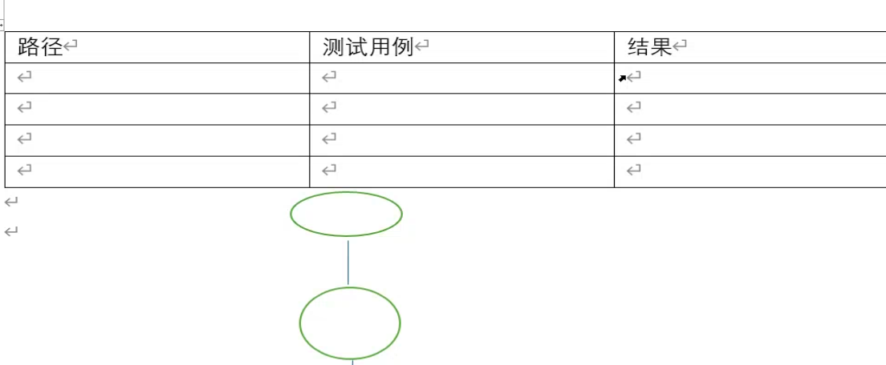

## 选择题（10‘）

1. 软件工程中的螺旋模型主要增加了哪个阶段的活动（D）
   A.需求分析        B. 设计       C. 测试      D. 风险分析

2. 软件需求规格说明书的主要作用是什么（D）
   A. 作为项目结束的总结文档          B. 作为软件开发的法律性文件
   C. 作为软件测试的唯一依据          D. 作为软件维护的指导文档

3. 哪种设计方法强调了软件的模块化（B）
   A. 结构化设计  B. 面向对象设计  C. 功能设计  D. 数据流设计

4. 软件测试中，黑盒测试不关注以下哪一项（C）
   A. 输入数据       B. 软件功能
   C. 内部逻辑       D. 输出结果

5. 软件项目管理的主要目标不包括以下哪一项（C）
   A. 确保项目按时完成       B. 确保项目在预算内完成
   C. 确保项目符合技术标准   D. 确保项目团队成员满意

6. 软件工程可维护性不涉及哪个？（D）
   A.可测试性 B.可理解性 C.可扩展性 D.可销售性

7. 软件工程中的配置管理不涉及以下哪一项活动（C）
   A. 版本控制     B. 变更管理   C. 性能评估     D. 性能评估

8. 面向对象方法中，不属于UML图的是（C）
   A. 类图     B. 序列图     C. 流程图      D. 用例图

9. 软件工程中的敏捷开发方法不包括以下哪一项（C）
   A. Scrum    B. 极限编程    C. 瀑布模型     D. 精益开发

10. 软件工程中的软件质量保证活动不包括以下哪一项（C）
    A. 代码审查     B. 软件测试     C. 需求变更     D. 质量审计

11. 在软件工程中，瀑布模型的主要缺点是什么（B）
    A. 开发周期长           B. 不支持需求变更
    C. 开发成本高           D. 不适合大型项目

12. 敏捷开发强调什么（B）
    A. 严格的计划和文档     B. 持续的交付和反馈
    C. 详细的测试和验证     D. 大量的前期设计和规划

13. 什么是软件架构（B）
    A. 软件的源代码结构     B. 软件的系统级设计
    C. 软件的物理部署结构   D. 软件的数据库设计

14. 在软件工程中，哪个模型强调了迭代和增量的开发方法（C）
    A. 瀑布模型   B. 增量模型    C. 螺旋模型     D. 敏捷模型

15. 在面向对象分析中，对象之间的主要关系有哪些（B）
    A. 继承、封装、多态     B. 关联、聚合、组合、继承
    C. 封装、继承、接口     D. 关联、继承、接口

16. 什么是代码重构（B）
    A. 重新编写整个软件系统       B. 改进现有代码的结构和可读性
    C. 修复软件中的错误           D. 对软件进行性能优化

17. 在软件维护中，哪种维护所占的比例最高（A）
    A. 改正性维护  B. 适应性维护  C. 完善性维护  D. 预防性维护

18. 什么是软件复用（C）
    A. 使用相同的代码开发不同的软件      B. 使用相同的工具开发不同的软件
    C. 使用已有的软件元素来构造新的软件  D. 使用相同的开发方法开发不同的软件

19. 敏捷开发中的“Scrum”指的是什么（A）
    A. 一种项目管理框架       B. 一种需求分析方法
    C. 一种代码编写规范       D. 一种软件测试技术

20. 以下哪种模式属于设计模式中的创建型模式（A）
    A. 工厂方法模式   B. 模板方法模式     C. 观察者模式   D. 策略模式

## 填空题（10’）

1. 在软件工程中，==需求分析==是软件开发过程中的第一步骤，它直接影响到后续设计、编码和测试的工作。
2. 在软件测试中，==系统测试==是一种通过模拟用户操作来检验软件功能的测试方法。
3. 软件维护的目的是改正软件中的错误、适应环境变化以及==改进性能==以延长软件的使用寿命。
4. 软件配置管理是对软件开发过程中产生的所有==组件和文档==进行版本控制，确保变更的一致性和可追溯性。
5. 在软件工程中，==敏捷开发==是一种用于指导软件开发过程的系统化方法，它强调了开发过程的迭代和增量特性。
6. 软件架构是软件系统的==概念性==设计，它关注于系统的高层结构，包括软件组件、它们之间的关系以及它们与环境的交互。
7. 在敏捷开发中，==Scrum==是一种以人为核心、迭代和循序渐进的软件开发方法。
8. 软件重用是提高软件开发效率和质量的重要手段，它主要包括代码重用、==设计模式==重用和过程重用，以减少开发成本和时间。
9. 在软件项目管理中，==项目里程碑==是衡量项目进度完成情况的重要指标，它帮助项目管理者监控项目状态和调整资源分配。
10. ==质量评估==是软件质量保证的重要手段，它通过定期评估软件产品和过程，以确保软件质量符合预定标准。
11. 软件设计的主要任务是将==软件需求==转化为软件的结构和数据结构。
12. 在软件需求分析中，除了功能需求外，还需要考虑性能需求、安全需求以及==非功能性需求==等。
13. ==面向对象编程==是一种软件开发方法，它侧重于软件的可重用性和可维护性，通过减少重复代码和提高代码质量来提升开发效率。
14. 在软件工程中，==能力成熟度模型==是评估软件开发过程、产品、服务或组织成熟度的框架。
15. 软件开发过程中的==编码与实现==阶段是将软件设计转化为实际可执行的代码。
16. 软件工程中，==模块化设计==是一种通过减少软件复杂度来提高软件可维护性和可靠性的技术。
17. 在软件测试中，==性能测试==主要用于检查软件是否满足规定的性能和效率要求。
18. 面向对象编程中，==单例类==是一种特殊的类，它只能被实例化一次。
20. 在软件工程中，==项目管理==是对软件系统进行计划、组织、指导和控制的活动。

## 判断题（10‘）

1. 软件工程的目标之一是降低软件开发的成本和提高开发效率。（   ）

2. 软件需求分析阶段结束后，需求应该是完整、一致、无歧义的。（   ）

3. 软件设计阶段的主要任务是确定软件的系统架构和组件设计。（   ）

4. 软件测试的目的是证明软件没有任何错误。（  x ）

5. 软件配置管理的主要活动包括版本控制和变更管理。（ ）

6. 敏捷开发方法强调的是严格遵循计划，而不是适应变化。（  x ） => 适应变化

7. 软件工程中的模块化有助于提高软件的可维护性和可扩展性。（   ）

8. 软件工程不涉及软件的运营和维护阶段。（  x ）

9. 软件质量保证活动旨在确保软件产品符合预定的质量标准。（   ）

10. 软件工程中的项目管理不包括风险管理。（ x  ）

11. 在软件工程中，需求变更总是有害的，应该避免。（  x  ）

12. 瀑布模型是一种线性顺序的开发模型，不支持迭代和反馈。（  ）

13. 在面向对象编程中，封装的主要目的是隐藏对象的内部状态。（   ）

14. 软件测试的目的是证明软件没有错误。（ x  ）

15. 软件危机是指软件开发过程中遇到的技术难题。（ x ）

16. 代码优化是软件开发过程中的一个可选步骤，可以省略。（  x ）

17. 在软件维护阶段，修复错误是唯一的任务。（  x  ）

18. 软件重用是提高软件开发效率的有效手段，但可能导致软件质量的下降。（ x ）

19. 在敏捷开发中，团队成员之间的紧密协作和沟通是非常重要的。（    ）

20. 软件项目管理只关注项目的进度和成本，不考虑其他因素。（  x   ）

## 简答题（5 x 6’）

### 1.	【*描述软件测试的目的和主要测试阶段*】==类T6==

目的：

（1）确保质量：验证软件产品是否符合预定的质量标准。

（2）发现缺陷：识别软件中的缺陷或错误，以便在产品发布前修复。

（3）风险管理：通过早期发现问题来降低项目失败的风险。

（4）符合需求：确保软件满足既定的用户需求和业务目标。

（5）文档化：提供详细的测试报告，为项目文档添加价值。

（6）性能评估：评估软件的性能，确保它在实际使用中能够满足性能要求。

主要测试阶段分为
  * 单元测试： 单元测试是针对软件中最小的可测试单元（通常是单个函数或方法）进行的测试。
    * 目的是验证每个单元是否按照设计和要求正常工作。
    * 开发人员通常在编码阶段编写和执行单元测试。
  * 集成测试: 集成测试关注多个单元或模块如何协同工作。
    * 目的是确保不同模块之间的接口能够正确交互，数据能够正确传递。
    * 通常在单元测试完成后进行，以确保集成过程中没有引入新的错误。
  * 系统测试: 系统测试是在完整的软件系统环境中进行的测试。
    * 目的是验证整个系统是否满足需求规格说明书中定义的功能和性能要求。
    * 包括对系统的所有功能、性能、安全性、兼容性等方面的测试。
  * 验收测试: 验收测试是由客户或最终用户进行的测试，以确认软件是否满足业务需求。
    * 目的是确保软件产品适合其预期用途，并得到用户的认可。
    * 通常在系统测试之后进行，作为交付前的最后一步验证

---

### 2.	【请解释软件架构在软件开发中的作用】

- 提高软件系统的可维护性：软件架构能够帮助开发人员更好地组织和管理软件系统，使得软件系统更易于维护和扩展。
-  提高软件系统的可扩展性：软件架构能够为软件系统的功能扩展和需求变更提供更好的支持，使得软件系统更易于扩展和升级。
-  提高软件系统的可靠性：软件架构能够通过优化软件系统的结构和组织方式，提高软件系统的可靠性和稳定性，减少软件系统的故障和错误。
-  提高软件系统的性能：软件架构能够通过优化软件系统的架构设计，提高软件系统的性能和响应速度，以满足用户的需求。
-  提高软件系统的安全性：软件架构能够通过优化软件系统的安全设计，提高软件系统的安全性和防护能力，保护软件系统的数据和信息不受攻击。

---

### 3. 【阐述软件重用的概念及其在现代软件开发中的好处。】

软件重用的定义： 软件重用，也称为软件复用，是指在新的软件开发项目中使用已有的软件组件、代码、框架、库或其他软件资产的过程。这些资产可以是通用的，也可以是为特定类型的软件或应用领域定制的。软件重用的目的是减少软件开发的时间和成本，同时提高软件的质量和一致性。

在现代软件开发的好处：
* 提高开发效率：通过重用已有的代码和组件，开发者可以减少从头开始编写代码的工作量，从而加快开发进程。
* 降低成本：由于减少了编码工作，软件开发的成本得以降低，尤其是在需要实现相似功能或解决相似问题时。
* 提高软件质量：重用的组件通常已经过广泛测试和验证，因此它们比新编写的代码更稳定、更可靠。

---

### 4. 【什么是软件维护，它有哪些主要类型。】

定义：
   软件维护是指在软件产品发布后，为了保持其可用性、性能和适用性，对软件进行的修改、更新和改进的过程。软件维护是软件开发生命周期中持续时间最长的阶段，它包括对软件的修复、优化、升级和适应环境变化等工作。软件维护的目的是确保软件产品能够持续满足用户需求，适应技术发展，并解决在使用过程中发现的问题。

类型：

- 纠错性:涉及修复软件中发现的错误或缺陷。通常在软件发布后的初期进行。

* 适应性:调整软件以适应环境变化，如新的操作系统、硬件或依赖软件的更新。使软件能够继续在新的技术环境中运行。

* 完善性:也称为改进性维护，涉及对软件进行改进，以提高性能、可用性或用户体验。可能包括添加新功能或优化现有功能。

* 预防性:通过重构代码、改进设计来预防未来可能出现的问题。目的是提高软件的可维护性和可扩展性，减少未来的维护成本

---

### 5. 【请解释敏捷开发的核心原则和特点。】

核心原则：

- 个体和交互高于流程和工具：敏捷开发强调团队成员之间的沟通和协作，认为这是比遵循严格流程和使 用工具更重要的。
- 可用的软件高于详尽的文档：敏捷开发重视实际交付的、可工作的软件产品，而不是过分依赖详尽的文档。
- 客户合作高于合同谈判：敏捷开发鼓励与客户或利益相关者的紧密合作，以确保项目能够满足他们的需求，而不是仅仅依赖于合同条款。
- 响应变化高于遵循计划：敏捷开发认识到变化是不可避免的，因此它鼓励快速、灵活地响应变化，而不是僵化地坚持最初的计划。

特点：

- 迭代增量开发：
  敏捷开发通过一系列短周期的迭代（Sprint）进行，每个迭代结束时都会产出一个可工作的软件增量。这允许团队持续交付价值，并逐步完善产品。
- 高度协作和沟通：
  敏捷团队强调开放和透明的沟通，以及团队成员之间的紧密协作。这通常通过每日站立会议（Daily Stand-up）和其他定期会议来实现。
- 快速反馈和适应性调整：
  敏捷开发鼓励快速收集来自客户和用户的反馈，并根据反馈进行适应性调整。这有助于确保产品方向与用户需求保持一致。
- 重视工作和软件交付：
  敏捷开发重视实际交付的工作，而不是文档或其他非工作产出。虽然文档很重要，但它们不应该妨碍开发进度。

---

### 6. 【请简述软件测试的目的和主要类型。】 

目的：
   1. 验证功能：确保软件的功能符合需求规格说明书的要求。 
   2. 发现缺陷：识别软件中的缺陷或错误，以便在发布前修复。 
   3. 提高质量：通过发现和修复问题来提高软件的整体质量。 
   4. 风险管理：评估软件的稳定性和性能，降低发布后的风险。

主要类型：
按测试阶段分类： 

   1. 单元测试：单元测试是针对软件中最小的可管理单位(如函数、模块)进行的测试。单元测试的主要目的是验证每个单元是否按照预期的设计和规范正确实现。 
   2. 集成测试：集成测试是将软件的各个单元组合在一起进行测试，以确保各个单元之间的交互和协作是正确的。集成测试的主要目的是发现和修复软件中的接口和组件问题。 
   3. 系统测试：系统测试是针对整个软件系统进行的测试，主要目的是验证软件是否满足预期的功能、性能和可靠性要求。系统测试的目的是确保软件在各种环境和条件下的正常运行。 
   4. 验收测试：验收测试是客户或最终用户对软件进行的测试，主要目的是验证软件是否满足客户或最终用户的实际需求和期望。验收测试的目的是确保软件能够满足实际应用场景的需求。

---

### 7. 【请简述面向对象编程的三个基本特性。】

定义： 面向对象编程（Object-Oriented Programming，OOP）是一种编程范式，它使用对象来表示现实世界中的实体，以及这些实体之间的关系和交互。

三个基本特征：

* 封装（Encapsulation）：
  封装是指将数据（属性）和操作这些数据的方法（行为）捆绑在一起，形成一个对象（类或实例）。它隐藏了对象的内部状态和实现细节，只通过一个清晰的接口与外部交互，从而保护对象的完整性。

* 继承（Inheritance）：
  继承是一种创建新类（子类或派生类）的方式，它允许新类继承现有类的属性和方法。这有助于代码复用，并可以建立类之间的层次结构，使得代码更加模块化和易于管理。

* 多态（Polymorphism）：
  多态是指允许不同类的对象对同一消息做出响应的能力，即同一个接口可以被不同的实例以不同的方式实现。这使得代码更加灵活，可以根据对象的实际类型来调用相应的方法。

---

### 9. 【请简述UML（统一建模语言）在软件工程中的作用。】

定义：UML（统一建模语言，Unified Modeling Language）是一种标准化的图形建模语言，用于软件工程领域中对软件系统的结构、行为和功能进行建模。UML在软件开发中的应用不仅体现在对核心要素的支持上，还体现在其实际应用中的多种优势。

作用：

- 提升沟通效率：UML采用图形化的表示方式，使得非技术人员也能理解系统的基本结构和功能。这大大提升了项目团队成员之间的沟通效率，降低了沟通成本。设计师可以通过UML模型向开发人员清晰地传达设计思路，开发人员也能通过模型更好地理解系统需求，减少因沟通不畅导致的误解和返工。
- 规范开发流程：UML为软件开发提供了一套统一的建模语言和表示方法，使得开发过程更加规范化、标准化。通过遵循UML的建模规范，开发团队可以确保软件开发的各个阶段都有明确的输出和交付物，从而提高开发效率和质量。
- 降低开发风险：UML在软件开发中的使用有助于提前发现和解决潜在的问题，降低开发风险。通过构建UML模型，开发团队可以在早期阶段就发现设计中的不合理之处和潜在缺陷，及时进行修正和调整。这有助于减少后期开发中的修改和返工工作，降低开发成本和时间成本。
- 支持迭代开发：UML支持迭代开发模式，使得软件项目能够灵活地应对需求变更。在迭代开发过程中，开发团队可以根据新的需求或反馈对UML模型进行调整和修改，然后重新生成代码或更新现有代码。这种灵活性使得软件项目能够更好地适应市场变化和用户需求的变化。

---

### 10. 【什么是软件危机，如何通过软件工程来解决软件危机。】

定义： 软件危机是指在计算机软件的开发和维护过程中所遇到的一系列严重问题，这些问题通常表现为开发成本和进度的估计不准确、软件产品不能完全满足用户要求、软件可靠性差、缺乏适当的文档、软件可维护性差等软件危机的产生主要源于软件规模的扩大、需求的变化、质量的要求、维护的困难等因素

解决软件危机：

* 需求分析：深入了解和分析用户需求，确保对需求的准确理解和把握，以避免开发过程中需求变更导致的进度延误和成本增加
* 软件设计：根据需求分析的结果，设计出符合用户需求的软件系统，包括软件系统的架构设计、数据库设计、界面设计等方面
* 编码与测试：按照设计要求编写高质量的代码，并进行严格的测试，确保软件的功能和性能符合设计要求
* 软件维护：软件发布后，进行持续的维护和更新，包括修复错误、添加新功能以及优化性能等方面
* 文档编写：在软件开发过程中编写详细的文档，包括需求文档、设计文档、测试文档等，这些文档有助于更好地理解和维护软件系统
* 工程化方法：采用现代工程的概念、原理、技术和方法指导软件开发、管理和维护，包括使用好的软件开发技术和方法、良好的组织和严密的管理、各类人员协同配合共同完成任务、使用好的软件开发工具提高软件生产率

---

## 应用题(2 x 20’)

画 

1. 数据流图（重点：系统的输入和输出分别是什么、数据从何处来又去向何方、数据存储在何处）
2. 软件结构图
	数据源点

建立对象模型

### 1. 流程图 分析 路径测试

> 五种基本控制结构：顺序、选择、先判定型循环（while-do）、后判定循环（do-while）、多分支选择

第一步：画程序流程图

第二步：流程图转化为程序流图

第三步：分析环路复杂度V(G)，计算独立路径数量

第四步：根据独立路径数量准备测试用例

V(G) = 区域数量

V(G) = E - N + 2 （E为边的数量，N为节点数量）

V(G) = P + 1 ( p是判定节点数量 ) 

所以独立路径（线性无关的基本集）为 V(G)：

### 2. 面向对象分析，用例图

> 用例图，从用户角度描述系统的功能，由`用例、参与者、和它们的关系连线`组成
>
> 参与者：系统交互的==外部实体==，使用者、外部系统、基础设施（人形符号，unique名称）
>
> 区分参与者主次：直接和用例进行交互的是主参与者，不进行交互的是从次级，学生跟图书管理员（主）到图书管理系统借书。
>
> 用例：一个类，代表一类功能而不是实例（椭圆，unique名称）
>

参与者和用例关系：参与者和实例之间用箭头实线连接，（参与者 => 实例），如果没有箭头，代表参与者为次级参与者

参与者和参与者：泛化关系，用户可泛化为游客、注册用户，游客和注册用户用实线空箭头指向顶级参与者，顶级参与者共享游客和注册用户的用例

用例之间关系：包含（共有部分被指向）、拓展（被异常情况指向）、泛化(不建议使用泛化)（Include、Extend、Generalization），用户虚线箭头表示。

用例之间关系：`--->`：箭头上写`<<include>>` 、`<<extend>>`

