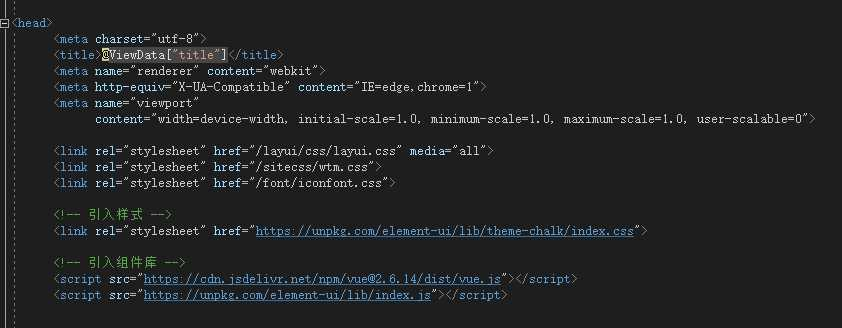
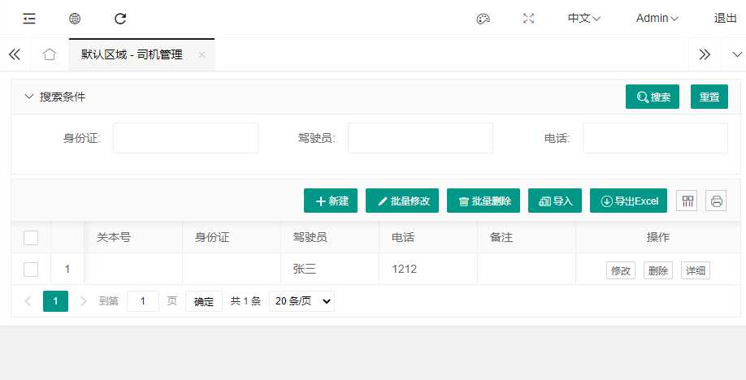
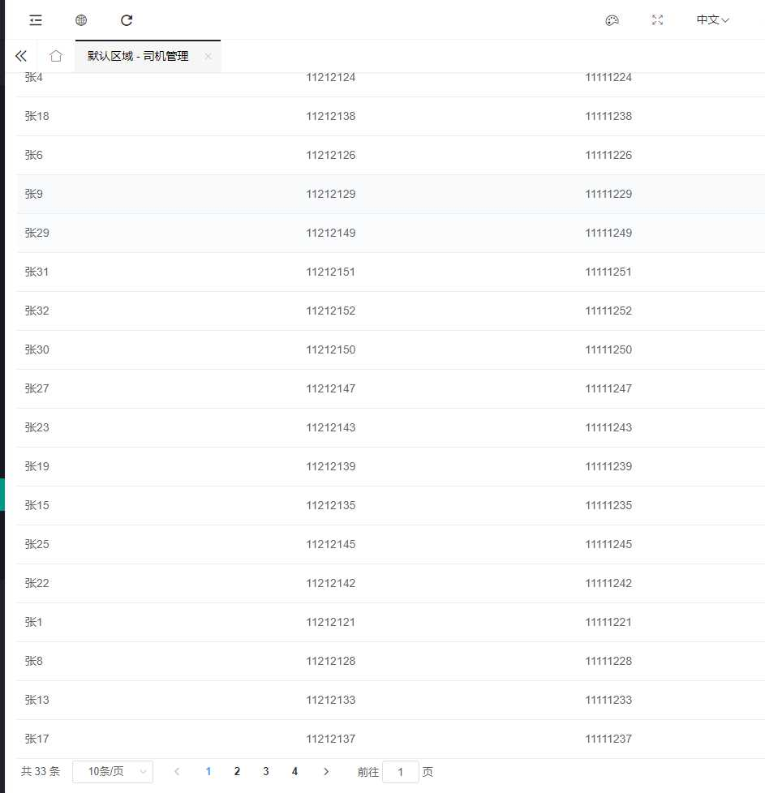
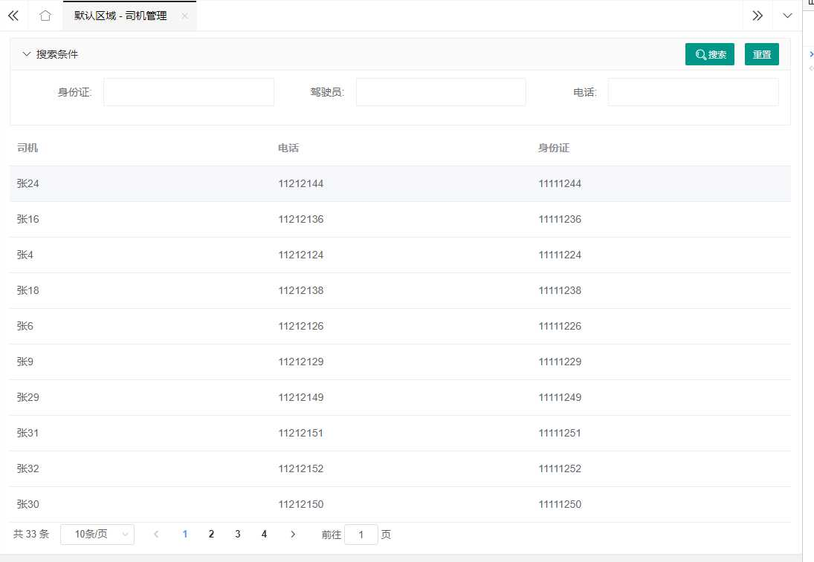
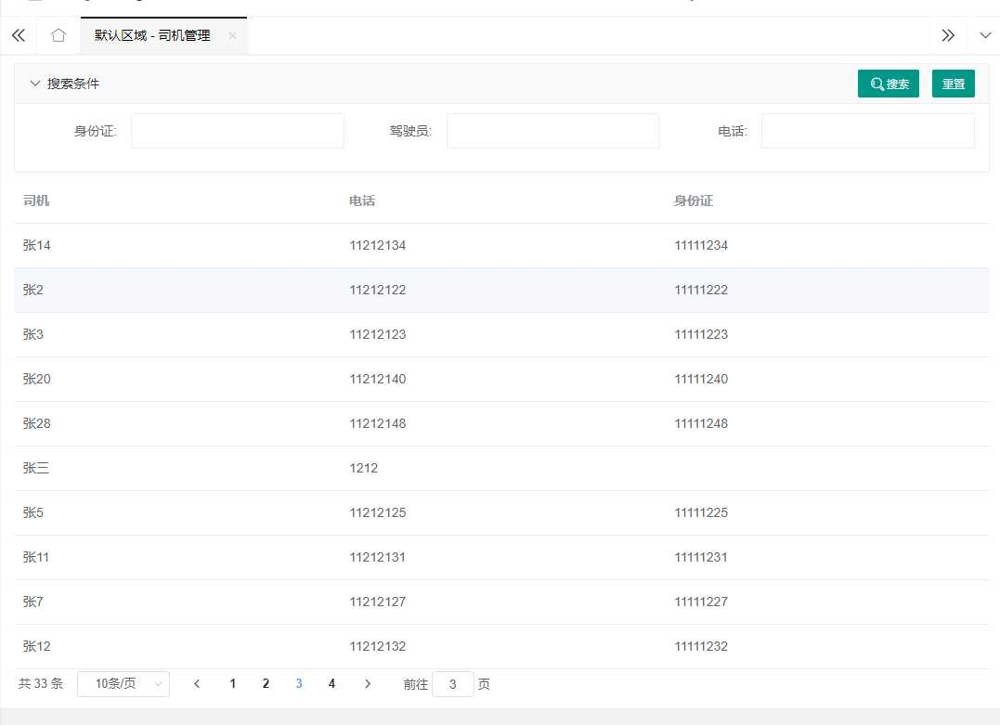
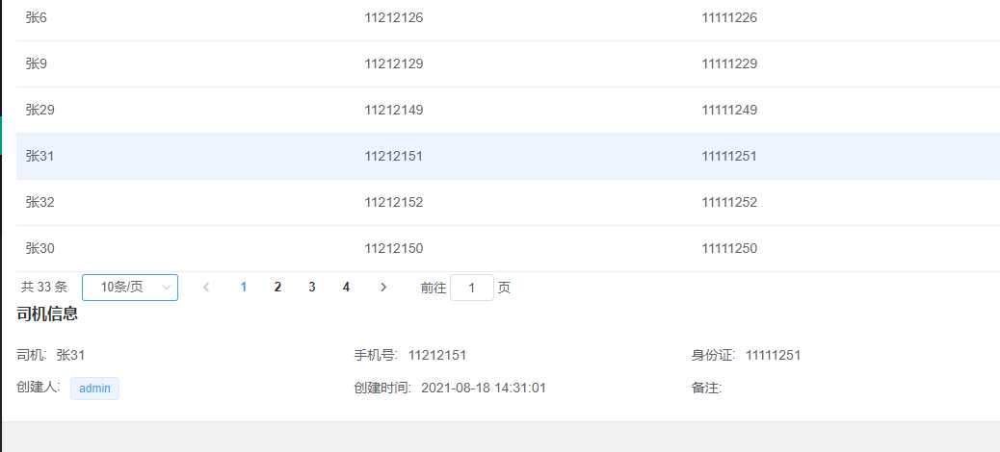

---
tags:
  - 使用技巧
title: Layui版本嫁接Vue+ElementUI
createTime: 2024/09/14 21:15:57
permalink: /article/cog35bpe/
---

> 本文引自[WTM框架使用技巧之：Layui版本嫁接Vue+ElementUI[通俗易懂]](https://cloud.tencent.com/developer/article/2103231)

## 为什么要这样做

1.  layui版本具备很多优点：组件齐全、ide提醒程度高、代码量少、依赖少、编译快、运行快，非常适合一个人的开发团队。
2.  但它也有很多缺点，比如说组件灵活度低、可控性差。
3.  受blazor ssr的思路启发，将vue嫁接进layui版本中，在大部分常规页面中，保留layui的快速高效用法。在极少部分需要大量定制化的页面，采用vue+elementUI的方式编写，既能保证开发效率，又能解决复杂页面编写。
4.  因此本文拿一个页面改造的例子，旨在抛砖引玉。

## 准备工作

### 在\_Layout中引入包

`_Layout.cshtml`文件位于`Views\Shared\_Layout.cshtml`

**操作步骤**

1.  引入element-ui.css
2.  引入vue.js
3.  引入element-ui.js

代码语言：javascript

复制

```html
<!-- 引入样式 -->
<link rel="stylesheet" href="https://unpkg.com/element-ui/lib/theme-chalk/index.css">

<!-- 引入组件库 -->
<script src="https://cdn.jsdelivr.net/npm/vue@2.6.14/dist/vue.js"></script>
<script src="https://unpkg.com/element-ui/lib/index.js"></script>
```

本篇文章使用的vue版本为2.6.14 如下图示



## 改造一个index.cshtml页面

**原页面代码为**

代码语言：javascript

复制

```html
@model ReaTms.ViewModel.TruckerVMs.TruckerListVM
@inject IStringLocalizer<Program> Localizer;

<wt:searchpanel vm="@Model" reset-btn="true">
	<wt:row items-per-row="ItemsPerRowEnum.Three">
		<wt:textbox field="Searcher.TruckerIdentify" />
		<wt:textbox field="Searcher.TruckerName" />
		<wt:textbox field="Searcher.TruckerPhone" />
	</wt:row>
</wt:searchpanel>
<wt:grid vm="@Model" url="/Trucker/Search" />
```

**显示效果为**



但我不满意layui的表格，功能太少了,准备使用element-ui的table来替代。 开始改造：

### 处理原页面

1.  干掉`<wt:grid/>`组件 将`<wt:grid vm="@Model" url="/Trucker/Search" />`打上注释，或者干脆直接删掉。
2.  重写`<wt:searchpanel/>`的`搜索按钮`点击事件 我们知道，wtm中`<wt:searchpanel/>`的搜索按钮默认id为`wtSearchBtn_@Model.UniqueId`（如果对这一点不了解同学，请查看源码`src/WalkingTec.Mvvm.TagHelpers.LayUI/Form/SearchPanelTagHelper.cs`），那么我们只要拿到这个id，在页面加载的时候，卸载掉框架默认的点击事件，重新绑定一个新的点击事件就可以了。

> 这里为什么要卸载掉点击事件呢？因为默认的点击事件会调用layui.table去加载数据，而我们在第一步中已经将`<wt:grid/>`组件移除了，如果不卸载掉默认事件的话，点击按钮会报错。

**参照以下代码：**

代码语言：javascript

复制

```html
@model ReaTms.ViewModel.TruckerVMs.TruckerListVM
@inject IStringLocalizer<Program> Localizer;

<wt:searchpanel vm="@Model" reset-btn="true">
	<wt:row items-per-row="ItemsPerRowEnum.Three">
		<wt:textbox field="Searcher.TruckerIdentify" />
		<wt:textbox field="Searcher.TruckerName" />
		<wt:textbox field="Searcher.TruckerPhone" />
	</wt:row>
</wt:searchpanel>
<script> $().ready(() => { 
      $('#wtSearchBtn_@Model.UniqueId') .off('click') .on('click', e => { 
      e.stopPropagation();//阻止点击事件继续冒泡，使pannel不折叠 //查询方法写在这里，下文会继续讲到 } ); }); </script>
```

1.  定义一个vue的根[容器](https://cloud.tencent.com/product/tke?from_column=20065&from=20065)。切记：不要在这个容器中写任何`<script>`代码，否则vue会报警告

代码语言：javascript

复制

```html
<div id="app">
</div>
```

1.  创建vue实例,并创建表格数据对象 注意：在cshtml文件中不能使用vue的事件绑定符号@，请使用全称`v-on:`

代码语言：javascript

复制

```js
	var app = new Vue({ 
   
		el: '#app',
		data: { 
   
			TableItems: { 
   } //表格数据对象
		},
		methods: { 
   
		}
	});
```

到这一步后，页面的样子是这样的

代码语言：javascript

复制

```html
@model ReaTms.ViewModel.TruckerVMs.TruckerListVM
@inject IStringLocalizer<Program> Localizer;

<wt:searchpanel vm="@Model" reset-btn="true">
	<wt:row items-per-row="ItemsPerRowEnum.Three">
		<wt:textbox field="Searcher.TruckerIdentify" />
		<wt:textbox field="Searcher.TruckerName" />
		<wt:textbox field="Searcher.TruckerPhone" />
	</wt:row>
</wt:searchpanel>
<div id="app">

</div>
<script> $().ready(() => { 
      $('#wtSearchBtn_@Model.UniqueId') .off('click') .on('click', e => { 
      e.stopPropagation();//阻止点击事件继续冒泡，使pannel不折叠 //查询方法写在这里，下文会继续讲到 } ); }); var app = new Vue({ 
      el: '#app', data: { 
      TableItems: { 
     } //表格数据对象 }, methods: { 
      } }); </script>
```

1.  创建element-ui的table 注意这里绑定的是`TableItems.Data`，这是因为wtm后端传过来的数据是这种格式的。

代码语言：javascript

复制

```html
<div id="app">
	<el-table :data="TableItems.Data">
		<el-table-column prop="TruckerName" label="司机" />
		<el-table-column prop="TruckerPhone" label="电话" />
		<el-table-column prop="TruckerIdentify" label="身份证" />
	</el-table>
</div>
```

1.  给第1步中的搜索按钮编写查询方法。

*   使用`ff.GetFormData(formId)`的形式，拿到查询条件的表单数据。
*   formId可以根据wtm的约定，使用`wtForm_@Model.UniqueId`拿到。
*   使用`$.post`访问后台数据接口，拿到数据后将数据赋值给vue的`TableItems`对象。

代码语言：javascript

复制

```js
<script>
	$().ready(() => { 
   
		$('#wtSearchBtn_@Model.UniqueId')
			.off('click')
			.on('click', e => { 
   
				e.stopPropagation();//阻止点击事件继续冒泡，使pannel不折叠
				//查询方法写在这里，下文会继续讲到
				let data = ff.GetFormData('wtForm_@Model.UniqueId');//拿到查询条件的表单数据
				$.post('/Trucker/Search', data, resp => { 
   
					app.TableItems = resp;
					},'json');
			}
		);
	});
	var app = new Vue({ 
   
		el: '#app',
		data: { 
   
			TableItems: { 
   } //表格数据对象
		},
		methods: { 
   
		}
	});
</script>
```

至此，我们的页面就跑起来了。


7\. 添加分页组件

*   分别绑定`:current-page="TableItems.Page"`、`:total="TableItems.Count"`

代码语言：javascript

复制

```html
	<el-pagination :current-page="TableItems.Page" :total="TableItems.Count" layout="total, sizes, prev, pager, next, jumper">
	</el-pagination>
```

再次刷新一下页面看下效果，分页组件能够读取当前页面和总条数了，但所有数据都显示出来了，并没有真正分页。



1.  完善分页组件的功能-分页显示

*   首先创建一个对象，用来对应wtm中的`Searcher`,这里只需创建Page和Limit字段就行了，表单字段可以使用对象复制功能，复制过来

代码语言：javascript

复制

```js
		data: { 
   
			TableItems: { 
   }, //表格数据对象
			TableSearcher: { 
    //对应wtm中的Searcher
				"Searcher.Page": 1,
				"Searcher.Limit": 10,
			}
		},
```

*   对第6步的查询方法进行封装，封装的过程中，使用`$.extend(newobj,oldobj)`的方法，将表单数据组装成一个`分页查询对象`

代码语言：javascript

复制

```js
methods: { 
   
	onSearch() { 
   
		//将表单数据复制到this.TableSearcher中，组装成一个完整的查询对象
		$.extend(this.TableSearcher, ff.GetFormData('wtForm_@Model.UniqueId'));	
		$.post('/Trucker/Search', this.TableSearcher, resp => { 
   
			this.TableItems = resp;
			},'json');
	}
}
```



此时页面能够实现分页显示了，但还不能实现跳转页面 9. 完善分页组件的功能-跳转页面

*   上一步完成后，页面只是实现了分页，但还不能跳转 ，我们继续实现它
*   创建一个页面跳转函数`onPagination(newPage)`

代码语言：javascript

复制

```js
		methods: { 
   
			onSearch() { 
   
				//将表单数据复制到this.TableSearcher中，组装成一个完整的查询对象
				$.extend(this.TableSearcher, ff.GetFormData('wtForm_@Model.UniqueId'));
				$.post('/Trucker/Search', this.TableSearcher, resp => { 
   
					this.TableItems = resp;
					},'json');
			},
			onPagination(newPage) { 
   
				this.TableSearcher["Searcher.Page"] = newPage;
				this.onSearch();
			}
		}
```

*   在`el-pagination`添加跳转事件，`v-on:current-change="onPagination"`、 `v-on:size-change="onPagination"`

代码语言：javascript

复制

    	<el-pagination :current-page="TableItems.Page" :total="TableItems.Count" :page-size="10" layout="total, sizes, prev, pager, next, jumper" v-on:current-change="onPagination" v-on:size-change="onPagination">
    	</el-pagination>

*   此时，已经实现了页面分页，分页跳转



页面的完整代码为

代码语言：javascript

复制

```html
@model ReaTms.ViewModel.TruckerVMs.TruckerListVM
@inject IStringLocalizer<Program> Localizer;

<wt:searchpanel vm="@Model" reset-btn="true">
	<wt:row items-per-row="ItemsPerRowEnum.Three">
		<wt:textbox field="Searcher.TruckerIdentify" />
		<wt:textbox field="Searcher.TruckerName" />
		<wt:textbox field="Searcher.TruckerPhone" />
	</wt:row>
</wt:searchpanel>
<div id="app">
	<el-table :data="TableItems.Data">
		<el-table-column prop="TruckerName" label="司机" />
		<el-table-column prop="TruckerPhone" label="电话" />
		<el-table-column prop="TruckerIdentify" label="身份证" />
	</el-table>
	<el-pagination :current-page="TableItems.Page" :total="TableItems.Count" :page-size="10" layout="total, sizes, prev, pager, next, jumper" v-on:current-change="onPagination" v-on:size-change="onPagination">
	</el-pagination>
</div>
<script> 
$().ready(() => { 
      $('#wtSearchBtn_@Model.UniqueId') .off('click') .on('click', e => { 
      e.stopPropagation();//阻止点击事件继续冒泡，使pannel不折叠 app.onSearch(); } ); }); var app = new Vue({ 
      el: '#app', data: { 
      TableItems: { 
     }, //表格数据对象 TableSearcher: { 
      //对应wtm中的Searcher "Searcher.Page": 1, "Searcher.Limit": 10 } }, methods: { 
      onSearch() { 
      //将表单数据复制到this.TableSearcher中，组装成一个完整的查询对象 $.extend(this.TableSearcher, ff.GetFormData('wtForm_@Model.UniqueId')); $.post('/Trucker/Search', this.TableSearcher, resp => { 
      this.TableItems = resp; },'json'); }, onPagination(newPage) { 
      this.TableSearcher["Searcher.Page"] = newPage; this.onSearch(); } } }); 
</script>
```

### 增加一个Descriptions（描述列表）

**想实现效果：点击表格的行，能够在下方实现这行数据的明细**

*   创建当前行的绑定对象`SelectedRow`

代码语言：javascript

复制

```js
data: { 
   
	SelectedRow: null,
	TableItems: { 
   }, //表格数据对象
	TableSearcher: { 
    //对应wtm中的Searcher
		"Searcher.Page": 1,
		"Searcher.Limit": 10
	}
},
```

*   配置`el-table`的`highlight-current-row`，实现点击行自动选中
*   给`el-table`的`current-change`事件创建回调函数`onCurrentChange(currentRow, oldCurrentRow)`，

代码语言：javascript

复制

```js
		methods: { 
   
			onSearch() { 
   
				//将表单数据复制到this.TableSearcher中，组装成一个完整的查询对象
				$.extend(this.TableSearcher, ff.GetFormData('wtForm_@Model.UniqueId'));
				$.post('/Trucker/Search', this.TableSearcher, resp => { 
   
					this.TableItems = resp;
					},'json');
			},
			onPagination(newPage) { 
   
				this.TableSearcher["Searcher.Page"] = newPage;
				this.onSearch();
			},
			onCurrentChange(currentRow, oldCurrentRow) { 
   
				this.SelectedRow = currentRow;
			}
		}
```

*   增加一个`el-descriptions`

代码语言：javascript

复制

```html
	<el-descriptions title="司机信息" v-if="SelectedRow!=null">
		<el-descriptions-item label="司机">{
  
  {SelectedRow.Trucker}}</el-descriptions-item>
		<el-descriptions-item label="手机号">{
  
  {SelectedRow.TruckerPhone}}</el-descriptions-item>
		<el-descriptions-item label="身份证">{
  
  {SelectedRow.TruckerIdentify}}</el-descriptions-item>
		<el-descriptions-item label="创建人">
			<el-tag size="small">{
  
  {SelectedRow.CreateBy}}</el-tag>
		</el-descriptions-item>
		<el-descriptions-item label="创建时间">{
  
  {SelectedRow.CreateTime}}</el-descriptions-item>
		<el-descriptions-item label="备注">{
  
  {SelectedRow.Remark}}</el-descriptions-item>
	</el-descriptions>
```

此时，页面效果如下图



### 增加工具栏及权限控制

1.  使用`Wtm.IsAccessable`来控制权限
2.  使用`ff.OpenDialog()`来打开一个窗口

代码语言：javascript

复制

```html
	<el-row>
		@if (Model.Wtm.IsAccessable("/Trucker/Create")) {
			<el-button type="primary" onclick="ff.OpenDialog('/Trucker/Create',1,'创建',1000)">创建</el-button>
		}
	</el-row>
```


此时能够打开窗口创建数据，但创建完成后，数据不能自动刷新。 3. 在控制器中，重写刷新页面的js函数`AddCustomScript("app.onSearch();");`。

代码语言：javascript

复制

```js
        [HttpPost]
        [ActionDescription("Sys.Create")]
        public ActionResult Create(TruckerVM vm)
        { 
   
            if (!ModelState.IsValid)
            { 
   
                return PartialView(vm);
            }
            else
            { 
   
                vm.DoAdd();
                if (!ModelState.IsValid)
                { 
   
                    vm.DoReInit();
                    return PartialView(vm);
                }
                else
                { 
   
                    return FFResult().CloseDialog().AddCustomScript("app.onSearch();");
                }
            }
        }
```

至此，页面能够自动刷新了，其他工具栏按钮可参照该方法创建，复杂功能可参照element的官方案例。 本文仅就这问题谈些浅显的看法，意在抛砖引玉，以就教于各界专家。感谢WTM的作者刘亮，免费授权使用如此优秀的框架，造福大家。https://wtmdoc.walkingtec.cn/ 最终代码

代码语言：javascript

复制

```js
@model ReaTms.ViewModel.TruckerVMs.TruckerListVM
@inject IStringLocalizer<Program> Localizer;

<wt:searchpanel vm="@Model" reset-btn="true">
	<wt:row items-per-row="ItemsPerRowEnum.Three">
		<wt:textbox field="Searcher.TruckerIdentify" />
		<wt:textbox field="Searcher.TruckerName" />
		<wt:textbox field="Searcher.TruckerPhone" />
	</wt:row>
</wt:searchpanel>
<div id="app">
	<el-row>
		@if (Model.Wtm.IsAccessable("/Trucker/Create")) {
			<el-button type="primary" onclick="ff.OpenDialog('/Trucker/Create',1,'创建',1000)">创建</el-button>
		}
	</el-row>
	<el-table :data="TableItems.Data" highlight-current-row v-on:current-change="onCurrentChange">
		<el-table-column prop="TruckerName" label="司机" />
		<el-table-column prop="TruckerPhone" label="电话" />
		<el-table-column prop="TruckerIdentify" label="身份证" />
	</el-table>
	<el-pagination :current-page="TableItems.Page" :total="TableItems.Count" :page-size="10" layout="total, sizes, prev, pager, next, jumper" v-on:current-change="onPagination" v-on:size-change="onPagination">
	</el-pagination>
	<el-descriptions title="司机信息" v-if="SelectedRow!=null">
		<el-descriptions-item label="司机">{
  
  {SelectedRow.TruckerName}}</el-descriptions-item>
		<el-descriptions-item label="手机号">{
  
  {SelectedRow.TruckerPhone}}</el-descriptions-item>
		<el-descriptions-item label="身份证">{
  
  {SelectedRow.TruckerIdentify}}</el-descriptions-item>
		<el-descriptions-item label="创建人">
			<el-tag size="small">{
  
  {SelectedRow.CreateBy}}</el-tag>
		</el-descriptions-item>
		<el-descriptions-item label="创建时间">{
  
  {SelectedRow.CreateTime}}</el-descriptions-item>
		<el-descriptions-item label="备注">{
  
  {SelectedRow.Remark}}</el-descriptions-item>
	</el-descriptions>
</div>
<script> $().ready(() => { 
      $('#wtSearchBtn_@Model.UniqueId') .off('click') .on('click', e => { 
      e.stopPropagation();//阻止点击事件继续冒泡，使pannel不折叠 app.onSearch(); } ); }); var app = new Vue({ 
      el: '#app', data: { 
      SelectedRow: null, TableItems: { 
     }, //表格数据对象 TableSearcher: { 
      //对应wtm中的Searcher "Searcher.Page": 1, "Searcher.Limit": 10 } }, methods: { 
      onSearch() { 
      //将表单数据复制到this.TableSearcher中，组装成一个完整的查询对象 $.extend(this.TableSearcher, ff.GetFormData('wtForm_@Model.UniqueId')); $.post('/Trucker/Search', this.TableSearcher, resp => { 
      this.TableItems = resp; },'json'); }, onPagination(newPage) { 
      this.TableSearcher["Searcher.Page"] = newPage; this.onSearch(); }, onCurrentChange(currentRow, oldCurrentRow) { 
      this.SelectedRow = currentRow; } } }); </script>
```

控制器

代码语言：javascript

复制

```js
        #region Create
        [ActionDescription("Sys.Create")]
        public ActionResult Create()
        { 
   
            var vm = Wtm.CreateVM<TruckerVM>();
            return PartialView(vm);
        }

        [HttpPost]
        [ActionDescription("Sys.Create")]
        public ActionResult Create(TruckerVM vm)
        { 
   
            if (!ModelState.IsValid)
            { 
   
                return PartialView(vm);
            }
            else
            { 
   
                vm.DoAdd();
                if (!ModelState.IsValid)
                { 
   
                    vm.DoReInit();
                    return PartialView(vm);
                }
                else
                { 
   
                    return FFResult().CloseDialog().AddCustomScript("app.onSearch();");
                }
            }
        }
        #endregion 
```

