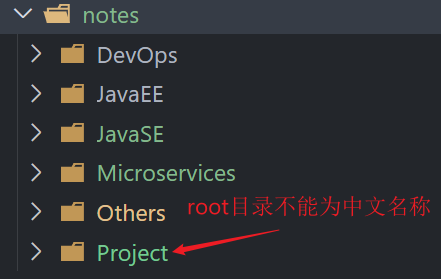

> [!TIP]
>
> 该文档记录plume主题遇到的一些常见的问题

<!-- more -->

## notes配置项

每个note的`根文件夹`名称不能为中文，貌似有bug，导致侧边栏无法自动生成。

> [!CAUTION]
>
> `docs/notes/{rootDir}`一级目录名不能是中文

> [!NOTE]
>
> `docs/notes/{rootDir}/{childDir}`子文件夹还是可以中文命名的

笔记实体：

```js
const ProjectNote = defineNoteConfig({
    text: '项目开发',
    //该项配置为文档所在的目录，目录名为中文导致sidebar: 'auto' 配置无效
    dir: 'Project/',				
    link: 'notes/Project/',
    sidebar: 'auto'
})
```

`docs/notes/路径下：`



```js
export default defineThemeConfig({
   notes: {
        dir: '/notes/', // 声明所有笔记的目录
        link: '/', // 声明所有笔记默认的链接前缀， 默认为 '/'
        notes: [
             ProjectNote
        ]
    },
})
```

## 博客文件夹命名显示错误

博客的目录生成貌似有bug，比如我想弄个日记分类的博客:
目录结构为Dailydiary/2024/8/xxxx.md，在分类展示里中2024显示成了Dailydiary/4/8/xxxx.md
改为Dailydiary/2024年/8/xxxx.md，显示Dailydiary/年/8/xxxx.md

