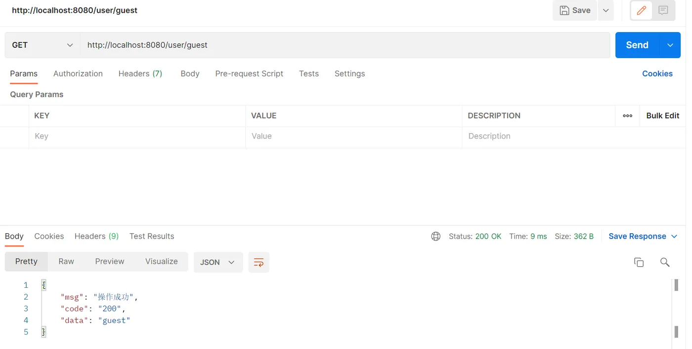
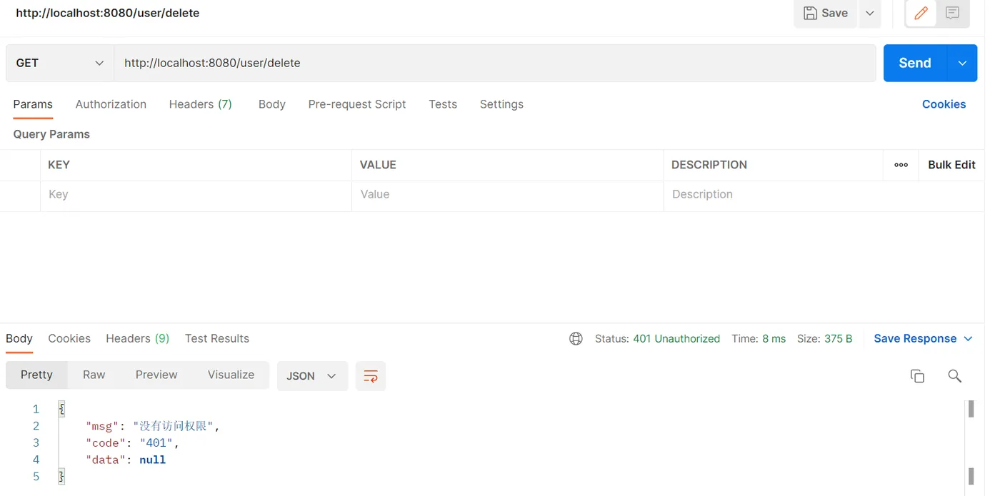

> 文章转载自https://developer.aliyun.com/article/1296302

**简介：**

 一、前情提要JWT：服务端根据规范生成一个令牌（token），并且发放给客户端（保存在客户端）。此时客户端请求服务端的时候就可以携带者令牌，以令牌来证明自己的身份信息。Shiro：Java的一个安全（权限）框架，用户登录时把身份信息（用户名/手机号/邮箱地址等）和凭证信息（密码/证书等）封装成一个Token令牌，通过安全管理器中的认证器进行校验，成功则授权以访问系统.（详细描述可以参考文章：Shiro基础）

### 一、前情提要

JWT：服务端根据规范生成一个令牌（token），并且发放给客户端（保存在客户端）。此时客户端请求服务端的时候就可以携带者令牌，以令牌来证明自己的身份信息。

  

Shiro：Java的一个安全（权限）框架，用户登录时把身份信息（用户名/手机号/邮箱地址等）和凭证信息（密码/证书等）封装成一个Token令牌，通过安全管理器中的认证器进行校验，成功则授权以访问系统.（详细描述可以参考文章：Shiro基础）可以看到Shiro本身是可以实现认证功能的，默认Shiro是在subject.login()后将认证状态存入全局session中, 之后的请求会从这个session中拿这个登录状态。而我们在这里将Shiro的认证部分交给JWT去做以抛弃session的使用（为什么要这么做可以参考JWT技术–JSON Web Token），即不使用Shiro自带的UsernamePasswordToken，而是让JWT来生成token，登录时自然也不用通过shiro的subject.login()方法，只需要对请求携带的token进行验证就行。

### 二、整合Shiro与JWT

#### 1、编写JWT工具类

> 作用

*   生成token
*   验证token
	    

```java
public class JWTUtils {
    
    private static final long EXPIRE = 30 * 60 * 1000;
    private static final String SECRET = "!ad#12~";
    
    public static String getToken(User user) {
        JWTCreator.Builder builder = JWT.create();
        return builder.withClaim("email", user.getUsername())
                .withClaim("role", user.getRole())
                .withExpiresAt(new Date(System.currentTimeMillis() + EXPIRE))
                .sign(Algorithm.HMAC256(SECRET));
    }
    
    public static DecodedJWT verify(String token) {
        return JWT.require(Algorithm.HMAC256(SECRET)).build().verify(token);
    }
    
}
```
#### 2、编写JWTToken

> 作用：取代原生token

正常使用shiro时是通过使用其自带的UsernamePasswordToken（如subject.login(new UsernamePasswordToken(username,password));）

这里我们选择使用JWT来生成token，那么就要编写一个JWTToken类来取代UsernamePasswordToken

需要实现AuthenticationToken类并重写getPrincipal()和getCredentials()两个方法（用本是用来获得用户名和密码的，这里直接将token返回）
    

```java
public class JWTToken implements AuthenticationToken {
    
    private String token;

    public JWTToken(String token) {
        this.token = token;
    }
    
    @Override
    public Object getPrincipal() {
        return token;
    }

    @Override
    public Object getCredentials() {
        return token;
    }
}
```

#### 3、编写JWTFilter

> 目的

*   过滤请求

封装subject.login()

shiro通过传入用户名和密码生成UsernamePasswordToken后使用subject.login进行登录，这里我们使用了JWT，token是通过是通过前台请求传过来的而不是后台自己通过账号密码生成的，所以我们需要编写一个过滤器对请求进行判断（如是否携带token，token是否合法，过滤option请求等）shiro内置了认证过滤器，我们只需对其中的几个方法进行重写

```java :collapsed-lines
public class JWTFilter extends BasicHttpAuthenticationFilter {
    
     /* 
     * 过滤器执行流程：
     * isAccessAllowed()->isLoginAttempt()->executeLogin()
     */

    // 是否允许访问
    @Override
    protected boolean isAccessAllowed(ServletRequest request, ServletResponse response, Object mappedValue) {
        if (isLoginAttempt(request, response)) {
            // 有认证意愿
            try {
                executeLogin(request, response);
                return true;
            } catch (Exception e) {
                // token错误
                responseError(response,e.getMessage());
            }
        }
        // 没有认证意愿（可能是登录行为或者为游客访问）,放行
        // 此处放行是因为有些操作不需要权限也可以执行，而对于那些需要权限才能执行的操作自然会因为没有token而在权限鉴定时被拦截
        return true;
    }

    // 是否有认证意愿（即是否携带token）
    @Override
    protected boolean isLoginAttempt(ServletRequest request, ServletResponse response) {
        HttpServletRequest httpServletRequest = (HttpServletRequest) request;
        String token = httpServletRequest.getHeader("token");
        return token != null;
    }

    // 执行认证
    @Override
    protected boolean executeLogin(ServletRequest request, ServletResponse response) throws Exception {
        HttpServletRequest httpServletRequest = (HttpServletRequest) request;
        String token = httpServletRequest.getHeader("token");
        JWTToken jwt = new JWTToken(token);
        // 使用自定义的JWTToken而不是默认的UsernamePasswordToken
        getSubject(request, response).login(jwt);
        // 调用了realm中的认证方法，没有出现异常则证明认证成功
        return true;
    }

    @Override
    protected boolean preHandle(ServletRequest request, ServletResponse response) throws Exception {
        HttpServletRequest req= (HttpServletRequest) request;
        HttpServletResponse res= (HttpServletResponse) response;
        res.setHeader("Access-control-Allow-Origin", req.getHeader("Origin"));
        res.setHeader("Access-control-Allow-Methods", "GET,POST,OPTIONS,PUT,DELETE");
        res.setHeader("Access-control-Allow-Headers", req.getHeader("Access-Control-Request-Headers"));
        // 跨域时会首先发送一个option请求，这里我们给option请求直接返回正常状态
        if (req.getMethod().equals(RequestMethod.OPTIONS.name())) {
            res.setStatus(HttpStatus.OK.value());
            // 返回true则继续执行拦截链，返回false则中断后续拦截，直接返回，option请求显然无需继续判断，直接返回
            return false;
        }
        return super.preHandle(request, response);
    }
    
    // 非法请求跳转
    private void responseError(ServletResponse response, String msg) {
        HttpServletResponse httpServletResponse = (HttpServletResponse) response;
        try {
            // msg封装为get请求的请求参数，即拼接在url后面，对于中文信息需要进行utf-8编码
            msg = URLEncoder.encode(msg, StandardCharsets.UTF_8);
            // 跳转至控制器unauthorized
            httpServletResponse.sendRedirect("/unauthorized/" + msg);
        } catch (IOException e) {
            System.out.println(e.getMessage());   
        }
    }
}
```
#### 4、编写JWTRealm

> 目的

用于进行权限信息的验证

让Shiro支持JWTToken

在JWTFIlter中，我们对于携带了token的请求会执行executeLogin方法，该方法封装了subject.login(token)方法，而login方法其实就是通过我们定义的realm对传入的token进行权限信息的验证

  

我们首先需要让Shiro支持我们自定义的token随后重写doGetAuthenticationInfo方法用于认证，重写doGetAuthorizationInfo方法用于授权

如果鉴权或者认证未通过则上面的filter会出现异常，进而拦截这次请求跳转至unauthorized控制器

```java :collapsed-lines
@Component
public class JWTRealm extends AuthorizingRealm {
    
    @Autowired
    private UserService userService;

    // 让shiro支持我们自定义的token，即如果传入的token时JWTToken则放行
    // 必须重写不然shiro会报错
    @Override
    public boolean supports(AuthenticationToken token) {
        return token instanceof JWTToken;
    }

    // 检验权限时调用
    @Override
    protected AuthorizationInfo doGetAuthorizationInfo(PrincipalCollection principalCollection) {
        DecodedJWT verify = JWTUtils.verify(principalCollection.toString());
        String email = verify.getClaim("email").asString();
        // 根据email查询用户的身份和权限
        User user = userService.selectByEmail(email);
        SimpleAuthorizationInfo info = new SimpleAuthorizationInfo();
        info.addRole(user.getRole());
        info.addStringPermissions(user.getPermission());
        return info;
    }

    // 认证和鉴权时调用
    @Override
    protected AuthenticationInfo doGetAuthenticationInfo(AuthenticationToken authenticationToken) throws AuthenticationException {
        String token = (String) authenticationToken.getCredentials();// 重写了该类，实际上返回的是token
        String email = null;
        try {
            // 根据token获得登录用户的email
            email = JWTUtils.verify(token).getClaim("email").asString();
        } catch (Exception e) {
            throw new AuthenticationException("该token非法，可能被篡改或过期");
        }
        if (userService.selectByEmail(email) == null) {
            throw new AuthenticationException("用户不存在");
        }
        return new SimpleAuthenticationInfo(token, token, this.getName());
    }
}
```


#### 5、编写Shiro配置类

> 目的

*   添加过滤器和过滤规则
*   为默认的安全管理器绑定我们编写的realm并关闭session
*   添加注解权限开发

```java :collapsed-lines 
@Configuration
public class ShiroConfig {
    
    @Bean
    public ShiroFilterFactoryBean shiroFilterFactoryBean(DefaultWebSecurityManager defaultWebSecurityManager) {
        ShiroFilterFactoryBean shiroFilterFactoryBean = new ShiroFilterFactoryBean();
        shiroFilterFactoryBean.setSecurityManager(defaultWebSecurityManager);
        // 添加自己的过滤器
        Map<String, Filter> filterMap = new HashMap<>();
        filterMap.put("jwt", new JWTFilter());
        shiroFilterFactoryBean.setFilters(filterMap);
        
        // 设置无权限时跳转url
        shiroFilterFactoryBean.setUnauthorizedUrl("/unauthorized/无权限");
        
        // 编写过滤规则
        Map<String, String> filterRuleMap = new HashMap<>();
        // 访问 /unauthorized/**时直接放行
        filterRuleMap.put("/unauthorized/**","anon");
        // 其他所有请求通过我们自己的JWT Filter
        filterRuleMap.put("/**", "jwt");
        
        shiroFilterFactoryBean.setFilterChainDefinitionMap(filterRuleMap);
        return shiroFilterFactoryBean;
    }
    
    @Bean
    public DefaultWebSecurityManager defaultWebSecurityManager(JWTRealm jwtRealm) {
        DefaultWebSecurityManager defaultWebSecurityManager = new DefaultWebSecurityManager();
        defaultWebSecurityManager.setRealm(jwtRealm);
        // 关闭session
        DefaultSubjectDAO defaultSubjectDAO = new DefaultSubjectDAO();
        DefaultSessionStorageEvaluator sessionStorageEvaluator = new DefaultSessionStorageEvaluator();
        sessionStorageEvaluator.setSessionStorageEnabled(false);
        defaultSubjectDAO.setSessionStorageEvaluator(sessionStorageEvaluator);
        defaultWebSecurityManager.setSubjectDAO(defaultSubjectDAO);
        return defaultWebSecurityManager;
    }

    /**
     * 添加注解支持，如果不加的话很有可能注解失效
     */
    @Bean
    public DefaultAdvisorAutoProxyCreator defaultAdvisorAutoProxyCreator(){

        DefaultAdvisorAutoProxyCreator defaultAdvisorAutoProxyCreator=new DefaultAdvisorAutoProxyCreator();
        defaultAdvisorAutoProxyCreator.setProxyTargetClass(true);
        return defaultAdvisorAutoProxyCreator;
    }

    @Bean
    public AuthorizationAttributeSourceAdvisor authorizationAttributeSourceAdvisor(DefaultWebSecurityManager defaultWebSecurityManager){
        AuthorizationAttributeSourceAdvisor advisor = new AuthorizationAttributeSourceAdvisor();
        advisor.setSecurityManager(defaultWebSecurityManager);
        return advisor;
    }

    @Bean
    public LifecycleBeanPostProcessor lifecycleBeanPostProcessor() {
        return new LifecycleBeanPostProcessor();
    }
    
}
```

  

三、编写异常处理类

在过滤请求过程中，对于不合法的请求我们进行拦截并抛出了异常，在前后端分离的项目中，我们应该将请求的处理结果（如无权限等信息）返回给前端，而不是直接进行页面跳转。所以我们需要编写一个异常处理类捕获抛出的异常，并根据不同的异常返回给前端相应的信息，让前端进行页面跳转。

```java
@ControllerAdvice
public class ControllerExceptionHandler {

    // 捕捉shiro的异常
    @ExceptionHandler(ShiroException.class)
    @ResponseStatus(HttpStatus.UNAUTHORIZED)
    @ResponseBody
    public Result handle401(ShiroException e) {
        return Result.error(ErrorCodeEnum.UNAUTHORIZED);
    }

    // 捕捉未认证的异常
    @ExceptionHandler(UnauthenticatedException.class)
    @ResponseStatus(HttpStatus.UNAUTHORIZED)
    @ResponseBody
    public Result handle401(UnauthenticatedException e) {
        return Result.error(ErrorCodeEnum.UNAUTHORIZED);
    }
    
    // 捕捉token过期异常
    @ExceptionHandler(value = TokenExpiredException.class)
    @ResponseStatus(HttpStatus.BAD_REQUEST)
    @ResponseBody
    public Result handleTokenExpired(TokenExpiredException e) {
        return Result.error(ErrorCodeEnum.TOKEN_VERIFY_FAIL);
    }

}
```


### 四、编写Controller

**记得编写处理未认证请求的控制器**

```java
@RestController
@RequestMapping("/user")
public class UserController {
    
    @Autowired
    private UserService userService;
    
    @PostMapping("register")
    public Result register(@RequestBody UserBody userBody) {
        return userService.register(userBody);
    }
    
    @PostMapping("login")
    public Result login(@RequestBody User user) {
        // 在编写业务逻辑时应该在结果集中封装token，使得下次发送请求时可以携带token
        return userService.login(user);
    }
    
    // 处理未认证请求的控制器
    @GetMapping("/unauthorized/{message}")
    public Result unauthorized(@PathVariable("message") String message) {
        return Result.error(message);
    }
    
    @GetMapping("guest")
    public Result guest(){
        return Result.success("guest");
    }

    @RequiresRoles("普通用户")
    @GetMapping("delete")
    public Result delete(){
        return Result.success("delete");
    }
}
```

测试结果

访问不需要权限的请求（不需要登录(无token)就可以执行的请求）——操作成功



访问需要权限的请求（控制器上添加了类似@RequiresRoles(“普通用户”)的注解）——请求失败 

因为发送请求时没有携带token，故没有执行该行为的权限
