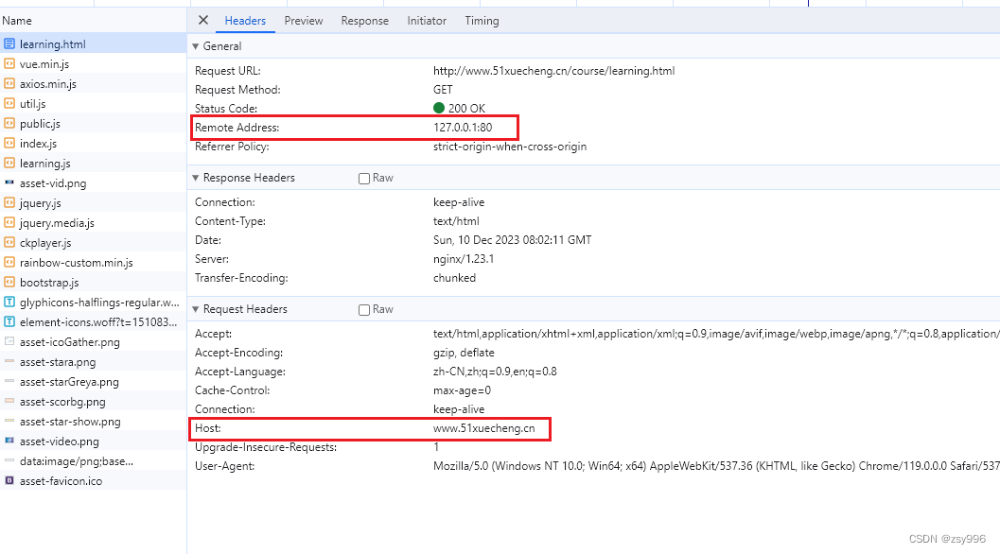
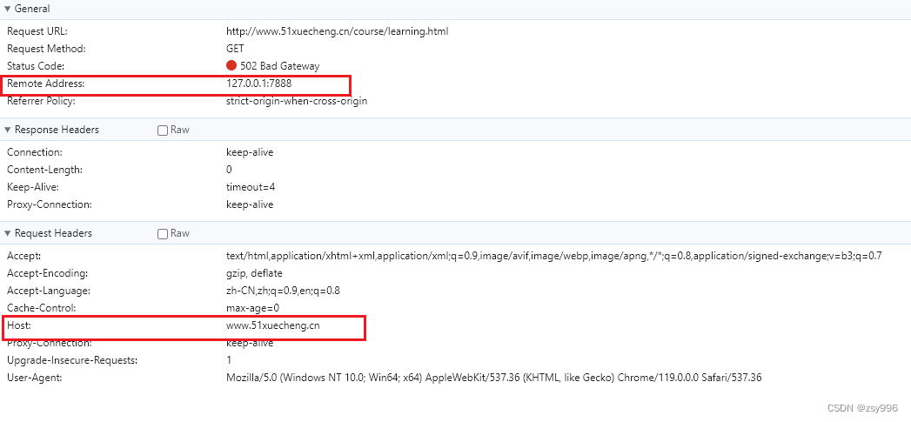
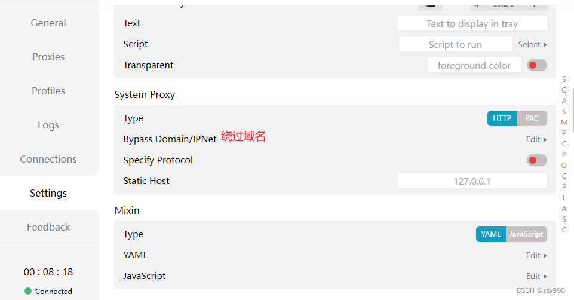
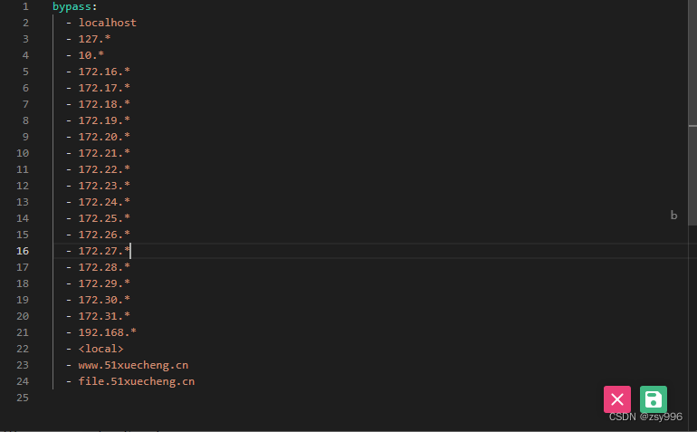

开启代理后，解决开启vpn代理后无法访问hosts域名以及Nginx
============================

版权声明：本文为博主原创文章，遵循 [CC 4.0 BY-SA](http://creativecommons.org/licenses/by-sa/4.0/) 版权协议，转载请附上原文出处链接和本声明。

本文链接：[https://blog.csdn.net/zsy996/article/details/134908223](https://blog.csdn.net/zsy996/article/details/134908223)

关闭[vpn](https://so.csdn.net/so/search?q=vpn&spm=1001.2101.3001.7020)时，正常Http请求结构如下。  
  
Nginx是通过Host，以及监听80端口，来确认某个请求的。  
当使用Vpn正向代理后，我的代理端口是7888。  
此时Host未变，而端口却变成了代理端口，这样Nginx应该是无法监听到.  

查看一下代理日志，  

发现应该是VPN的dns服务器无法解析Host映射的域名。  
最简单的处理方式：设置某些域名不走代理  
通过设置CFW中的Bypass Domain/IpNet  
  
如图  

设置完后，就可以开着代理也能正常访问本地hosts域名以及Nginx了。
