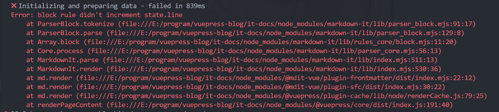

> 该文档主要存放markdown写作时遇到的FAQ，减少资料收集工作

<!-- more --> 

## 标题

有一些以前的文档写的时候多用的是一级标题，vuepress无法展示在侧边栏大纲中(看了plume主题的文档貌似没有找到全局的配置，只有通过单个文章的frontmatter来控制)，影响观感，可以用这个表达式在Typora编辑器中正则批量替换让原本的标题结构进行降级

> 搜索 `(#{1,6})\s` 替换为：`$1# `(带空格)

## 图片

我在Typora中配置图片设置的是图片粘贴时自动存放到{filename}.assets文件夹的规则，在本地的路径是呈现``的相对路径

如果有以下的需求，可以在该路径的基础上加上`/`引用全局静态资源

例如：``  => ``

* 你可能需要提供一些静态资源，但是它们并不直接被你的 Markdown 文件引用，比如 favicon 和 PWA 图标。
* 你可能想要托管一些共享的静态资源，甚至可能需要在你的网站外部引用它，比如 Logo 图片。
* 你可能想在你的 Markdown 内容中通过绝对路径来引入图片。

> vuepress的静态资源一般放在.vuepress/public下，这样构建项目生成网站的时候会自动放在引用它的文件附近，这时需要额外地在原本的相对路径前加上`/`(默认是vuepress的全局静态资源路径，详见[静态资源](https://v2.vuepress.vuejs.org/zh/guide/assets.html))。

## 文本引用块

markdown语法本身默认支持如下的渲染

> xxx

下面的都是拓展的用法

### 拓展用法第一种形式

主题支持下方的这些书写方式来拓展引用块的含义

input: 

```markdown
::: note
This is a note box
:::

::: info
This is an info box.
:::

::: tip
This is a tip.
:::

::: warning
This is a warning.
:::

::: caution
This is a dangerous warning.
:::

::: details
This is a details block.
:::
```

output:
::: note
This is a note box
:::

::: info
This is an info box.
:::

::: tip
This is a tip.
:::

::: warning
This is a warning.
:::

::: caution
This is a dangerous warning.
:::

::: details
This is a details block.
:::

### 拓展用法第二种形式

主题也支持github文档中描述的markdown这种[警报](https://docs.github.com/zh/get-started/writing-on-github/getting-started-with-writing-and-formatting-on-github/basic-writing-and-formatting-syntax#alerts)用法，在typora编辑的时候偶然发现typora也支持这种的拓展语法的渲染，但是在文档里没有找到这种使用方式（可能文档太老，没有维护了，新增的特性没有加）

input: 

```
> [!NOTE]
> 强调用户在快速浏览文档时也不应忽略的重要信息。

> [!TIP]
> 有助于用户更顺利达成目标的建议性信息。

> [!IMPORTANT]
> 对用户达成目标至关重要的信息。

> [!WARNING]
> 因为可能存在风险，所以需要用户立即关注的关键内容。

> [!CAUTION]
> 行为可能带来的负面影响。
```

output:

> [!NOTE]
> 强调用户在快速浏览文档时也不应忽略的重要信息。

> [!TIP]
> 有助于用户更顺利达成目标的建议性信息。

> [!IMPORTANT]
> 对用户达成目标至关重要的信息。

> [!WARNING]
> 因为可能存在风险，所以需要用户立即关注的关键内容。

> [!CAUTION]
> 行为可能带来的负面影响。

### 错误用法<Badge type="danger" text="error"/>

发现第二种形式在不加任何文本的情况下在vuepress解析的时候会出现渲染错误
::: tip 正确用法

```
> [!NOTE]
> 强调用户在快速浏览文档时也不应忽略的重要信息。  //附加文本的情况下解析正常
```

::: 

::: caution 错误用法

```
> [!NOTE]  //单独使用会解析错误
```

:::

